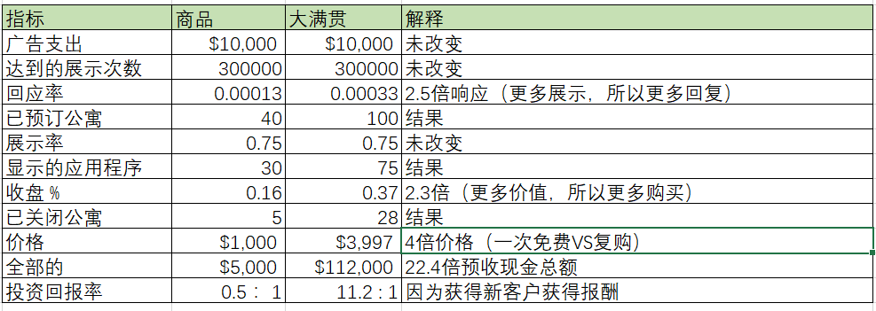
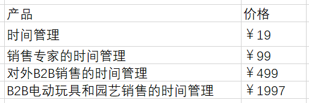
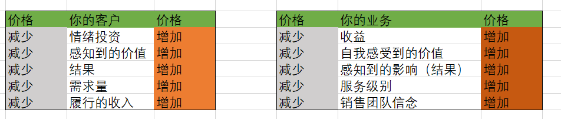
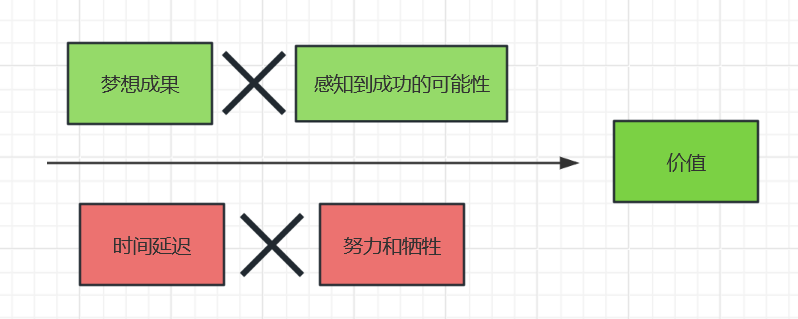
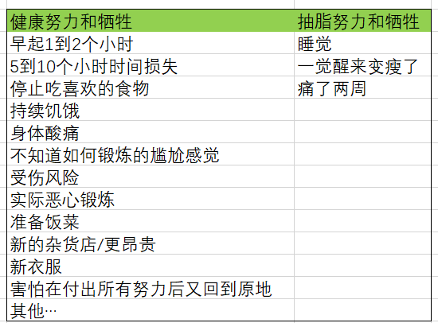
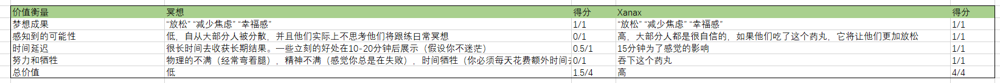

# 从这里开始

> 巨额的回报通常来自对传统智慧的押注，而且传统智慧通常是对的。给你100次10%的回报的机会，你会每天赌博。但是你还有90%的失败几率。我们都知道如果你向摇篮倾斜，你会有很大的机率出局，但是你也会打出一些本垒打。 然而，棒球和商业的区别在于棒球有一个截断的结果分布，当你挥杆的时候，无论你怎样打，你最多可以得到4分.在商业上，每当你站起来，你就可以得到1000分。由于回报的长尾特性，勇于冒险变得尤为重要，因为大量的实验尝试中，只要有几个大赢家，就可以弥补其他所有尝试的成本。

  作为一个企业家，我们每天都在赌博，我们就是一个赌徒-把我们辛苦赚来的钱压在劳动力、库存，房租，营销等事情上。所有这些都希望获得更高的报酬，大部分时间，我们都失败。但是，有时候，我们赢得很大。
  然而，在商业上赌博和在赌场里赌博是有区别的，你的胜算很大，凭借技能，你可以提高他们，但永远不能击败他们。相反，在商业上，你可以通过提高你的技能然后将机会转向有利于你的方向。简单的来说，只要有足够的技能，你就可以成为庄家。

  在开始一系列的acquisition的书之前，很明显，如果不首先解决问题，我就不能讨论任何其他问题的报价。与客户成交的起点是，你实际提供什么东西用来和客户交换钱。这是所有事情的起点。
  这本书是在讨论怎样去制作一个有收益的报价。尤其是，怎样去把广告费转换成收益，使用定价、价值、保证和命名策略。我把这些组件的组合称作“大满贯报价”。
  我选择这个术语是向上面的引言致敬（来自亚马逊创始人杰夫、贝佐斯），因为就像棒球里面的大满贯一样，一个大满贯报价既优秀又罕见。制作一个“大满贯报价”相比“三振出局”并不需要付出太多努力。这种差异来自于营销人员的技能差异和他将报价和客户的渴望连接的程度。在商业上你可以有一般的报价：使用单打和双打可以让游戏进行下去，支付账单，然后打开灯。但是，不像棒球，大满贯比赛的最高得分是4分。而在商业领域，大满贯优惠能让你获得千倍的回报，并让你从此无需再工作。他就像你完成某一次特别棒的击球后，脑袋里会想接下来一百年的所有世界级赛事都会获取成功。
  要让像`将大联盟的快速球打入看台这样复杂的事情看起来毫不费力，需要多年的练习。`你的站姿，视线，预判，球速和球棒速度和臀部位置必须完美。在市场营销和获客方面，也有许多变量必须同时符合，才能真正“大获全胜”。但是，通过足够的练习和足够的技能，你可以将获客这件事作为一场比赛，这个领域每天都会给你出难题。对于其他人来说，你的成功看起来是不可思议的。但是对你来说，这不过是另外“普通的一天”。历史上伟大的击球手都有很多出局。正如伟大的营销人员过往的推销经历中也有很多失败的案例一样。我们通过学习和失败来学习技能。我们知道十次或许有九次我们是错的。我们仍要大胆的行动，期待着我们能够成功推销的报价，从而得到丰厚的回报。
  在商业中的好消息是，你只需要完成一次大满贯报价，然后到退休。在我的生命中我已经完成了5次以上的这种操作，在我的职业生涯中有36倍的广告投入回报率。你可以把这看作我一生的“击球率”，这意味着在广告上我每花一美元都会得到36美元的回报，3600%的回报，这是我8年来的平均水平，而且还在继续尝试去提高，
  这本书是我分享这些技能给你的尝试，伴随着特别的注意力在构建“大满贯报价”。所以你可以经历相同程度的成功，这也是系列书籍中的第一本，旨在帮助企业家实现财务自由。换句话说，可以自由生活的钱。本系列后续书籍将更深入的探讨如何吸引更多客户，如何让客户更有价值，以及其他我希望在扩大业务规模时希望学到的经验。

# 我们怎样到达这里的

> 即使一起看似都已失去，魔法也会找到心灵纯净的人

  这个房间漆黑一片，我的鞋子粘在了布满干苏打水和碎糖果的地板上。我的鼻孔里充满了陈旧的爆米花的味道。我们来的太晚了，没能占到好座位，最后只好挤在剧院的前排。就在我前面几排。电影的耀眼投影占据了我的整个视野。在反射出的光晕中，我能看到莱拉家人脸庞的轮廓。他们可能也被催眠了。我很羡慕他们，他们坐在那里，陶醉在圣诞节休假的快乐中。真好。换成其他人可能不太注意到，但当时的女朋友莱拉太了解我了。换成其他人可能会以为我在看电影。但莱拉能看出我目光呆滞的盯着屏幕，眼神也没有随着电影情节移动。我脸色苍白。我的颧骨和颚骨显得很憔悴，数周的长期压力扼杀了我的胃口。
  “出什么错了”，她问道。
  我无法回答。
  他把手放在我的手上以引起我的注意，我没有回应，一段时间后。她的手指紧紧握住我的手腕。她盯着我，她的眼神在我身上搜寻。你的心跳的好快，他担忧的低声说道。
  她没问就把了脉。
  每分钟100次，对于一个在凉爽黑暗的房间里“休息”的健康的27岁男性来说，这几乎是正常心率的两倍。
  “到底怎么了？”，他更用力的问道，但仍然是低声细雨。
  事实是，我非常害怕。
  几个小时之前...
  我看起来像一个巨人，我蜷缩着坐在一个儿童游戏座椅上。我的膝盖几乎挨着胸膛。即使我的脚牢牢的踩在那块旧米色的地毯上也是如此。我的笔记本电脑放在我陡峭倾斜的膝盖上时感觉很热。我周围散落着玩偶和玩具。他们睁着大眼睛，咧着嘴笑着。一动不动的盯着我，在过去的几周里，我就是他们的消遣对象。
  我当时正在莱拉的父母的房子里面。他们最近正成为了爷爷奶奶，并且用空闲的卧室改造成他们的孙子用的游戏室。我没有住的地方，所以他们让莱拉和我能住多久就住多久。他们已经让我用孩子的游戏室作为办公室进行开展业务。到了这个时候，这感觉就像是他们在这个房间给孙子们讲的虚构故事一样。
  我真的觉得自己像是在玩角色扮演，但不同的是，赌注是真实的，这就是我的生活。
  因为电话紧贴着我的耳朵，我觉得好像过了一个小时，我的耳朵变得又热又红。我不停的摆动我的手臂，因为长时间举着电话会让我的手臂疲劳。
  "Alex,我很抱歉"。电话另一头传来声音，我们必须在接下来的六个月保留这些资金。我们已经观察到了不合规的行为，所以这是我们的预防措施。
  ”你他妈的在跟我开玩笑吧，120美元的大礼包“。我说：一个”预防措施“？
  ”很抱歉先生，我们的承保团队...“
  是的，我用到了，打断了他的话。“我不接受这个”。
  “先生，他不取决与我，他只是我们的波尔”
  “我要怎样对我的销售员说，那些有孩子和还未出生孩子的销售员”，你要跟他说他不能给怀孕的妻子和未出生的孩子买食物？你会帮他支付抵押贷款吗？“
  我沸腾了。
  ”先生-“，毫无阶段性的冷漠，只是想传递这个消息。
  ”这不是你可以拿走的“，我的愤怒很快就转换成了失望。我只要还给我一半，然后让我可以给我的员工发工资。我恳求道，”这还是圣诞夜“。
  ”先生，根据您的协议，我们将要保留您的接下来六个月的资金“，声音渐渐远去。
  ”草“。
  我挂断电话并检查了我的账户。
  我欠销售员2.2W的佣金支票，但是我从未得到12W的销售收入。
  不想给我自己机会去思考它，我就把消息传给了他。
  2.2W美元支付成功。
  余额还剩 $1036。
  
  当我从日场出现的时候，阳光刺的我睁不开眼。家庭随着旋转门进出，制造他们的快乐回忆。我当时愣住了，莱拉拉着我来到车旁，她的手紧紧握着我的手。
  ”发生什么事了“，她问道。
  ”钱还没来“。
  ”你的意思是？“他问道：”延期了？“。
  我失败的叹了口气，“他们保留着这一切”。
  “他们能做到吗？”。
  “显然”，我坚忍的说。试图在她的父母面前保持镇静。
  “你打算怎么处理这些佣金？”。
  “我已经付钱给他了”，说这话的时候我没有看着她。
  莱拉的担忧变成了恐惧。
  我们回家的路上一路无言，我盯着窗外，她紧抓住我的手。相比我预期的更加欣慰。我们会度过这个难关。
  -   
  三十天之前...
  我决定全力投入进“健身房启动”的新业务。这是新主意。我将飞到全国各地的健身房使用新方法最大化的填充。该方法取决与我拥有连锁健身房时完善的报价。
  直到这一刻，我已经卖掉了我的六个健身房中的5个。这些资金来自与我卖健身房的钱。我一生的工作。我已经放进我和另一个合伙人建立的一个账户。这些钱应该是我的新公司的种子资金。
  我终于要实现某种程度的成功。
  我的闹钟响了，我昏昏沉沉的摆动手臂，麻木的抓着床头柜。我关闭了闹钟，而莱拉在骚动中睡着了。
  我静静的躺在那儿，打开银行账户，例行公事。余额是300$。
  等等，不对。昨天账户里有46000$。
  我的肾上腺素飙升。靠近一看我有一个支付45700$成功的交易，我很疯狂。
  卖掉所有健身房的钱已经没了。我查了一下钱去哪儿了，致我的伙伴，他把钱都拿走了。
  ”草“。
  我最近的四年生命就消失的那么快。我正式一无所有，甚至没有什么可展示的，没有健身房，没有设备，没有员工，什么都没有。
  我感觉自己死了。
  雪上加霜的是，在同一个30天时间段内，我的母亲因险些丧命的事故而生命垂危（而且仍在24小时监护）。我的车在每小时60英里的速度迎头相撞时完全报废。而且赢得了一个酒驾作为安慰奖。
  这是我的樱桃，这段时间我的可取之处是在健身房出售一项新的挑战优惠，并预先收取现金作为我扭转业务的费用。
  所以我做了唯一我知道的事，我的推销员一个月的销售额为12W美元，所以我欠他2.2W美元的佣金支票。
  问题是12W美元从未到账。
  “我们需要谈一谈”，我跟莱拉说完之后进了另一个房间。我鼓起勇气去说出口，但是眼睛却尴尬的盯着地板。
  “我什么都没得到”，我对他说。我是一艘正在下沉的船，你不必留在我身边。
  她拉过我的下巴，然后拉过我的脸对着他的脸，好让我们四目相对。“如果到了那个时候我会和你一起睡桥下”。我本来会留下喜悦的泪水，但是我的情绪太疲惫了，我的反应很冷漠。
  我不会留在我身边。
  “从明天开始我们还会进行这些发布吗？”，她问道，“我所有的朋友都辞了工作来做这件事”。她说的是事实，但是它任然还刺痛了我。我感觉自己被打败了，“听着，这很有可能出错”。
  “我相信你，我们会解决的”。
  那时我还剩下两件事：一份大满贯优惠和从我拥有健身房时的一张限额为10W美元的商业信用卡。圣诞节后第一天（在和支付处理商交流两天后），我们计划启动6个新健身房。与此同时，机票、酒店、租车、汽油和广告费。每天要花掉我不曾拥有的3300美元。我最后一美元都用来支付我的推销员了。我还记得广告投放时我的手在抖。关-开。
  就这样，我负债累累，每工作小时都要花费412美元。就这样，每天3300美元从我账户上扣除。
  
  - -3300$...我现在正式一无所有
  - -3300$...我现在几乎一无所有
  - -3300$...我还剩10000美元，总比一无所有
  - -3300$...这个决定将永远毁掉我的未来

  但是事情开始好转，这是当月（2017年1月）发生的事情，正如我挖出的旧处理记录记录的。你可以在左栏看到月份，然后在右栏看到收入。
  
  我们赚了100,117美元。这仅仅够支付每天从信用卡扣除的3300美元。它实际上正在工作，我很难相信他，我投掷了冰雹玛丽，宇宙抓住了它。我从寻找破产律师到弄清楚如何处理300W美元的利润。前12个月的积累，感觉超现实，事后看来，它仍然是这样。
  到年底，我们的收入已经达到150W美元每个月，两个月之后，440W美元每个月。每个月，那之后的24个月，我们的销售额突破了1.2亿美元。捐赠200W美元帮助资助低收入地区的的平等机会。我们遇见了施瓦辛格并被邀请成为他的慈善机构“After All Stars”的董事会成员。
  十二个月后，我们现在拥有七八位数的投资组合，以及跨越各种行业（摄影、出版、健身、商业咨询、美容）和业务类型（实体连锁店、软件、电子商务、培训和教育）的八位数公司。我们的投资收入组合现在每周收入约为160W美元/周（并且还在不断增长）。
  我说这些是因为我真的很难相信，所有的这些东西都来自于一个女孩相信我，一张信用卡，和一个大满贯优惠。
  我知道我将你从赤贫变成了富有。而且最初的问题是什么？这就是我将本书的剩余部分用来分解的内容。
  做Offer的技能把我从破产拯救出来，并可能挽救了我的生命。我一生中犯了很多错误。我做过很多错误的人生决定，我故意或错误的伤害了别人，我曾怀着好意做过好事，我说这些是因为我是一个人。我不要假装知道答案，我有自己的恶魔，并每天都和恶魔战斗。但是，尽管我有很多缺点，但是我在制作Offer这件事上做的非常好，我想把它分享给你。
  我不知道你是谁（你，正在阅读这本书的人）。但是从心底里感激你。感谢你允许我做我认为有意义的工作，感谢你给我你最有价值的资产-注意力。我承诺尽我所能给你最好的反馈。
  这是我的第一条好消息，如果你正在阅读这本书，那么您已经跻身前10%。大部分人买了东西然后很快忽略它。我也可以剧透一下，你在书中读的越深，你挖掘到的金块就越大。好好看看吧。
  这本书提供了。
  这个世界需要更多的企业家，它需要更多战士，他需要更多魔法，这就是我要与你分享的-魔法。

## 大满贯优惠

> 给人们一个很好的报价，让人们觉得拒绝很愚蠢

  当我在23的时候，引用《黑钱胜地》里露丝的话，我对“草”一无所知。但我当时就在拉斯维加斯的一家顶层公寓里，给10为老板销售我的“野兽派”T恤（我免费的到的一件衬衫，以及我拥有的5件衬衫的一件）。
  说实话，我是焦虑的，自我意识的，而且认为我正在犯一个大错。我已经付了3000美元，我不必在桌子上找到座位。我知道我需要学习，那里的每个人都有自己的事业，除了我，我本来打算开一家健身房。
  TJ，会议的组织者，有多个成功的业务。当议程讨论到他时，我记得他随口一说他一年会赚100W美元。
  一百万美元，我被迷住了。我想像这个人一样。我可以做任何事，问题是，我不知道他们在说什么，关键绩效指标？CPL？转换率？当我假装知道他们在说什么时，我的头开始旋转，但是我没有，我不擅长伪装。
  在会议间隙，TJ找到了我，他看出来我有点不知所措。TJ很好奇，友善，并关心他人。闲聊了一会儿以后，他问了我一个简单的永久改变了我一生的问题。
  “你知道销售的秘诀是什么吗？”
  在我的生命里从来没有销售过任何东西，我甚至从来没有读过一本销售相关的书，我最近才知道这个词的意思（严肃的）。我向前倾身，想把他说的每一个音节印进我的脑子里。我打开记事本，专注的盯着他，我已经准备好接受这个秘密了。
  他严肃的看着我说：“给人们一个很好的报价，让他们觉得拒绝很愚蠢”。
  我点了点头，写下来，划线，圈起来。就这样，我的销售世界观发生了转变。
  我的思绪开始飞速运转，我不必很熟练，甚至得到任何好处。我只需要想出任何人都会同意的事情，我生命里最棒的游戏开始了。

### 本书的内容

  在某些时候，每一个成功的企业主都是一名想要创业的人。一个充满想法但因没有潜力而感到沮丧的人。当某些人认识到他们所做的糟糕交易时灵光一闪（很多人都这么做）。用他们的自由交易（错误的）感知到的安全。他们的不适加剧。一旦保持不变的不适感超过了改变的不适感。他么迈出了一步。我要成为一名企业家，那么我就自由了，自由的做我想做的事情，和任何的人，再任何的时间。
  有些人通过个人发展了解了企业家精神。其他人则因为特许经营权进入了这个领域。
  其他人购买了课程。
  有些人只是说，去他妈的，我正在做，我要让他发挥作用。
  他们做到了并使其发挥作用。
  我们大多数人开店是为了以某种方式帮助别人。很多时候，这种帮助在某种程度上与影响我们个人的事情有关，我们开始回馈，为他人提供价值，帮助他们解决曾经困扰我们的问题。话又说回来，有些时候这又不是我们的出路。我们坚持比现在赚的更多、更自由的梦想。
  我们很多人天真的以为，拥有一家企业是我们人生至高的成就-终点站-实际上，这只是一个开始。
  不知何故，在拥有我的第一笔生意和热衷于帮助他人的转变中。我们逐渐意识到我们连做生意的基本知识都不知道，更别说盈利了。我们可能对我们的热情了解很多，但是关于为什么我们开启创业，但这并不代表着我们对商业成功一无所知。让旁观的理想主义者失望。商业成功意味着让潜在客户为我们提供的服务付费。我们对他们来之不易的硬币的热情，这就是协议，促进他们交流的唯一方法。交易，实际上是通过向潜在客户提出要约来开展业务。

#### 无论如何，优惠是什么？
  
  开展业务的唯一途径是通过价值交换，以美元换取价值的差异。报价是发起此交易的原因。简而言之，报价是你同意或给予的商品或服务。您如何接受付款，以及协议条款。这是吸引客户和赚钱过程的开始。这是任何新客户在与您的业务中互动的第一件事。由于优惠是吸引新客户的因素，因此他是您业务的命脉。
    - 没有报价，没有生意，没有生活
    - 报价不好，负利润，没有生意，糟糕的生活
    - 体面的报价，没有利润，停滞的生意，停滞的生活
    - 好报价，一些利润，好的生意，好生活
    - 大满贯优惠，高利润，疯狂的生意，自由
  这本书帮助企业家制作大满贯报价，这些优惠是如此有效、有利可图并且可以改变生活，以至于他们似乎只能是运气的结果。至少对于未经训练的人是这样的。
  你可能现在知道，过去的十年里我已经制作了数十个报价，大部分失败了，一些做的很好，一些人挖到了金子。但我从来不知道为什么。正如斯坦福商学院著名教授伯格曼教授所说。理解自己失败的原因比不知道自己要和成功的原因好很多。
  但是，随着数据滚滚而来，看起来“财富”和“运气”更接近与一个可重复的框架。我很高兴能够多次获得金币来纪录这些框架，并获得“闪电两连击中”的机会。
  我已经将这些框架的步骤和组件以逻辑易于理解的方式呈现，所以他们实际上很有用。今天，像现在一样，我给你行动。而不是一本悲伤但典型的含糊商业理论和精神自慰的书。

##### 大多数企业家面临的问题以及他们如何解决这些问题
  尽管你可以把你要面临的问题列出一英里长，这是释放压力的好办法。所有这些问题通常都源于一个大问题。
    1. 没有足够的客户
    2. 现金不足（月底有超额利润）
  看起来很明显，对吗？花费更多的时间和金钱来获取更多的客户，从而解决问题一，这笔钱来自利润率。这就产生了问题二。还有什么更烦人的。潜在客户野蛮的比较和贬低我们的服务，转而选择更便宜，更糟糕的解决方案。以最便宜的“获胜”。当然，获胜意味着以更少的钱做更多的工作时（悲伤）。
  假设您降低了价格用以吸引更多客户，你甚至可能拥有完整的客户端负载，但你在这里。由于利润率太薄二勉强成功。“竞争”变成了逐底竞争。
  如果您正在努力解决其中一个或者两个问题，你并不孤单，我去过那里。
  哎呀，我认为每个企业家面临相同的挑战。
  我也想让你知道，这不是你的错。典型模型不是为了利润最大化而设计的。他们是由运营大量资金并且可以亏损运营很多年的公司设计的。但这些模型被用在现实世界。企业主只是“勉强度日”。他们本质上是给自己买了一份工作，每周工作100小时，以避免工作40小时。蹩脚的交易。我的猜测是，如果你和我一样，我就会注册更好的东西。
  保持开放的心态，如果执行本书的内容，可以改变你的业务...快速的。
  如果您不关心金钱数字或者商业模式，我已经为你做了所有这些工作。我将在这些页面中逐步引导您完成这个过程。我将详细解释我们上面提到的两个大问题。包括为什么他们不起作用。然后我将给你展示解决方案。而且结束这次冒险。我将解释如何提供价值以最大限度提高每个客户的收入。这样你就可以超越所有人并积累现金。
  我们对我们合作的每个利基模型都使用这个模型（牙医，健身房，机构，水管工，屋顶工，遛狗者，实际产品，实体产品，软件，实体店等等）。令人惊奇的是，当他们使用这个框架的时候，他们每一个人的进度有多快。

### 他对你有什么作用

  我犯过书中每一个错误（愚蠢的）。现在，你可以从我的尴尬，残酷，耗资数百万元的糟糕事情中获取教训，而不用自己承受痛苦。
  建立这些企业对我来讲是一段非常艰难和感人的旅程。我不会用这些经验来换取世界，然而，如果这本书能帮助一个企业家避免像我一样的痛苦，保持业务开放，或者实现自己的梦想，这一切都是值得的。如果你愿意用看两集你最喜欢的电视的时间来交换并真正学习这本书。- 如果你实现了一个报价组件-我可以保证增加更多的客户和更多的资金来增加自己的利润。读完整本书，并牢记在心。将是您的企业按时获得的最佳回报。没有其他任何办法可以让你在同样的时间完成本书的任务。这是一个承诺。
  作为附带好处，实施新优惠是企业中最容易做的事之一。所以你真的可以做到这一点。这不是某种管理实践或文化建设的不祥之兆。这才是真正的“买狗屎挣大钱的东西”。

#### 这对我有什么好处？
  
  我提供所有的材料（这本书，课程以及您在acquisition.com找到的其他书籍和课程），免费或有成本尽可能的帮助更多人赚更多钱并服务更多人。我制作这些课程的目的是提供比1000美元更多的价值。任何价值3W美元的教程，或者价值20W美元的大学学位。我这样做是因为，尽管我可以以这种格式出售这些材料。我只是不想，我靠做这些事赚了钱。和大多数营销界的人相反，没有教如何做这些事情，所以我的模型是不同的（稍后将解释更多）。
  话虽这么说，我希望为我出版的材料提供价值的两个原型。对于原型1，企业家年收入低于300W美元。我的目标是帮助您实现目标并赢得您的信任。尝试本书中的一些策略。观察他们工作，再尝试一些，再尝试他们的工作。等等，您在自己的业务中看到的成果越多越好。一旦您成功了，你就会成为原型2，年收入在三百万美元-1千万美元之间的企业家。一旦你到达那里，或是你现在在那，我很荣幸能投资您的业务并帮助您突破3千万，5千万，1亿美元。
  我不卖教程、策划、或者类似的东西，代替的是，我有一个公司的投资组合，我利用公司所有的基础设施，资源和团队来快速跟踪他们的发展。
  但别相信我...我们才刚认识。
  如果你好奇我的商业模式的话，我的商业模式很简单，就像四块金字塔标志一样。
  1. 免费提供远远超过市面上其他产品的价值
  2. 让企业家使用实际有效的材料并赚钱帮助更多的人
  3. 赢得超级执行者-企业主的信任，使用这些框架将业务扩展到每年3百万-1千万元甚至更多
  4. 投资这些企业以产生更大的影响力，同时免费帮助其他人

  如果你仔细观察，就会发现这个过程是一个成功的逆向工程。我认为这很酷。方法如下：我知道企业主无需手动操作就可以执行我拥有的框架。因此，下一组框架很可能会取得成功（达到3千万、五千万、一亿看起来都和3-10千万美元不同）。他们知道我的风格适合他们，因为他已经有了。因此，我们以共同的信任为基础开展业务。我相信他们能够执行，他们相信我们的东西有效。其次，因为他已经拥有了一切，同时帮助了其他人。免费的。因此，他使我能够先发制人的避免失败并大大增加成功的可能性，让我告诉你多少钱。
  在写这篇文章的时候，自2017年3月以来我创办的每家企业都实现了150W美元/月的运行率。根据小企业管理局，单个企业每年收入达到1千万美元的机率为0.4%，即250分之一。连续发生四次是 0.4%*0.4%*0.4%*0.4% 很低的概率。因此，我可以坚定的说，我可以用我分享过的一遍一遍的框架来实现成功。他们之所以有效，是因为他们是永恒的商业原则。
  我每天都积极的想象，半夜醒来出冷汗是什么感觉。想知道我该怎么发工资。这种令人痛苦的冥想让我作为一名企业家充满渴望。但也对我的安全感和内心的平静充满感激。我希望你和其他任何关心自己所做事情的人都能得到后者。
  很公平？
  凉爽的，让我们开始吧。
  
#### 本书的基本概要
  
  这本书旨在成为一种资源，作为一种资源，我的意思他将您通读的内容，然后保留在您的工具箱内。一次又一次的回到他，为什么？正如爱因斯坦所说：“永远不要记住任何您能查到的东西”。商业不是一项观赏性运动，你不会为了期中考试临时抱佛脚，而且你也不是什么软弱无力的哲学家。
  你做工作，为了工作，你需要一些工具。我的朋友，这些就是工具之一。

### 总体概要
  
  第一章：我们怎样到达这里的（我们已经完成了）
  第二章：定价，如何为商品收取大量费用
  第三章：价值，创造你的报价，如何让人们购买的好东西
  第四章：提高你的出价，如何让你的出价如此好，让他们都觉得拒绝是愚蠢的
  第五章：后续步骤，如何在现实世界中实现这一目标

## 第二章：定价
  
### 定价：商品问题

> 想法不同

  "生或死"是我们公司的核心宗旨，我们相信每个个人，每个公司，每个组织要么正在增长，要么正在消亡。维护是一个神话。
  这意味着什么？如果你的公司没有成长，它就正在消亡。这是一个发人深省的现实，对于大多数人来说。我经历了惨痛的教训，我的生意因此遭受了很长一段时间的损失。
  让我解释一下，这个市场在不断增长，股票市场每年增加9%。如果我们不以每年9%的速度增长，我们落后了。维护，从最简单的意义上来讲，将是同比增长9%。
  此外，如果您处于不断增长的牛市中。那么你可能以每年20-30%/年的速度增长。只是为了跟上，否则就有落后的风险。所以你可以看到维护是多么的神话。
  所以，成长需要什么？
  谢天谢地，只需要三件最简单的事情。
  1. 获得更多的客户
  2. 提尕他们的平均购买价值
  3. 让他们购买更多次

  就是这样！
  当然，获取客户的方法又很多，增加订单价值和购买频率的方法也有无数种。但是，简单的说，就是这样，这是唯一的三种成长方式。
  示例：如果我每月销售10个客户。客户一生对我来说价值1000美元（通过平均购物车价值*购买次数）。那么我的业务上限为1W美元/月。
  十个新客户/月 * 1000美元终身价值 = 1W美元/月 最大收入
  如果你想成长，你必须每月销售更多客户（同时保持适当的利润），或者让他们更有价值（通过增加每次购买利润和购买次数）。就是这样。
  
#### 商业条款

  在继续之前，并更好的充实接下来的概念。我们应该花些时间来定义和更好的理解一些关键的业务概念。当我穿着“野兽T恤”站在拉斯维加斯的顶层公寓时，我对这些术语一无所知。让我帮助你变得比我更好。
  毛利：收入减去为额外客户提供服务的直接成本，如果我以10美元的价格出售乳液，那么我的成本为2美元。我的毛利润是8美元或者80%。如果我已每月1000美元的价格出售代理服务，那么我每月要花费100美元来运营该客户的广告。当我的毛利润是900美元或90%时。
  注：这不是净利润，净利润是支付所有费用后剩下的的部分，而不仅是履行的成本。
  终身价值：客户整个生命周期累积的毛利润，这是毛利润*普通客户一生中的购买次数。使用上面的示例，如果客户平均停留5个月。他们每月要支付1000美元，而我每月要支付100美元完成任务，那么他的终身价值是4500美元。
  分解如下：
    收入：（1000美元/月 * 90%毛利 * 5个月） = 4500 美元 （终身价值）
  请注意：管理、软件、租金等成本等非直接花费不算在内
  注意：根据来源，你会发现生命周期价值的不同定义。最大的区别在与，有些只计算总收入，有些只计算整个生命周期的毛利，我关注的是毛利润。为了清楚起见，您可能会在其他文本中看到我将其称为LTGP终身毛利润。

#### 价值驱动 VS 价格驱动的购买

  本书旨在成为任何企业想要发展的教科书，我已经花费（并将继续花费）数百个小时的时间和企业家通电话，或者面对面会议咨询企业家如何制定他们的报价。我见过那些起飞进入平流层和那些失败的。
  拥有大满贯报价几乎不可能失去。但为什么？是什么赋予他们这么大的影响力，简而言之，拥有大满贯优惠有助于满足增长的三个要求：吸引更多客户，让他们支付更多费用，以及让他们做这样更多次。
  如何，它可以让您从市场脱颖而出，换句话说，它允许您根据价值而不是价格来销售商品。
    商品化：价格驱动购买
    差异化：价值驱动购买（在同类产品中销售，没有可比性，是的，市场很重要，我将在下一章详细阐述）
  正如我所定义的，商品是一种可以从许多地方获得的产品。因此，人们倾向于根据“价格”，而不是“价值”进行购买。如果所有产品都是平等的，那么默认情况下最便宜的就是最有价值的。换句话说，如果潜在客户将您的产品与其他产品进行比较并认为：“这些产品几乎相同”，我会购买更便宜的产品。然后他们将你商品化，多尴尬啊，但这是价值驱动型企业家遇到的最糟糕的事情。
  这对企业家来说是一个大问题，因为商品是根据市场效率来定价的。这意味着市场通过竞争来降低价格，知道利润刚好足以维持运转，“刚好”成为他们业务的奴隶。
  该企业的收入刚好够，足以让业主焦虑的等待事情好转。当这个谎言被实现的时候，他们陷得太深而无法扭转（至少到目前为止）。
  大满贯优惠解决了这个问题。

##### 但大满贯优惠有什么作用？
  
  好的，让我们首先定义大满贯报价。
  这是您向市场提供的报价，无法与任何其他可用产品或服务进行比较。结合有吸引力的促销，无与伦比的价值主张，溢价。以及无与伦比的货币模型保证（付款条件）这可以让您获得报酬来获得新用户，永远消除业务增长的现金限制。
  换句话说，它允许您以一个类别进行销售，或者，套用另一个伟大的短语，“真空销售”。潜在用户的购买决定现在是在你的产品和虚无之间。因此，你可以以潜在用户感知的任何价格销售，不与其他任何事物相比，因此，他以更高的票价带来更多的用户，为了更少的钱，如果你喜欢花哨的营销术语，他会这样分解。
    1. 提高响应率（思考点击次数）
    2. 增加转化（想想销售）
    3. 溢价（认为收取很多钱）
  获得大满贯报价可以提高您对广告的响应率（也就是更多人会看到包含大满贯优惠的广告并且行动）。
  如果你为眼球支付相同的金额，但是：1）更多人响应 2）更多的回复会购买 3）他们以更高的价格购买，您的价值就会增长
  我在自己的优惠中“挖到了金子”。不是因为我有超能力，而是因为我已经做过很多次了（并更加失败）。我整理了长期失败的东西，并把可重复成功的东西装进了口袋（并把它放进这本书里）。
  这是所有这一切的关键要点：企业在这两种情况下都做相同的工作（商品化或者大满贯），实现是一样的。但是如果一家企业使用“大满贯报价”，另一家使用“商品”报价。大满贯优惠是该企业看起来好像拥有完全不同的产品。这意味着价值驱动而非价格驱动的购买。
  如果您有商业报价，您将在价格上竞争（价格驱动型购买和价值驱动型购买）。然而，您的大满贯报价会迫使潜在客户停下来并以不同方式思考，以评估您的差异化产品的价值。这样做会让你成为自己的类别，这意味着比较价格太困难。这意味着你需要重新校准潜在客户的价值计量表。

##### 现实生活的大满贯提供金钱数字：之前和之后

  快速背景故事...我们的一家公司是广告公司用来为其客户寻找潜在客户的软件。使用该软件，代理机构将他们的报价从商品化的潜在客户生成服务转变成按绩效付费的大满贯报价。让我向您展示他对企业收入的乘数级影响。
  虽然为了说明四舍五入，这些值基于像实体企业销售服务的潜在客户开发机构的实际经验数据。
  旧的商品化方式（价格驱动） - 竞逐到底。
  商业化报价：首付1000美元，然后每月1000美元作为代理服务聘用金。
  
  分解：广告支出回报率为0.5：1,你在吸引客户方面会损失金钱。但30天内，这5位客户将每人再支付1000美元。这样您的总金额当达到10000美元，实现收支平衡。
  下个月，收入5000美元将是您第一个盈利的月份。此后的每个月都会盈利（假设他们都留着）。
  这是商品化服务的一个例子-正常的代理工作。一百万个，而且看起来都一样。商品化的企业和优惠很难从广告中获得回应。因为他们所有营销看起来都与其他人相同。
  很有道理，但很容易被复制（并受到商品化的影响）。这种商品化创造了价格驱动的购买。
  你被迫以有竞争力的价格来吸引客户，并保持这种方式用来留住他们。如果客户看到“同样的东西”的更便宜版本。那么价值差异将导致他们更换供应商。这是一个两难的境地...失去这个客户，其他客户和潜在客户。或者保持竞争力，你的利润变得如此微薄以至于消失。
  此外，很难让潜在客户答应（让他们说“是”），除非你对客户通过保持竞争力将你的业务商品化高度警惕。这就是旧的商品化方式的问题，他们可以比较，除非您使用大满贯优惠。否则您的价格将不断被压低。企业最终会认输，企业最终会消亡。没有布埃洛。
  我们希望提供与众不同的报价，以便您跳过关于为什么您的产品与其他产品不同的解释（如果他们不得不问，那么他们可能太无知，无法理解其中的解释）。而是让报价为您服务，这就是大满贯方式。
  让我们深入进去看看销售数字的对比。

##### 新大满贯报价方式（差异化，无与伦比）（价值驱动）

  大满贯优惠：一次性付款。（没有经常性费用，无保持器）。只需覆盖广告支出，我会帮您找到潜在客户。只有当人们出现时才付钱给我。我保证你第一个月就会吸引20个人。或者您可以享受下个月免费的服务。我还将提供来自像您这样的企业的所有最佳实践。
    - 为您的员工提供日常销售辅导
    - 测试过的脚本
    - 经过测试的价格点和可滑动和部署的优惠
    - 销售录音
  以及销售和满足客户需求所需的一切，我会给你整个剧本（插入行业），成为客户完全免费。
  简而言之，我正在让人们进入你的生意，准确的向您展示如何出售他们，以便您可以获得更高的价格，这意味着您可以赚到最多的钱，这听起来很公平。
  很显然，这些是截然不同的报价，但那又怎样？钱去哪儿了？让我们在下面的图表中找一下。
  
  分解：你花同样的钱买相同的眼球，然后，您的广告回复人数会增加2.5倍。因为这是一个更具吸引力的报价，从那里，您关闭的人数是原来的2.5倍，因为报价更具吸引力。从那里，您可以预先收取4倍的价格。最终结果是预先收集的现金增加了2.5*2.5*4倍=25倍。是的，您使用10000美元赚了112000美元。您刚刚赚到了新客户的钱。
  对比：记住老方法，您预先损失了一半的广告支出。通过新方式，您可以赚更多钱并获得更多客户。这意味着您获取客户的成本很便宜（相对您的收入）。您的限制因素是你做你喜欢做的工作的能力。现金流和获取客户将不再是您的瓶颈，因为他的利润比旧模式高22.4倍。是的，你没看错。这是动作片中你以慢动作逃离爆炸的部分。
  这是我们在为代理机构提供服务的软件业务中使用的大满贯优惠，数字可能变得狂野。快速的，我知道22.4倍更好听起来不合理，但这就是重点。如何你和其他人玩相同的游戏，你就会的到和其他人相同的结果（平庸）。你打单打和双打，保持灯亮，但永远不会领先。但请记住这本书的开头段落。当你把所有棋子对齐时，你就能把它从公园击倒，从而永远获胜。在我创业的头18个月内。我们的广告支出从每年50W美元到每年2800W美元。所以，当我说20：1，50：1，100：1回报时。我是认真的，当你做到这一点时，结果就是，嗯，难以置信。

### 总结要点

  本章阐述了商品化的基本问题和大满贯优惠如何解决这个问题，这可以让你摆脱价格战并进入一个类别。下一章将侧重于寻找正确的市场来应用我们的定价策略。这是最重要的事情之一。向错误的观众提供大满贯报价将被置若罔闻。我们希望不惜一切代价避免这种情况。我们必须暂时远离定价来了解在市场中到底寻找什么。在继续我们的旅程之前，这是一个必须检查的复选框。


## 定价：寻找合适的市场和饥饿的人群

  > 落在好土里的种子代表那些真正听神的话，明白神的话的人，所结的果子是所种的30倍、50倍、100倍。 - 马太福音 13:23
  
  一个市场专家问他们的学生，如果你要开一家热狗摊，你只能比你的竞争对手有一个优势，会是哪一个？
  “地点，质量，价格低，最佳口味！”。
  学生们一直继续下去，直到最后他们没有答案。他们面面相觑。房间终于安静下来。
  教授微笑着回答：“饥饿的人群”。
  你可能会吃到最糟糕的热狗，可怕的价格。并且处于一个糟糕的位置，如果你是镇上唯一的热狗摊，并且当地的大学橄榄球比赛开始了。你会卖光的，这就是饥饿人群的价值。
  归根结底，如果对解决方案有大量需求，你的生意可能很平庸，报价很糟糕，没有能力说服别人，但你任然可以赚钱。
  一个例子是COVID-19初期卫生纸的短缺。没有报价，定价很糟糕，而且没有令人信服的推销宣传。但因为人群如此之大，又如此饥饿。一卷卫生纸的售价是100美元或者更多，这就是饥饿人群的价值。

### 卖报纸

  我的好朋友劳埃德拥有一家软件公司，为报纸提供服务近10年。他们只需点击几下就可以在报纸网站上设置数字广告服务，并帮助他们销售全新的广告产品。他只向他们收取他增加的收入的一定比例。所以，如果他们什么也没做，他也没有，这对报纸来说是纯粹的收益，也是一个很棒的报价。
  但是，尽管有很好的报价和自然的销售能力，他的生意开始下滑。作为一名成就卓著的企业家，他尝试了各种不同的角度来解决问题。但都没有效果，他不明白问题出在哪里。我很难看到他为此挣扎，因此我认为劳埃德比我聪明的多，答案对我来说似乎是显而易见的，但看着他经历这一切是我一生的教训。在我透露之前，你认为问题出在哪里？产品？营销？报价？还是他的团队？
  让我们来分解一下，这不是他的产品-那很棒，这不是他的提议，他有一个零风险的收益分成模式。这不是他的销售技巧-他是一个天生的推销员。那么，问题出在哪里呢？他正在卖给报纸，他的市场每年萎缩25%。除了最明显的一个角度外，他已经看过了所有的角度。最终，经过多年的市场攻坚战，他意识到他的市场是他问题的根源，并决定缩小公司规模。
  别担心-这个故事有下半场。为了说明市场的导向，新冠疫情一袭来，劳埃德就转向了。他创办了一家自动化口罩制造公司。
  借助新技术，它使每个口罩的成本低于人们从中国购买口罩的价格。五个月内，他的收入达到数百万美元。同一个企业家，市场不同，他将同样的技能用到了一个他零经验的企业中，并取得了胜利，这就是选择正确市场的力量。
  我给你这个故事作为一个警示故事，您的市场很重要，劳埃德是一个非常聪明的人，显然他非常有能力，但作为企业家，我们都可能被蒙蔽，以为我们不喜欢放弃。我们太习惯与解决不可能的问题，以至于我们会把头撞在墙上。我们讨厌放弃，但现实是每个人都受到市场的影响。
  那么如何选择合适的市场？

#### 寻找什么

  有一个市场迫切需要你的能力，你需要找到他，当你这么做时，你会充分利用，同时想知道是什么花了你这么长的时间。不要对你的观众浪漫，为那些能够支付你应得的报酬的人服务。请记住，选择市场就像任何事情一样，始终是我们的选择，因此请明智的选择。
  为了销售任何东西，你需要需求，我们并不是试图创造需求，我们正在努力引导他。这是一个非常重要的区别。如果你的报价没有市场，那么接下来的一切都行不通。整本书都基于这样一个假设，至少有一个正常市场。我将其定义为与市场相同增速前进的市场。并且有共同的未满足需求，属于一下三类之一：改善健康，改善财富，改善人际关系。例如劳埃德，根据上面的报纸故事，可以读完整本书，但这里的任何内容都对他不起作用。为什么？因为他的目标是报纸，一个垂死的市场。
  话虽这么说，拥有广阔的市场是一个优势，但你可以在一个平均速度增长的市场中赚到疯狂的钱。我去过的每个市场都是正常的市场，你只是不想把冰卖给爱斯基摩人。以下是我在市场中寻找的基本原则。在我们回到报价之前让我们先回顾一下他们。
  在选择市场时，我会使用以下四个指标：
  > 痛苦+购买力+容易实现+增长
  
  1. 巨大的痛苦
    他们一定不想要，但迫切需要。我提供什么，痛苦是任何使人们生活感到沮丧的事情。破产是痛苦的，糟糕的婚姻是痛苦的。在杂货店排队是痛苦的。背痛...笑容丑陋痛苦...超重的痛苦...人类承受着很多苦难。所以对于我们企业家来说，无限的机会比比皆是。 
    疼痛的价格与您能收取的价格成正比。有关此内容的信息，请参考“值方程”一章。当他们听到解决他们痛苦的方法时，相反，如果没有这种痛苦，他们的生活会是什么样子，他们应该被你的解决方案所吸引。我有一句话用来培训销售团队。“痛苦就是音高”，如果你能准确表达潜在客户遭受的痛苦，他们几乎总是会购买你们提供的产品，潜在客户必须有一个痛苦的问题需要我们解决，并为我们的解决方案收费。
    我有句话用来培训销售团队“痛苦在于营销”，如果你能够准确的表达潜在客户所感受的痛苦。他们几乎总是会购买您提供的产品。潜在客户必须要有一个痛苦的问题需要我们解决，并为我们的解决方案收费。

  > 专业提示： 好的写作的重点是让读者理解，良好说服的要点是让潜在客户感到被理解。

2. 购买力
    我有一个朋友有很好的系统，可以帮助人们改进简历以获得更多的面试机会。他很擅长，但尽管他尽力了，他就是无法让人们为他的服务付费。为什么！因为他们都失业了。
    这似乎又是显而易见的，但他认为，这些人很容易成为目标，他们正承受着巨大的痛苦，他们的数量很多，而且还在不断的增加新人。这是一个巨大的新人。
    他只是忘记了一个关键点，您的受众需要能够负担起您向他们收费的服务。确认你的目标有钱。或获得金额，需要以您需要的价格购买你的服务，以使其值得你花时间。
3. 易于瞄准
    如果说你有一个完美的市场，但无法找到组成他的人，好吧，提出大满贯报价会很困难。我通过寻找易于定位的市场让我的生活变得更轻松。这方面的例子是具有所属协会的化身。邮件列表，社交媒体群组，他们都观看的频道等。如果我们的潜在客户都聚集在某个地方。然后我们就可以向他们推销。如果把他们找出来，然而，就像大海捞针一样，那么很难让你的报价出现在任何潜在感兴趣的人面前。
    这一点是战术性的，这是现实，而不是理论。例如，您可能想为富有的医生服务，但是，如果您的广告向护理学生展示，您的报价将置若罔闻。不管他有多好，要点：您要确保可以轻松定位目标受众（澄清一点，想要为富有的医生服务没问题，他们很容易找到，这只是说明您的促销活动必须提供给正确的受众）。
4. 增长
    不断增长的市场就像一阵顺风，他们让一切进展更快。下降的标记就像逆风。他们让一切变得更加困难，这是劳埃德的例子，报纸具备大市场的四种要素的三种：（1）很多痛苦 （2）购买力 （3）容易瞄准。但他们正在缩小（快速）。无论他如何努力，市场都会和他作对，生意已经够难了，市场变化很快。所以你不妨找到一个好的市场来给你顺风顺水，让这个过程变的更容易。
    
#### 使这成为现实

  有三个市场会永远存在：健康，财富和人际关系。那些永远存在的原因是当你缺乏他们时永远存在着巨大的痛苦。始终要解决人类这些核心痛点，目标是在不断增大的桶中寻找较小的子组：具有购买力，并且易于定位（其他三个变量）；
  所以如果我是一个关系专家试图找到我的化身，我宁愿专注于为老年人提供“后半生关系辅导”，也不愿帮助大学生处理人际关系，为什么？因为独居的老人在临近死亡时会遭受更多的痛苦，有更多的购买力（金钱），并且很容易找到（目标）。最后，在撰写本文时，每年65岁以上的人数多与20岁以上的人数（还在增长）。
  这就是这个想法，想想你在健康、财富、人际关系方面擅长什么。想想谁可能最看重你的服务（最大痛苦的）。有购买力来支付你想要的东西（金钱）。并且可以轻松找到（针对）。只要这三个标准足够强大并且市场不萎缩，你会保持良好的状态。
  但对于你的成功来说，找到一个“伟大的市场”，“糟糕的市场”，“正确的市场”是多么重要。答案，这实际上取决与。让我解释一下。

#### 重要性顺序：成功的三个杠杆

  你不太可能像报纸上的例子那样陷入垂死的市场，你也不太可能在新馆疫情期间出售卫生纸（疯狂购买）。您可能处于“正常市场”。那完全没问题。在正常市场中可以赚大钱，我的要点是：你不能处于糟糕的市场中。否则什么都行不通。话虽这么说，这是市场、报价和说服技巧之间重要性顺序的最简单说明。
  饥饿人群（市场）> 提供强度 > 说服技巧
  假设您要按照“好”，“正常”，“坏”的等级对这些元素评分。您基本上可以展按照重要性排序从左到右向下移动。对高阶作品的优秀评级压倒了优先级较低的其他任何作品。“正常评级”将责任转移到等式的下一部分。除非来自更高优先级组件的“好”使方程式无效。否则“坏”会停止方程式子。下面是一些例子：
  示例#1：即使你的报价很差而且不善于说服。如果你身处在一个好的市场，你就会赚钱。如果凌晨2点酒吧打烊时你正在街角吃热狗。和一群饥饿的醉汉在一起，你的热狗就会卖光。
  示例#2：如果您处于正常市场并且有大满贯报价（很棒），即使你不善于说服，你也可以赚很多钱。这是读这本书的大多数人。这就是我写他的原因，通过学习建立大满贯报价来帮助您最大限度的获得成功。
  示例#3：假设您处于正常市场并有正常报价，为了获得巨大的成功，你必须非常善于说服。那时，也只有那时你会成功。以你的说服技巧作为你成功的支点。哎呀，许多帝国都是由杰出的说服者建立的。这是最难走的路，需要最多的努力和学习。确定您的报价可以帮助您走上成功之路。否则，您只会拥有一个需要非凡技能才会成功的普通业务。（这没什么问题，但可能不是你注册的）。
  
#### 致力于利基（合适的小环境）市场
  我在指导创业者选择目标市场时有一句话，”别让我利基打你一巴掌“。很多时候，新创业者都会半新半意的尝试某一市场的某一项提议。赚不到一百万美元，然后错误的认为”这是一个糟糕的市场“。大多数时候情况并非如此。他们只是还没有找到适用于该市场的大满贯报价。
  他们认为，我将从帮助牙医转向帮助脊柱按摩师-就是这样。实际上，这两个都是正常市场并代表数十亿美元的收入。两者都可以，但不能两者都有效。你必须选择一个，一个人不能侍奉两个主人。
  我创造了”利基一巴掌“这个词来提醒我所在社区的企业家一旦选择就做出承诺。所有企业和所有市场都有不快的特征。一旦你到达彼岸，草就不会更绿。如果你不断的从一个利基到另一个利基。希望市场能解决你的问题，你活该被利基打一巴掌。
  你必须坚持你选择的任何东西足够长的时间以进行反复校验，你会失败的，事实上，在你成功之前会失败。但如果你不断改变你的营销对象，你的失败时间就会更长。因为你必须每次从头开始，所以，选择然后提交。

#### 财富在利基市场

  致力于利基市场的另一个原因是你会赚更多的钱，简而言之，缩小利基会让你赚到更多的钱。
  作者建议-何时扩大（给大多数人的建议）
  对于大多数人来说，如果每年的收入低于1000W美元，缩小利基会让你赚更多的钱。之后，这将取决于利基市场的狭窄程度，即所谓的TAM（总可寻址市场）。企业实际上只能发展以满足整个潜在市场的要求。话虽这么说，但对于大多数人来讲，每年达到1000W美元，0.4%的最高成就（只有二分之一的企业能实现这个目标）。因此，对于每年1000W美元以下的99.6%的读者来说。为更少的客户提供更狭窄的服务几乎总是更容易。但是如果你想超越这个，您或许必须进入高端市场来扩大你的受众。低端市场，或进入您现有服务可以提供价值的相邻市场。就背景而言，许多公司每年的扩张规模超过3000W美元，服务于单一利基市场：记住按摩师、健身房、水管工、太阳能。如果你的资产到达100W或者300W美元。认为你已经达到上线且必须扩张，那么你就错了，你必须变得更好。
  当我真正意识到我还剩下多少利润时，他改变了我的生活。这就是从为任何人获取到将其教授给特定化身的原因。以我为例，我选择一家拥有100名会员。签订租约，至少1名员工的微型健身房老板。与常见的小企业主和“愿意付钱给我的人”比。这是相当具体的。我非常具体。在那个业务（健身房启动）中，我们拒绝了，但任然拒绝做那个不是化身的人。这意味着没有私人教练，没有在线教练等。
  我可以帮助他们吗？我当然可以。我是说，我们的投资组合大部分都是健身公司。但为了保持产品焦点和高转化率消息。确切的直到产品的用途是改变游戏规则的因素。
  它帮助我们准确的知道我们一直在和谁说话，我们到底在解决谁的问题。
  但简单和轻松可能不足以打动你，那么让我来解释一下为什么专注于一个利基市场会让你赚到更多钱。
  原因：对于完全相同的产品，您可以收取100倍的费用。丹.肯尼迪是第一个说明这点的人。我将尽我所能在这些页面中将这些页面传递给您。
  利基产品定价示例：
  例子：
  
  丹肯尼迪教会了我这点（这永远的改变了我的生活）。假设您出售了时间管理的通用课程。除非你是一位引人入胜或独特故事的时间管理大师。他不太可能变成任何重大的事情。您认为另一门“时间管理”课程的价值是什么？19美元，29美元，当然，没什么可以写的。为了说明起见，我们假设19美元。
  “现在我们将为你的产品释放利基定价的力量”
  因此，让我们想象一下，您使产品更加具体，保持相同的原则，并将其称为“销售专业人员的时间管理”。
  突然之间，这门课程是针对更特定类型的人的。
  我们可以将他们的增长与更多的销售或更多的交易联系起来，这回带来更多价值。但有很多销售人员。所以这可能是一款99美元的产品，整洁，但我们可以做的更好。
  因此，让我们再深入一点，将我们的产品称为“B2B外向销售代表的时间管理”。遵循相同的特异性原则，现在知道我们的销售人员可能拥有非常有经验的交易和佣金。一次销售很容易让这位推销员净赚500美元（甚至更多）。所以很容易证明价格$499的标签是合理的。对于几乎相同的产品来说，这已经是价格的25倍上涨。我可以就此打住，我还要更进一步。让我们再降级到最后一级。“B2B出站电动玩具和园艺销售代表的时间管理”。繁荣。
  想一想，如果您是电动工具对外销售代表。你可能会想：这就是为我量身定做的，并且会很乐意花1000到2000美元购买一个可以帮你实现目标的时间管理计划。该课程的实际内容可能与19美元的通用课程相同，但自从他们被应用以来，销售信息可以对头像传递很多信息。他们会发现他更有吸引力，并真正从中获得更多价值。这个概念适用于你决定做的任何事，你想成为为此类人提供服务或解决“此类问题的人"。甚至更小众的，我以这种独特的反直觉方式为这种特定类型的人解决这类问题。扭转了他们最深的恐惧。
  这就是一般减肥健身计划的售价可能仅为19美元，而转为轮班护士设计和销售的健身计划可能售价仅为1997美元（尽管计划的核心在于少吃多动）。
  最终结果：市场很重要，利基很重要。如果你可以以100倍的价格出售你的产品，你应该。
  我会让你决定。
  
### 总结要点

  本章的目的是强调两件事，首先，不要选择不好的市场。正常市场没问题。伟大的市场就是伟大的，其次，一旦你选择了，就要坚持下去，直到你弄清楚为止。
  如果你尝试100个Offer，我保证你会成功。大多数人从未尝试过任何事情。其他人失败一次，然后放弃，成功需要韧性。停止个性化，这和你无关，如果你的报价不起作用，这并不代表你很糟糕。这意味着你的报价很愚蠢。差别很大，如果你停止尝试，你只会很糟糕。所以，再试一次，如果你在尝试失败后停下来。你永远不会成为世界级的。
  乳如果你发现了一个疯狂的好市场，那就抓住他，努力抓住他。如果您将大满贯优惠与疯狂的市场配对。你可能永远不需要再工作了（认真的）。所以有这个技能。通过考虑痛苦、金钱、目标、增长来准确评估市场的能力。-放在你的后口袋里，这样当闪电袭来时，你可以保证他击中两次。
  确定了如何锁定市场，让我们回到定价上来，赚大钱的第一步是收取高价。


```
---
免费礼物 #2 奖金教程：赢得市场
  如果你想了解我如何选择市场并如何寻找有利可图的利基市场，访问"Acquisition.com/training/offers"的课程，然后观察"Winning Market"的简短视频教程，我还提供了一份免费清单，以了解您的市场或利基市场的表现如何。完全享受，免费。
---
```


#### 定价：按其价值收取费用

> "收取尽可能高的价格，你可以大声说出来而不笑。"


#### 2019年1月

  我能看到的是黑色，我的眼睛感觉被粘住了。我醒了，但太阳穴里的疲劳感觉有一个5磅重的东西被胶带粘在我的头骨上，把我的眼皮拉下来。我必须集中精神才能打开他们。
  昏暗的房间的细节映入眼帘，我翻到了酒店房间床边，当我的体重转移时，感受我身体的每一块肌肉。弯腰靠在我身边，我可以看到我的衣服散落在地上，前一天晚上我太沮丧了，我甚至不记得把他们脱下来了。我刚刚在主题演讲结束后完成了为期5天的主题演讲挑战。与我们的最高级别客户进行为期两天的演示，然后立即花两天时间与我们整个公司（超过135位员工）进行规划。
  前一天我错过了父亲打来的FaceTime电话，我早上的议程上没有任何事情，于是我摇摇晃晃的站起来，穿上连帽衫和一些汗水，走进酒店走廊给他回电话。在最初的寒暄之后，他立即深入探讨他打电话的原因。-父母的关心。
  “我看到了你发布的所有客户的图片...”，他说道，但语气异常关切。我认为这个活动是为所有付费最高的客户举办的，我不知道这是一个大事件，看起来你那里有1千人。
  独自一人走在走廊里，努力拜托沉重的疲惫感。我尝试判断他的担忧来自何处以及他的目的是什么？我已经向他解释了这一切。这仅适用于我们最高级的客户，而不是我们的所有客户。我说，就是那些每年支付4.2W美元的人。我们的道观大佬，就像我之前告诉你的。
  “照片中的每个人都付给你4.2W美元？”他听起来几乎被这个想法吓坏了。
  “是啊，狂野吧”，由于几天的讲话和数千次20秒的对话，我的声音变得嘶哑。
  你这样做合法吗，他这样问道，哇，我心里想，事情升级的很快。“他们知道他付给你那么多钱吗？”
  是的，这是合法的。他们当然知道，不像神奇的吸走金钱。那是很多钱，我希望你给他们的是值得的。
  我思考是否值得花精力去思考这个问题，但是忽略他，但我知道这将成为一件事。我深吸了一口气，开始解释。“如果我今年多赚你239000美元，你会付给我42000美元吗？”我问的是：239000美元，这是我们的健身房11月内营收的平均增幅。
  当然，他说，我的意思是，如果我知道的话，我就能赚回来。但我该怎么办？
  “每周工作约15小时”。
  “我需要多长时间才能赚到239000美元？”。
  ”11个月“。
  “我需要先付给你420000美元的多少？”。
  “没有什么，当你使用系统赚钱时付给我”。
  我看着他点击，我爸爸明白了。“欧”，他说，“那么是的，我会这么做的”。
  这就是为什么他们也这么做。
  赚大钱会让人精神崩溃，这确实让他们的思维远远超过了他们认为可能的范围，他们认为你是做错事或者做违法的事。他们确实：“甚至不能”。
  我能看到的是黑色的，我的眼睛感觉被粘住了。我醒了，但太阳穴里的疲劳感觉像有一个五磅重的东西被胶带粘在的头骨上。把我的眼皮拉下来，我必须集中精神才能打开他们。
  昏暗的房间的细节映入眼帘，我翻到酒店房间的床边，随着体重的转移，感受着身体的每一块肌肉。我弯腰驼背，看到我的衣服散落在地板上。前一天晚上太沮丧了，我甚至不记得把他们脱下来了。
  为什么，因为他们自己认为，他么不可能比我聪明多少，也不可能比我努力的多。所以他们怎么可能比我多赚1000倍呢？钱足够我花上是十辈子才能赚到他们一年赚到的钱。在我写这本书之前的三年里，我每个月赚取超过120W美元的利润。每一个单身的，月，这比福特、摩托罗拉、麦当劳和雅虎执行官的薪酬总和都高。合并，每年，作为一个20岁的孩子。
  他激怒了那些认为生活不公平的人，他让其他无法理解并相信其中一定存在错误的人感到困惑。他激励了少数注定要成就伟大的人。
  我希望你属于最后一类，因为这就是我写这篇文章的对象。
  你可以这样做。
  你只需要学习如何。
  我会告诉你。

### 价格和价值的差异

  “我希望你给他们的东西是值得的。”
  这些话可能让大多数人感到刺痛，但当我父亲对我说这些话时，我只知道他不理解我们的价值。我想向您展示的是怎样去创造和传达价值，即报价的“价值”。
  为了了解如何提出令人信服的报价，你必须了解价值，人们购买任何东西的原因是为了达成交易。他们相信所得到的（价值）比他们付出的（价格）更有价值。当他们收到的价值低于他们所支付的价值时，他们不再向你购买产品。这种价格与价值的差异是你需要不惜一切代价避免的。
  毕竟，正如沃伦.巴菲特所说：“价格就是你所付出的，价值就是你所得到的”。
  扩大价格与价值间差异的最简单方法就是降低价格，大多数时候，这对企业来说也是错误的决定。
  让人们购买并不是企业的目标，赚钱就是，对大多数人来说，降低价格是一条通往毁灭的单向之路。-你只能降到0。但是你可以在另一方向无限高。因此，除非你有革命性的方法将成本降至竞争对手的1/10。不进行价格竞争。
  正如丹.肯尼迪所言，成为市场上第二便宜的产品并没有战略利益。但有一个是最贵的。
  因此，我们大满贯优惠的目标是通过增加我们的价值和价格差异，让更多人以更高的价值接受。换句话说，只有在充分提高了我们的价值之后，我们才会提高价格。这样，他们仍然可以得到一笔划算的交易（想想用1W美元购买价值10W美元的东西）。这是打折的钱。
  免费礼物#3: 额外教程和免费下载：按其价值收费
  > 如果你想了解我如何为B2B或B2C产品创造价值差异，请访问Acquisition.com/training/offers课程。然后观看Charge it worth的简短视频教程。我的目标是赢得您的信任并提前交付价值。因此他是完全免费的。
  
#### 为什么你应该充电这么多伤害

  大多数企业主并不在价值或者价格上竞争，事实上，他们根本没有在任何事情上竞争，他们的定价过程通常是这样的：
  1. 看市场
  2. 看看其他人提供了什么
  3. 取平均值
  4. 稍微低于以保持“竞争力”
  5. 提供的产品比竞争对手多一点
  6. 最终得到少花钱多办事的价值主张

  还有一个大秘密：他们正在效仿的竞争对手已经破产了，那么到底为什么要复制他们？
  根据市场定价意味着您根据市场效率定价，随着时间推移，在一个高效的竞争市场中，更多的竞争对手进入提供“少一点多一点”的服务。直到最终没有人可以以更少的价钱提供更好的东西。此时，市场达到了完美的效率，参与的业主在月底的收入刚好够维持运转。排民最后10%和20%的运营商被淘汰或失去意志。然后新的企业主毫无头绪的进入并重复他们祖先的过程。而且他们绕来绕去。
  简而言之，以这种方式定价意味着您提供的服务价格略高于维持水面的成本。我们并不想勉强维持在水面之上。我们正试图赚取巨额金钱。这会让你的亲戚问你所做的事情是否合法。再说一遍，我们并不想获得最多的客户，我们正在努力赚最多的钱。话虽这么说，因为成为市场上价格第二低的参与者没有战略意义。请允许我向您简要的解释一下为什么我认为溢价不是一个非常明智的商业决策。但一种道德的。此外，他是唯一能提供最大价值，在市场中占据独特而强大的选择。让我向您介绍价格的良性循环。
  
  我在发布的大部分材料中都使用了这个框架。因为它需要不断得到强化，市场的力量会侵蚀你的信仰体系。你必须保持坚强并忽略他们。如果你想为客户提供最好的服务，那么你需要收取额外费用的基本前提如下：
  当你降低价格时，你...
  减少客户的情感投资，因为这并没有花费他们太多。降低价格对您服务的感知价值，因为如果太便宜，服务就不会那么好。或与其它人定价相同。
  降低客户的结果，因为他们不重视您的服务并没有投资。吸引最差的客户，他们在免费服务之前永远不会满意。

#### 更高的价格意味着更高的价值

  在盲品测试中，研究人员要求消费者对三种葡萄酒进行评分。低价葡萄酒、中价葡萄酒、和昂贵葡萄酒。在整个研究过程中，参与者对葡萄酒进行了评分，并给出了可见的价格。不出所料，他们按照价格的顺序对他们评级。最贵的是“最好”，第二贵的是“第二好”。第三个最便宜的选择是“廉价葡萄酒”。
  品尝者不知道的是，研究人员给了他们三次完全相同的酒。然而，品酒师报告说，“高价”葡萄酒和“廉价”葡萄酒之间存在巨大差异。这对价格与价值之间的直接关系具有深远的影响。
  从本质上，提高您的价格可以可以直接提高您提供的价值。而且，价格越高，你的产品或服务的吸引力越大。人们想买昂贵的东西。他们只是需要一个理由，我们的目标不仅仅是略高于市场价格。目标是要高的多，以至于消费者会想，“这太贵了，这里一定发生了完全不同的事情”。
  这就是你如何创建一个类别，在这个新的感知市场里，你就是新的垄断者，可以赚取垄断利润，这就是重点。最后一点我想开车回家，如果您提供的服务要求客户必须做某事才能获得结果。或者解决你说你解决的问题，他们必须投入，投资更多。他们更可能取得积极的结果。因此，如果你关心你的客户，你应该尽可能的让他们投入。理想情况下，这意味着你的服务或定价方式应该让他们在购买时感到有点刺痛。这种刺痛会迫使他们的投资或注意力集中在你的产品或注意力上。那些付出最多的人，也最受关注。如果您的客户更加坚持并坚持到底。并且如果他们通过你的服务取得了比竞争对手更好的效果。那么您确实比其他任何人都提供了更多的价值。这就是你获胜的方式。
  但是我知道这并不容易，也不应该如此。您的产品必须交付，许多人希望缩短实际的工作时间。这样做你就会失败，在现实世界中，要有“性腺”才能收取高价。你必须克服自我怀疑。你必须对自己的交付充满信心。因为你已经做过很多次了，你知道这个人会成功。经验让你信心索要某人全年的工资作为报酬。你必须对自己的解决方案深信不疑。以至于当你晚上独自看着镜子时。你的信念仍然不可动摇。让我用我的个人经历把这一部分带回家。
  
#### 我的优质价格体验

  在我的第一个利基咨询业务中-健身房推出-我教健身房老板更好的商业模型。在将我的咨询服务产品化之前，我在18个月内飞向33个健身房周转。我们会飞出去，修理健身房里的所有东西。然后在21天内重新启动它。我们将在21天内重新增加42000美元的销售额。很狂野，我的费用是我带来的收入的100%。在巅峰时期，我们每个人要转掉8家健身房，很快就变成了一场后勤噩梦，经过了生活的磨损
  我们会飞出去，修理健身房里的所有东西，然后在21天内重新启动它。我们将在21天内平均增加42000美元的销售额。很狂野，我的费用是我带来收入的100%。
  在巅峰时期，我们每个月要周转8家健身房。这很快就变成了一场后勤噩梦。在经历住过汽车旅馆的一夜一夜的磨损后，我心想一定有更好的办法来做到这点。
  一个月，我们计划飞去一家健身房。但是我只是不想这样做，所以我告诉他们我要取消订婚。健身房老板几乎威胁我要帮助他。所以我说我能帮助他，但他必须做所有的工作。但我会告诉他如何。
  三十天内，这家健身房的新预收现金销售收入接近44000美元（是上个月的4倍）。当我发现我的流程可以从远处复制时，我不必让人们飞进来，我们的业务爆炸式增长。我找到了缺失的环节，因为我的旅行日程不再受到限制。在接下来的几年中，我们使用“和你一起完成”，而不是“为你完成”模型继续销售了4000多家健身房。但...回到溢价。
  当我进入这个领域时，低价竞争对手以每月500美元的价格提供全方位营销服务。一个高价竞争对手对其产品收取5000美元。我想成为溢价领导者，我想要变得如此昂贵，以至于它对我们正在做的事产生了吸引力。因此，我们的价格是价格最高球员的三倍，是价格较低球员的32倍，为其16周的”随心所欲“强化课程价格为16000美元。然后我们将其中35%的人追加销售为3年期。我们每年为他们提供42000美元的提议。帮助他们发展健身房。
  背景信息：健身房老板每年平均获得35280美元的利润。如果这是平均值，这意味着有一半人的收入甚至低于这个水平。因此，对于他们中的许多人来说，他们承诺花费一半或者更多的年薪来购买我们的程序。当我还是个二十多岁的孩子时，我就把这个卖给成年男人，告诉他们我要帮助他们赚更多的钱。这是有可能的，因为我的信念比他们的怀疑更强烈，如何？
  根据我们上次在158健身房活动的自愿调查，我们发现加入我们11个月的”健身房启动“计划的健身房平均体验到如下改进。
  - 收入增长：+19932美元/月（+239000美元/年）
  - 经常性收入增长：+13339美元/月（+160068美元/年）
  - 底线增长（利润）：从2941美元/月 到 8940美元每月 （3.1倍）
  - 客户增长：+67
  - 流失率（每月离开的客户百分比）：从10.7%到6.8%
  - 零售销售：零售销售产品收入 +4400美元/月
  - 价格：从129美元/月 到 167美元/月
  这项调查只是证明了我已经知道的事，我对我们的产品有信心。我知道他有效，我已经克服了自我怀疑。
  
### 总结要点

  你应该从中得到什么？
  首先，也是最重要的一点，收取溢价，他将使您能够做其他人做不到的事，从而使您的客户获取成功。我们收取溢价，是因为我们提供的价值比业内其他的任何人都多。实际上，我们只收取客户使用我们系统的一小部分费用。这很重要。我们的客户仍然达成了交易，他们付出（价格）的和得到的（价值）的差距是巨大的。结果，良性循环继续运转。我们收的钱最多，我们提供了最大价值。
  我们的健身房仍然是最具竞争力，赚最多钱的。始终拥有最新、最好的采集系统。并获得以闪电般的速度实施这些系统的支持。
  我们一路走来犯了很多错误，但是我们的定价模式不是其中之一。它让我有空间在不失去农场的情况下进行大赌注。事实是，99%的企业需要提高价格来实现增长。而不是降低价格。利润就是氧气，它点燃了希望之火。如果您想影响更多人并产生更大影响，你就需要他。
  然而，为了收取费用，你必须学会创造巨大的价值，接下来我们就去那里吧。

## 第三部分：创造您的报价的价值

### 如何提供如此好的报价，让人们觉得拒绝很愚蠢

#### 价值提供：价值相等式
  
  > 我们质疑我们所有的信仰，除了那些我们真正相信的信仰，以及那些我们从未想质疑的信仰。 - 奥森。斯科特。卡德
  
  我想要非常清楚：目标应该是为您的产品或服务收取尽可能多的费用。我说的是令人发指的金钱。话虽这么说，任何人都可以提高价格，但只有少数人可以收取这些费用并让人同意。
  从现在开始，你必须放弃关于“什么是公平”的观念。世界上每家大公司都会向你收取不花钱的东西的费用。电话公司添加额外用户只需花费几美分，但他们不介意向你收取数百美元的访问费用。制造药品的成本很低，但他们不介意每月收取数百美元的费用。媒体公司向广告商收取巨额赎金来换取你的眼球。而他们几乎不需要花取任何代价就能让你喜欢社交媒体上的小猫照片。你需要在某件事物的成本和你收取的费用之间存在很大的差异。这是获得不合理成功的唯一途径。
  许多企业家认为收费“过高”是不好的。现实是，是的，你的收费不应该超过你的产品的价值。但是你对你的产品或服务收取的费用应该远远高于实现它的成本。想多一百倍。不仅仅是两三倍，如果你提供了足够的价值那么对于潜在客户来说，他仍然是一个便宜的东西。这就是价值的力量。他释放无限的定价和利润能力来扩展您的公司。
  例如，我的一位私人客户（我拥有其股权）从事摄影领域，两年多来，通过实现本书的策略，业主将平均门票价格从300美元提到1500美元（这是5倍的增长）。更酷的是，他们现在为每个客户花费的时间更少，并且客户满意度更高，平均票价增加5倍，企业利润增加38倍。他从每周1000美元的利润增到38000的利润。并持续增长，结果，公司终于能够扩展到多个地点。并为优秀的员工提供有意义的工作。还有一个有趣的福利，我们能够向儿童慈善机构捐赠更多的钱。这是我会业主的共同点（在捐赠金额时，捐赠金额近50W美元）。但如果弄不清楚人们最看重什么，这一切都不可能实现。加大三倍投入，并无情的消除这一切。价格上涨5倍看起来很疯狂。但客户用他们的钱投票认为公司现在提供的产品比以前好的多。破解价值，开启无限利润，影响力和可能性的世界。
  那些了解价值的人能够为他们的服务收取最多的费用，好消息是我创建了一个可重复的公式（我从未在其他地方看到他的展示）去帮助量化任何报价产生价值的变量。我称之为“价值方程”。一旦你看见他，你永远无法忽视它。他将在你的潜意识中运作，在后台运行。呼唤你，这是一个观察世界的新镜头。
  价值方程：
  
  > 免费礼物#4: 价值方程奖金教程和免费下载 - 如果你想知道我如何将企业产品分解为更有价值的东西，请访问Acquisition官网并选择“Value Equation"进行观看。我还提供了一个可下载的清单，我的目标是赢的您的信任并提前交付价值。因此，他是完全免费的，请享受它。
  从图中可以看出，价值有四个主要驱动因素，您将寻求增加其中两个驱动程序（在顶部）。另外两个（在底部），您将寻求减少。
  
  1. 耶：梦想的结果（目标：增加）
  2. 是的：感知到的成就可能性（目标：增加）
  3. 开始和完成之间的感知时间延迟（目标：减少）
  4. 感知的努力和牺牲（目标：减少）

  如果您注意到我父亲问我的最后一部分中的问题，您会发现他们和这些支柱相对应。
  
  1. 我会做什么？（梦想的结果）
  2. 我怎么知道他会发生？（感知的成就可能性）
  3. 他需要多长时间？（时间延迟）
  4. 对我有什么期望？（努力与牺牲）

#### 触底归零
  
  在我职业生涯初期，我我把所有注意力放在梦想的结果和成就感上（社会证明、第三方熏陶等）。换句话说，等式的上边。这就是新手营销人员提出越来越大主张的地方。很简单，而且很懒。
  但随着时间的推移，我意识到这些具备传奇色彩的主张是最容易建立的（因此不那么独特）。毕竟，任何人都可以做出承诺。时间延迟和努力与牺牲是更困难，更具竞争性的项目。世界上最好的公司把所有注意力放在公式的底部。让事情变得即时，无缝且轻松。与当时的其他手机相比，Apple毫不费力的制造了iPhone。亚马逊只需点击一下就可以购买，并且几乎可以立即到达（也许当您阅读本文时，他们将在60分钟内将无人机放在家门口）。Netflix让看电视变得即时，轻松。所以，随着年龄的增长，我越来越把注意力转移在”困难的事情上“。- 减少方程的底边。我相信你做的越好，市场对你的奖励越多。最后一点，这是一个处罚而不是一个减法的原因是我想传达一个关键点。如果你可以让公式的底部部分变成零，你就是黄金。无论顶边有多小，任何除以零的值都等于无穷大（对于数学迷来说，这在技术上是未定义的）。换句话说，如果你可以将潜在客户接受价值的真实时间延迟到零（也就是说您立即实现了梦想的结果）。而你的努力和牺牲为零。你就拥有了无限有价值的产品，如果你做到了这一点，你就赢得了比赛。
  鉴于这一假设，潜在客户会向你购买某些东西。当他们的信用卡被使用的那一刻。这将立即成为他们的现实，那就是无限的价值。
  想象一下，点击减肥产品的购买按钮。立即看到你的胃变成了6块腹肌。或者想象一下，雇佣了一家营销公司，一旦您签署了文件，您的电话就开始响起，新的高素质潜在客户。这些产品/服务有多大价值。价值无限，这就是重点。
  我不知道我们企业家能否达到这个目标，但这是我们所有人都应该努力实现的假设极限。以及我为什么构造这些方程。

#### 感知即现实

  感知就是现实，重点不在于你能增加多少潜在客户成功的可能性。或减少取得成就的时间延迟，或减少他们的努力与牺牲。这本身并没有什么价值。很多时候，他们不知道。只有当潜在客户意识到实现目标的可能性增加、时间延迟减少以及努力和牺牲减少时，大满贯报价才变得有价值。
  伦敦隧道系统就是一个很好的例子。乘客满意度的最大增长从来不是通过更快的火车来减少等待时间。
  相反，它来自一张点状地图，显示下一趟火车何时何时到来以及他们需要多少时间。这张点状地图只花费了数百万美元。他减少了乘客对时间延迟和牺牲（无聊等待）的感觉。而不是实际比火车更快（这需要数十亿美元）。这不是很酷吗？这就是思考我们的产品的方式。
  
> 专业提示：逻辑解决方案和心理解决方案
  
  ```大多数人会自然尝试用逻辑解决方案解决问题，但逻辑解决方案通常时以及被尝试过的。因为他们是合乎逻辑的（这是每个人会尝试和做的）。
  作为企业主和企业家，我越来越多通过心里解决方案来解决问题。而不是逻辑解决方案。因为如果有一个合乎逻辑的解决方案。他可能已经被解决了。从而消除了问题，剩下的就是心理问题了。
  受广告营销学家“罗里、萨瑟兰”启发的实例：
  “任何傻瓜都可以通过打折来销售产品，而已一溢价销售相同的产品则需要出色的营销”。
  逻辑解决方案：提高火车速度以提高满意度
    逻辑解决方案：通过添加点状图来减少等待的痛苦
    心理解决方案：付费模特担任旅途中的女主人（人们希望花更长的时间到达目的地）
    逻辑解决方案：让电梯更快
    心理解决方案：在地板和天花板上安装镜子，这样人们就会分心盯着自己，忘记自己在电梯里呆了多久
    逻辑解决方案：降低成本
    心理解决方案：少生产、提高价格。让人们更想要他
  通常，大多数合乎逻辑的解决方案都已被尝试过但都失败了。在历史的这个时刻，我们必须尝试用心理方法来解决问题。
  ```

  因此，作为企业主。我们有责任清晰的传递这些及价值传递因素，以增加潜在客户对这些现实的看法。你在潜在客户心中回答这些问题的程度将决定您现在创建的价值。只有这样，我们才能真正实现我们产品对市场的实际价值。进而实现我们先要收取的令人震惊的价格。
  很难将四个价值驱动因素彼此分开，因为大多数车辆将这些元素组合在一起。但我将尽力在下面分离并清楚的解释每个因素。
  
#### 梦想成果（目标=增加）

  人都有深沉的、不变的欲望。这就是婚姻失败、战争斗争、人们甘愿死去的原因。我们的目标不是创造欲望。只是通过我们的优惠和货币化工具来传递这些欲望。
  梦想的结果是潜在客户心中所设想的感受和表达的经历。这就是他们现在的现实和梦想之间的差异。我们的目标是向你准确的描绘那个梦想，让他们感到被理解。并解释我们的车辆如何将他们送至那里。
  梦想的结果很简单；这是价值增加或减少的“到达那里”。
  一般来说，人们，特别是我们的客户，希望：
    ...被认为是美丽的
    ...受到尊重
    ...被视为强大
    ...被爱
    ...为了提高自己的地位
  这些都是强大的驱动力。
  但多辆车可能会完成相同的事，以“被认为美丽”的愿望为例。这里有很多涉及这种愿望的事情。
    - 化妆品
    - 抗衰老面霜/精华液
    - 补充剂
    - 塑身衣
    - 整形外科
    - 健康
  -> 所有的这些车辆都传达了人们对美丽的渴望。
  如果我们进一步解析对美丽的渴望，我们发现这可能是一种表面层次的宣言。表达了在一个人的社会群体中获得更高地位的更深层次渴望。
  当比较两个不同的满足欲望的之间的相对价值时，最显著的使用使用梦想结果驱动价值驱动因素。一般来说，最直接提高潜在客户地位的梦想结果当时他们看重的结果。因此，潜在客户可能更看重满足一种需求的整类车辆。而不是满足另一种需求的另一种车辆。对于很多男人来说，赚钱比帅更重要。为什么？因为对于男人来说，金钱比英俊更能提高地位。因此，一般来说，他们会更看重所有能让他们更赚钱的优惠。而不是帮助他们看起来不错的优惠。
  我曾经听“Russell Brunson”讲过一个故事。他解释了他的妻子在第一次听到这个地位概念时如何拒绝他。他声称自己不受地位的驱使，也永远不想开兰博基尼。
  相反，他更喜欢他的小型货车。但是，进一步交谈后，他透露这是因为开兰博基尼会降低他在妈妈朋友中的地位。而开小型货车会显示他是一个好母亲（地位提高）。所以这不是钱的问题，而是地位的问题（与其他人相比，在社会上或职业上感知到的相应地位的增加和减少）。谈论你的潜在客户认为可能会提高他们地位的事。你会让你的潜在客户垂涎欲滴。
  ```
    专业提示：根据从他人的角度获得的地位来确定利益
    在撰写文案时，您可以通过谈论其他人如何看待潜在客户的成就来使其更有力。为他们连接点。示例：如果您购买此高尔夫球杆，您的击球距离将增加40码。当您的高尔夫球友看到您的球飞过他们的球40码时。他们的下巴都会惊掉。他们会问你发生了什么变化，只有你会知道。
   
  ```
  话虽如此，当比较满足相同愿望的两种产品或服务时，梦想结果的价值将相互抵消（因为他们是相同的）。其他三个变量将导致感知架子和的差异，并最终导致价值的差异。例如，如果我们有两种产品或服务都有助于帮某人变得更美丽。那么实现目标的可能性，时间延迟和所需的努力将区分每个产品或服务的感知价值。
  简而言之：如果有两个产品可以使一个人变得美丽，那么是什么会让他们一个值5000美元，另一个值5美元呢？答案：其他三个值变量的范围。
  
#### 2 感知的成就可能性（目标=增长）
  这是几年前我在尝试思考这个框架时添加的最后一个变量。我只是觉得只有其他三个人缺少了一些东西。
  然后我意识到人们为确定性付出代价，他们重视确定性。我称之为“感知到的成就可能性”。换句话说，如果如果我通过我这次购买，我将获得我想要的结果的可能性有多大？
  例如，作为一名整形外壳医生。您愿意为第1W名用户支付多少钱？而不是为第1W名患者支付多少钱？
  如果你是一个正常、理智的人，那就更多了。我的意思是，如果你是他们的第一个病人。他们可能会要求付钱给你。
  因此，即使从这个简单的示例也可以看出。虽然您收到的技术是相同的，但唯一改变的是您感知到的获得你服务的可能性。
  两位外科医生完成手术所需的时间相同（如果有的话，做过一万次的人可能会完成的更快，并且收费更高）。
  经验丰富的外科医生拥有取得成果的纪录，这会激发他们的渴望。
  人们重视这种感知到实现的可能性。增加潜在客户对你的报价“实际上”为他们工作的信念。将使你的报价更有价值，即使你的工作保持不变。所以，为了增加所有报价的价值，我们必须通过我们的消息，证据。我们选择在报价中排除的内容或者我们的保证来传达感知的成功可能性（稍后会详细介绍）。

#### 3 时间延迟（目标=减少）
  时间延迟是指客户购买和收到承诺的利益的时间。他们购买和获得价值之间的距离越短。您的产品或者服务就更有价值。
  这种价值驱动有两个要素：长期成果和短期经验。很多时候，在实现长期结果的过程中会发生一些短期经历。他们“一路发生”并提供价值。
  两者都了解一下就好，人们购买的东西是长期价值。也就是他们的“梦想结果”。但让他们停留足够长的时间来获得它的是短期经验。这些是潜在客户一路上看到的小里程碑，表明他们正走在正确的道路上。我们尝试将尽可能多的这些内容与我们提供的任何服务结合起来。我们希望客户尽早获得巨大的情感胜利（尽可能接近他们的购买时间）。这给了他们情感上的支持和“坚持到底”实现最终目标的动力。例如，每年给健身房额外增加239000美元需要一段时间。但这就是他们要买的东西。所以，一旦他们购买了，我们就要快速创建情感上的胜利。我们的方法之一是让他们的广告上线，并让他们在前7天内完成第一笔2000美元的销售。通过这样做，他们与我们合作的决定得到加强。他们立即更加信任我们。这使他们更有可能遵循我们系统的其余部分并到达最终目的地。
  
  ```
    专业提示：快速获胜
      始终尝试为客户带来短期，立即的胜利。更有创意。他们更需要知道他们走在正确的道路上。并且他们做出了正确的决定，信任您和您的企业。
  ```

  让我再举一个例子，如果我向某人出售比基尼泳衣。他们可能需要12个月甚至更长的时间才能意识到这结果。然而，随着时间的改变，他们可能会体验到更高的性欲。更多的精力及更多的朋友圈。他们最初并没有购买这些东西，但这些事情可能会成为短期利益。让他们在游戏中停留足够长的时间以实现最终结果。
  他们购买了梦想，但他们留下来是为了一路上的好处。
  您越快，越清楚的展示这些优势，您的服务就越有价值。对于减肥客户，我们会让他们认识其他人。以便他们立刻从该计划中获得一些社会效益。并且我们通常在一开始就给他们更积极的饮食。
  为什么？因为我们希望他们在情感上取得巨大而快速的胜利。这样我们就可以让他们做出快速的承诺。这也是有科学依据的。早期经历过胜利的人比没有经历过胜利的人更有可能继续做某事。
  话虽这么说，要等12-24个月才能得到你需要的东西。对于你可以在一个下午完成的抽脂手术来说是很长的时间。这是人们花费250000美元进行抽脂手术的原因之一。而人们每月支付100美元即可参加训练营。
  但这不是唯一的原因，不是吗？
  这让我找到了价值的最后一个驱动力：努力与牺牲。
  ```
    专业提示：快速胜过免费
    唯一打败免费的是“快”，人们会为速度付出代价。许多公司已经进入自由空间，并通过“速度第一”的策略取得了很多好成绩。一些值得注意的例子：MVD和DMV永远在排队，或者支付50美元。您可以免排队并私下更新你的牌照。联邦快递和美国邮政（当他必须过夜时）。Spotify和免费音乐。优步与步行。快节奏自由，许多人总是愿意为速度（价值）付出（价格）。因此，如果你发现自己处于免费竞争的市场中，请加倍速度。
  ```
  
#### 4 努力与牺牲（目标=减少）

  这就是人们付出的“辅助”成本。又名“一路上产生的其他成本”。这些可以是有形的也可以是无形的。
  使用健身和抽脂的例子，让我们看看努力和牺牲的区别：
  
  差别很大，对吧？
  事实上，看看整形外科医生的营销：这正是他们所说的痛点：厌倦了在健身房浪费无数时间，厌倦了尝试无效的饮食。
  这就是为什么你花一小时推销健身时，你必须花一小时和客户掰手腕。才能支付他们手术费用的1/10到1/100之一以上。只是没有太多的感知价值，因为感知到的成就可能性。取得成就的事件延迟，付出的努力和牺牲是如此之大。
  因此，即使结果相同，车辆的价值却截然不同，因此价格也不同。
  减少努力与牺牲，或者至少减少感知的努力与牺牲。可以极大的提高你报价的吸引力。
  在理想的世界里，潜在的客户想要简单的说是。并让他们梦想的结果发生，而不需要为他们做更多的努力。
  这就是为什么“为您服务”几乎总是比“自己动手”更昂贵。因为该人没有付出所有的努力和牺牲。还有一个“感知的成就可能性”的组成部分。人们相信，如果专家做到了，那么他们比自己尝试更可能取得结果。
  我希望您现在对价值的组成部分以及每个组成部分之间的相互作用，如何创造或减少某人可能愿意支付的价值有一个大概的了解。

#### 把他们放在一起

  正如我之前所说，这些价值要素并不是凭空产生的。他们同时发生，组合在一起。因此，让我们看几个同时利用四个价值组成部分的示例。
  努力量化价值，我按照0或1的二进制等级来对它们评分，1表示所实现的价值，0表示无价值。然后我会将所有四个加在一起，为您提供某种服务的相对价值评级。作为营销人员和企业主我们的目标是增加梦想结果和感知的成就可能性。同时减少实现成就的时间延迟和实现这一目标所必须要付出的努力和牺牲。
  首先，我将对具有两个相同梦想结果的“车辆”并排比较：冥想和Xanax。两者都可以让买家放松，减少焦虑和幸福感。我将演示其他三个变量如何极大的改变实现梦想结果的价值。并最终改变价格。
  示例：梦想结果，“放松”和“焦虑减少”，“幸福感”，冥想和Xanax。
  
  这就是为什么Xanax是一个价值数十亿美元的产品，而据我所知，还没有价值数十亿美元的冥想业务。
  我不是在这里争议“冥想”是否比Xanax更好（显然是）。但这并不意味着他比Xanax更有价值。
  这也是补充剂行业是健身房行业两倍规模的原因。他们都实现了两倍的目标。- 健康、减肥、看起来不错、精力增加等。但一种被认为更有价值，因为他的“成本”更低。
  人们愿意支付200美元的附加费，而不是每月29美元的附加费。吃奶或者喝奶昔比每天去健身饭要快得多，容易得多。因此...。有价值的。
  我们生活的疯狂世界。
  你也可以坐在那里发抱怨帖子，抱怨人们“应该”以某种方式形行事。或者你可以利用人们的方式并利用。这本书适合那些想成为胜利者而不是环境受害者的人。
  你要么是对的，要么是富有的。这本书是为了致富。如果这让你烦恼，那就放下这，回去争论人性吧。提示：你不会改变他。
  话虽这么说，了解人们看重什么以及什么对他们最有利是关键。这意味着你可以找到方法将人们重视的东西货币化。以便为他们提供真正需要的东西。
  双赢。 
  你可以在赚取外卖的同时在宇宙中做出你的贡献。

### 免费商誉

  > 说金钱买不到幸福的人，他付出的还不够多
  
  帮助他人的人会体验到更高水平的成就感。活得更久，赚更多的钱。我想创造机会在您的阅读或聆听体验中向您传递这种价值。为此，我有一个简单的问题要问你。
  如果不花钱但你从未获得荣誉，你会帮助一个你从未见过的人吗？
  如果是这样，我要代表您认识的人提出一个请求，并且很可能永远不会。
  他们就像你一样，就像几年前额你一样：经验不足，充满帮助世界的愿望，寻找信息但不知道去哪里寻找，这就是你进来的地方。
  Acquisition.com帮助完成企业家使命的唯一途径是，首先，通过接触他们。事实上，大多数人通过封面来判断一本书（以及它的评论）。如果到目前为止您发现这本书很有价值。请您花费一点时间对本书的内容进行简单的一个评价好吗？花费您0美元且不到60秒的时间。
  您的评论会有所帮助：
  - 又一位企业家支持他/她的家庭
  - 又一位员工找到了他认为有意义的工作
  - 又一位客户体会到了他们原本以为无法转变的改变
  永远不会遇到。
  - 生活再一次变得更好
  要实现这一目标，你需要做的是，这需要不到60秒的时间，留下评论。
  如果您使用有声功能：请点击设备右上角的三个点，点击评分和评论。然后留下该书的几句话并给予星级评价。
  如果你在Kindle或者电子阅读器上阅读-你可以滚动到书的底部，然后向上滑动，他会自动提示评论。
  如果由于某种原因他们更改了某种功能，您可以赚到亚马逊的图书页面，并在页面上留下评论。
  PS - 如果您对帮助一个不知名的企业家感到高兴，那么您就是我的一类人。我非常高兴能在接下来额章节粉碎他。
  PPS - 如果您想某人介绍一些有价值的东西，那么他们就会把这种价值和你联系起来，如果您想直接从其他企业家那里获得善意，那么请向他们发送这本书。
  从心底里感谢你，现在回到我们定期安排的节目。
  - 你最大的粉丝 Alex

#### 价值提供：思考过程

  > 如果一开始你没有成功，请尝试，尝试，再尝试一次

  我想和你做一个小训练，我想向你展示收敛问题解决和发散问题解决之间的联系。为什么，这样你就可以真正创建大满贯报价，这将成为您业务的基石。

##### 聚合和发散思维

  简单来说，收敛问题解决就是在条件不变的情况下采用大量已知的变量。然后收敛到一个单一的答案。思考数学。
  例子：
   你有3名销售人员，每人每月可以接听100个电话。
  需要打4次电话才能完成一次销售（包括没有出现）。
  你需要达到110销售额。

###### 你必须雇用多少销售人员？
    
  推断信息：
    

  
  
  
  
    


  
  
  


