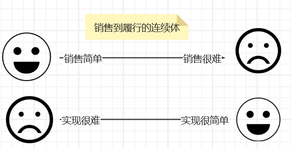
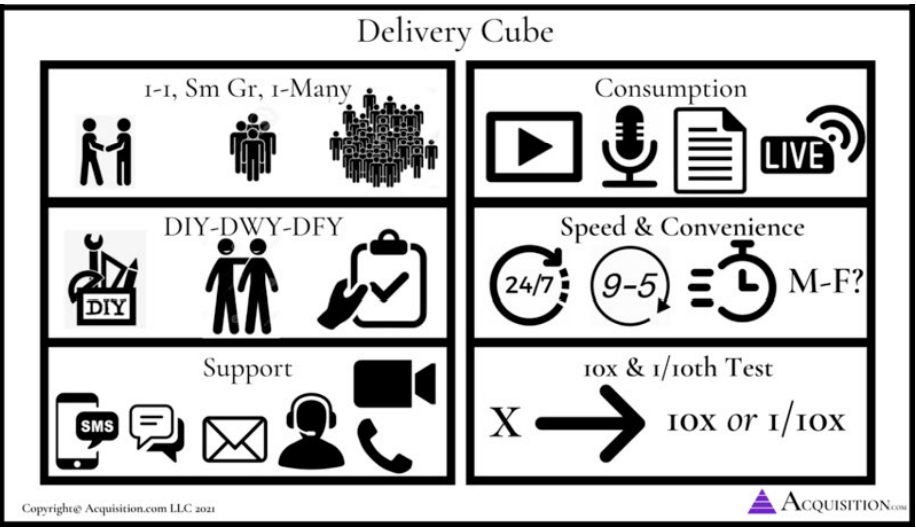
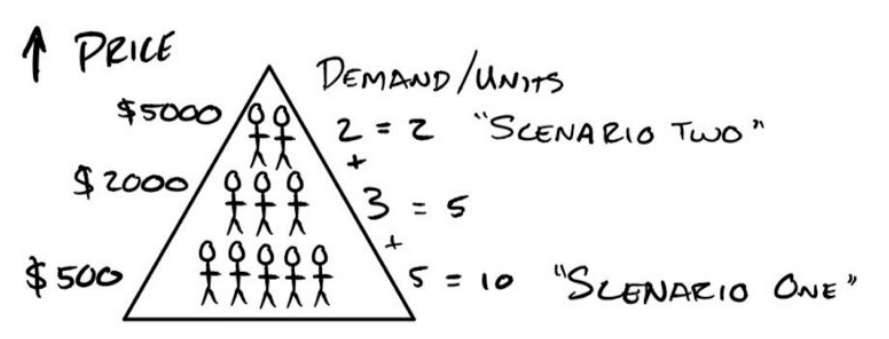
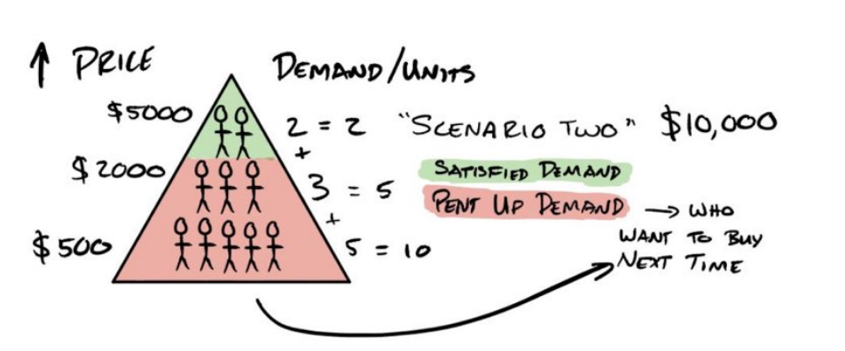
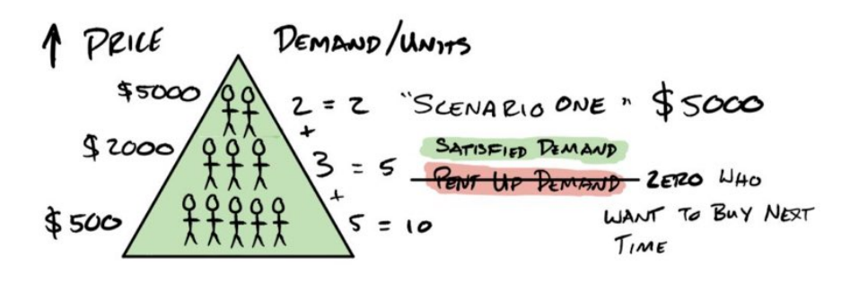

# 从这里开始

> 巨额的回报通常来自对传统智慧的押注，而且传统智慧通常是对的。给你100次10%的回报的机会，你会每天赌博。但是你还有90%的失败几率。我们都知道如果你向摇篮倾斜，你会有很大的机率出局，但是你也会打出一些本垒打。 然而，棒球和商业的区别在于棒球有一个截断的结果分布，当你挥杆的时候，无论你怎样打，你最多可以得到4分.在商业上，每当你站起来，你就可以得到1000分。由于回报的长尾特性，勇于冒险变得尤为重要，因为大量的实验尝试中，只要有几个大赢家，就可以弥补其他所有尝试的成本。

  作为一个企业家，我们每天都在赌博，我们就是一个赌徒-把我们辛苦赚来的钱压在劳动力、库存，房租，营销等事情上。所有这些都希望获得更高的报酬，大部分时间，我们都失败。但是，有时候，我们赢得很大。
  然而，在商业上赌博和在赌场里赌博是有区别的，你的胜算很大，凭借技能，你可以提高他们，但永远不能击败他们。相反，在商业上，你可以通过提高你的技能然后将机会转向有利于你的方向。简单的来说，只要有足够的技能，你就可以成为庄家。

  在开始一系列的acquisition的书之前，很明显，如果不首先解决问题，我就不能讨论任何其他问题的报价。与客户成交的起点是，你实际提供什么东西用来和客户交换钱。这是所有事情的起点。
  这本书是在讨论怎样去制作一个有收益的报价。尤其是，怎样去把广告费转换成收益，使用定价、价值、保证和命名策略。我把这些组件的组合称作“大满贯报价”。
  我选择这个术语是向上面的引言致敬（来自亚马逊创始人杰夫、贝佐斯），因为就像棒球里面的大满贯一样，一个大满贯报价既优秀又罕见。制作一个“大满贯报价”相比“三振出局”并不需要付出太多努力。这种差异来自于营销人员的技能差异和他将报价和客户的渴望连接的程度。在商业上你可以有一般的报价：使用单打和双打可以让游戏进行下去，支付账单，然后打开灯。但是，不像棒球，大满贯比赛的最高得分是4分。而在商业领域，大满贯优惠能让你获得千倍的回报，并让你从此无需再工作。他就像你完成某一次特别棒的击球后，脑袋里会想接下来一百年的所有世界级赛事都会获取成功。
  要让像`将大联盟的快速球打入看台这样复杂的事情看起来毫不费力，需要多年的练习。`你的站姿，视线，预判，球速和球棒速度和臀部位置必须完美。在市场营销和获客方面，也有许多变量必须同时符合，才能真正“大获全胜”。但是，通过足够的练习和足够的技能，你可以将获客这件事作为一场比赛，这个领域每天都会给你出难题。对于其他人来说，你的成功看起来是不可思议的。但是对你来说，这不过是另外“普通的一天”。历史上伟大的击球手都有很多出局。正如伟大的营销人员过往的推销经历中也有很多失败的案例一样。我们通过学习和失败来学习技能。我们知道十次或许有九次我们是错的。我们仍要大胆的行动，期待着我们能够成功推销的报价，从而得到丰厚的回报。
  在商业中的好消息是，你只需要完成一次大满贯报价，然后到退休。在我的生命中我已经完成了5次以上的这种操作，在我的职业生涯中有36倍的广告投入回报率。你可以把这看作我一生的“击球率”，这意味着在广告上我每花一美元都会得到36美元的回报，3600%的回报，这是我8年来的平均水平，而且还在继续尝试去提高，
  这本书是我分享这些技能给你的尝试，伴随着特别的注意力在构建“大满贯报价”。所以你可以经历相同程度的成功，这也是系列书籍中的第一本，旨在帮助企业家实现财务自由。换句话说，可以自由生活的钱。本系列后续书籍将更深入的探讨如何吸引更多客户，如何让客户更有价值，以及其他我希望在扩大业务规模时希望学到的经验。

# 我们怎样到达这里的

> 即使一起看似都已失去，魔法也会找到心灵纯净的人


这个房间漆黑一片，我的鞋子粘在了布满干苏打水和碎糖果的地板上。我的鼻孔里充满了陈旧的爆米花的味道。我们来的太晚了，没能占到好座位，最后只好挤在剧院的前排。就在我前面几排。电影的耀眼投影占据了我的整个视野。在反射出的光晕中，我能看到莱拉家人脸庞的轮廓。他们可能也被催眠了。我很羡慕他们，他们坐在那里，陶醉在圣诞节休假的快乐中。真好。换成其他人可能不太注意到，但当时的女朋友莱拉太了解我了。换成其他人可能会以为我在看电影。但莱拉能看出我目光呆滞的盯着屏幕，眼神也没有随着电影情节移动。我脸色苍白。我的颧骨和颚骨显得很憔悴，数周的长期压力扼杀了我的胃口。
  “出什么错了”，她问道。
  我无法回答。
  他把手放在我的手上以引起我的注意，我没有回应，一段时间后。她的手指紧紧握住我的手腕。她盯着我，她的眼神在我身上搜寻。你的心跳的好快，他担忧的低声说道。
  她没问就把了脉。
  每分钟100次，对于一个在凉爽黑暗的房间里“休息”的健康的27岁男性来说，这几乎是正常心率的两倍。
  “到底怎么了？”，他更用力的问道，但仍然是低声细雨。
  事实是，我非常害怕。
  几个小时之前...
  我看起来像一个巨人，我蜷缩着坐在一个儿童游戏座椅上。我的膝盖几乎挨着胸膛。即使我的脚牢牢的踩在那块旧米色的地毯上也是如此。我的笔记本电脑放在我陡峭倾斜的膝盖上时感觉很热。我周围散落着玩偶和玩具。他们睁着大眼睛，咧着嘴笑着。一动不动的盯着我，在过去的几周里，我就是他们的消遣对象。
  我当时正在莱拉的父母的房子里面。他们最近正成为了爷爷奶奶，并且用空闲的卧室改造成他们的孙子用的游戏室。我没有住的地方，所以他们让莱拉和我能住多久就住多久。他们已经让我用孩子的游戏室作为办公室进行开展业务。到了这个时候，这感觉就像是他们在这个房间给孙子们讲的虚构故事一样。
  我真的觉得自己像是在玩角色扮演，但不同的是，赌注是真实的，这就是我的生活。
  因为电话紧贴着我的耳朵，我觉得好像过了一个小时，我的耳朵变得又热又红。我不停的摆动我的手臂，因为长时间举着电话会让我的手臂疲劳。
  "Alex,我很抱歉"。电话另一头传来声音，我们必须在接下来的六个月保留这些资金。我们已经观察到了不合规的行为，所以这是我们的预防措施。
  ”你他妈的在跟我开玩笑吧，120美元的大礼包“。我说：一个”预防措施“？
  ”很抱歉先生，我们的承保团队...“
  是的，我用到了，打断了他的话。“我不接受这个”。
  “先生，他不取决与我，他只是我们的波尔”
  “我要怎样对我的销售员说，那些有孩子和还未出生孩子的销售员”，你要跟他说他不能给怀孕的妻子和未出生的孩子买食物？你会帮他支付抵押贷款吗？“
  我沸腾了。
  ”先生-“，毫无阶段性的冷漠，只是想传递这个消息。
  ”这不是你可以拿走的“，我的愤怒很快就转换成了失望。我只要还给我一半，然后让我可以给我的员工发工资。我恳求道，”这还是圣诞夜“。
  ”先生，根据您的协议，我们将要保留您的接下来六个月的资金“，声音渐渐远去。
  ”草“。
  我挂断电话并检查了我的账户。
  我欠销售员2.2W的佣金支票，但是我从未得到12W的销售收入。
  不想给我自己机会去思考它，我就把消息传给了他。
  2.2W美元支付成功。
  余额还剩 $1036。
  
  当我从日场出现的时候，阳光刺的我睁不开眼。家庭随着旋转门进出，制造他们的快乐回忆。我当时愣住了，莱拉拉着我来到车旁，她的手紧紧握着我的手。
  ”发生什么事了“，她问道。
  ”钱还没来“。
  ”你的意思是？“他问道：”延期了？“。
  我失败的叹了口气，“他们保留着这一切”。
  “他们能做到吗？”。
  “显然”，我坚忍的说。试图在她的父母面前保持镇静。
  “你打算怎么处理这些佣金？”。
  “我已经付钱给他了”，说这话的时候我没有看着她。
  莱拉的担忧变成了恐惧。
  我们回家的路上一路无言，我盯着窗外，她紧抓住我的手。相比我预期的更加欣慰。我们会度过这个难关。


  <hr/>
  
  
  三十天之前...
  我决定全力投入进“健身房启动”的新业务。这是新主意。我将飞到全国各地的健身房使用新方法最大化的填充。该方法取决与我拥有连锁健身房时完善的报价。
  直到这一刻，我已经卖掉了我的六个健身房中的5个。这些资金来自与我卖健身房的钱。我一生的工作。我已经放进我和另一个合伙人建立的一个账户。这些钱应该是我的新公司的种子资金。
  我终于要实现某种程度的成功。
  我的闹钟响了，我昏昏沉沉的摆动手臂，麻木的抓着床头柜。我关闭了闹钟，而莱拉在骚动中睡着了。
  我静静的躺在那儿，打开银行账户，例行公事。余额是300$。
  等等，不对。昨天账户里有46000$。
  我的肾上腺素飙升。靠近一看我有一个支付45700$成功的交易，我很疯狂。
  卖掉所有健身房的钱已经没了。我查了一下钱去哪儿了，致我的伙伴，他把钱都拿走了。
  ”草“。
  我最近的四年生命就消失的那么快。我正式一无所有，甚至没有什么可展示的，没有健身房，没有设备，没有员工，什么都没有。
  我感觉自己死了。
  雪上加霜的是，在同一个30天时间段内，我的母亲因险些丧命的事故而生命垂危（而且仍在24小时监护）。我的车在每小时60英里的速度迎头相撞时完全报废。而且赢得了一个酒驾作为安慰奖。
  这是我的樱桃，这段时间我的可取之处是在健身房出售一项新的挑战优惠，并预先收取现金作为我扭转业务的费用。
  所以我做了唯一我知道的事，我的推销员一个月的销售额为12W美元，所以我欠他2.2W美元的佣金支票。
  问题是12W美元从未到账。
  “我们需要谈一谈”，我跟莱拉说完之后进了另一个房间。我鼓起勇气去说出口，但是眼睛却尴尬的盯着地板。
  “我什么都没得到”，我对他说。我是一艘正在下沉的船，你不必留在我身边。
  她拉过我的下巴，然后拉过我的脸对着他的脸，好让我们四目相对。“如果到了那个时候我会和你一起睡桥下”。我本来会留下喜悦的泪水，但是我的情绪太疲惫了，我的反应很冷漠。
  我不会留在我身边。
  “从明天开始我们还会进行这些发布吗？”，她问道，“我所有的朋友都辞了工作来做这件事”。她说的是事实，但是它任然还刺痛了我。我感觉自己被打败了，“听着，这很有可能出错”。
  “我相信你，我们会解决的”。
  那时我还剩下两件事：一份大满贯优惠和从我拥有健身房时的一张限额为10W美元的商业信用卡。圣诞节后第一天（在和支付处理商交流两天后），我们计划启动6个新健身房。与此同时，机票、酒店、租车、汽油和广告费。每天要花掉我不曾拥有的3300美元。我最后一美元都用来支付我的推销员了。我还记得广告投放时我的手在抖。关-开。
  就这样，我负债累累，每工作小时都要花费412美元。就这样，每天3300美元从我账户上扣除。
  
  - -3300$...我现在正式一无所有
  - -3300$...我现在几乎一无所有
  - -3300$...我还剩10000美元，总比一无所有
  - -3300$...这个决定将永远毁掉我的未来

  但是事情开始好转，这是当月（2017年1月）发生的事情，正如我挖出的旧处理记录记录的。你可以在左栏看到月份，然后在右栏看到收入。
  
  我们赚了100,117美元。这仅仅够支付每天从信用卡扣除的3300美元。它实际上正在工作，我很难相信他，我投掷了冰雹玛丽，宇宙抓住了它。我从寻找破产律师到弄清楚如何处理300W美元的利润。前12个月的积累，感觉超现实，事后看来，它仍然是这样。
  到年底，我们的收入已经达到150W美元每个月，两个月之后，440W美元每个月。每个月，那之后的24个月，我们的销售额突破了1.2亿美元。捐赠200W美元帮助资助低收入地区的的平等机会。我们遇见了施瓦辛格并被邀请成为他的慈善机构“After All Stars”的董事会成员。
  十二个月后，我们现在拥有七八位数的投资组合，以及跨越各种行业（摄影、出版、健身、商业咨询、美容）和业务类型（实体连锁店、软件、电子商务、培训和教育）的八位数公司。我们的投资收入组合现在每周收入约为160W美元/周（并且还在不断增长）。
  我说这些是因为我真的很难相信，所有的这些东西都来自于一个女孩相信我，一张信用卡，和一个大满贯优惠。
  我知道我将你从赤贫变成了富有。而且最初的问题是什么？这就是我将本书的剩余部分用来分解的内容。
  做Offer的技能把我从破产拯救出来，并可能挽救了我的生命。我一生中犯了很多错误。我做过很多错误的人生决定，我故意或错误的伤害了别人，我曾怀着好意做过好事，我说这些是因为我是一个人。我不要假装知道答案，我有自己的恶魔，并每天都和恶魔战斗。但是，尽管我有很多缺点，但是我在制作Offer这件事上做的非常好，我想把它分享给你。
  我不知道你是谁（你，正在阅读这本书的人）。但是从心底里感激你。感谢你允许我做我认为有意义的工作，感谢你给我你最有价值的资产-注意力。我承诺尽我所能给你最好的反馈。
  这是我的第一条好消息，如果你正在阅读这本书，那么您已经跻身前10%。大部分人买了东西然后很快忽略它。我也可以剧透一下，你在书中读的越深，你挖掘到的金块就越大。好好看看吧。
  这本书提供了。
  这个世界需要更多的企业家，它需要更多战士，他需要更多魔法，这就是我要与你分享的-魔法。

## 大满贯优惠

> 给人们一个很好的报价，让人们觉得拒绝很愚蠢

  当我在23的时候，引用《黑钱胜地》里露丝的话，我对“草”一无所知。但我当时就在拉斯维加斯的一家顶层公寓里，给10为老板销售我的“野兽派”T恤（我免费的到的一件衬衫，以及我拥有的5件衬衫的一件）。
  说实话，我是焦虑的，自我意识的，而且认为我正在犯一个大错。我已经付了3000美元，我不必在桌子上找到座位。我知道我需要学习，那里的每个人都有自己的事业，除了我，我本来打算开一家健身房。
  TJ，会议的组织者，有多个成功的业务。当议程讨论到他时，我记得他随口一说他一年会赚100W美元。
  一百万美元，我被迷住了。我想像这个人一样。我可以做任何事，问题是，我不知道他们在说什么，关键绩效指标？CPL？转换率？当我假装知道他们在说什么时，我的头开始旋转，但是我没有，我不擅长伪装。
  在会议间隙，TJ找到了我，他看出来我有点不知所措。TJ很好奇，友善，并关心他人。闲聊了一会儿以后，他问了我一个简单的永久改变了我一生的问题。
  “你知道销售的秘诀是什么吗？”
  在我的生命里从来没有销售过任何东西，我甚至从来没有读过一本销售相关的书，我最近才知道这个词的意思（严肃的）。我向前倾身，想把他说的每一个音节印进我的脑子里。我打开记事本，专注的盯着他，我已经准备好接受这个秘密了。
  他严肃的看着我说：“给人们一个很好的报价，让他们觉得拒绝很愚蠢”。
  我点了点头，写下来，划线，圈起来。就这样，我的销售世界观发生了转变。
  我的思绪开始飞速运转，我不必很熟练，甚至得到任何好处。我只需要想出任何人都会同意的事情，我生命里最棒的游戏开始了。

### 本书的内容

  在某些时候，每一个成功的企业主都是一名想要创业的人。一个充满想法但因没有潜力而感到沮丧的人。当某些人认识到他们所做的糟糕交易时灵光一闪（很多人都这么做）。用他们的自由交易（错误的）感知到的安全。他们的不适加剧。一旦保持不变的不适感超过了改变的不适感。他么迈出了一步。我要成为一名企业家，那么我就自由了，自由的做我想做的事情，和任何的人，再任何的时间。
  有些人通过个人发展了解了企业家精神。其他人则因为特许经营权进入了这个领域。
  其他人购买了课程。
  有些人只是说，去他妈的，我正在做，我要让他发挥作用。
  他们做到了并使其发挥作用。
  我们大多数人开店是为了以某种方式帮助别人。很多时候，这种帮助在某种程度上与影响我们个人的事情有关，我们开始回馈，为他人提供价值，帮助他们解决曾经困扰我们的问题。话又说回来，有些时候这又不是我们的出路。我们坚持比现在赚的更多、更自由的梦想。
  我们很多人天真的以为，拥有一家企业是我们人生至高的成就-终点站-实际上，这只是一个开始。
  不知何故，在拥有我的第一笔生意和热衷于帮助他人的转变中。我们逐渐意识到我们连做生意的基本知识都不知道，更别说盈利了。我们可能对我们的热情了解很多，但是关于为什么我们开启创业，但这并不代表着我们对商业成功一无所知。让旁观的理想主义者失望。商业成功意味着让潜在客户为我们提供的服务付费。我们对他们来之不易的硬币的热情，这就是协议，促进他们交流的唯一方法。交易，实际上是通过向潜在客户提出要约来开展业务。

#### 无论如何，优惠是什么？
  
  开展业务的唯一途径是通过价值交换，以美元换取价值的差异。报价是发起此交易的原因。简而言之，报价是你同意或给予的商品或服务。您如何接受付款，以及协议条款。这是吸引客户和赚钱过程的开始。这是任何新客户在与您的业务中互动的第一件事。由于优惠是吸引新客户的因素，因此他是您业务的命脉。
    - 没有报价，没有生意，没有生活
    - 报价不好，负利润，没有生意，糟糕的生活
    - 体面的报价，没有利润，停滞的生意，停滞的生活
    - 好报价，一些利润，好的生意，好生活
    - 大满贯优惠，高利润，疯狂的生意，自由
  这本书帮助企业家制作大满贯报价，这些优惠是如此有效、有利可图并且可以改变生活，以至于他们似乎只能是运气的结果。至少对于未经训练的人是这样的。
  你可能现在知道，过去的十年里我已经制作了数十个报价，大部分失败了，一些做的很好，一些人挖到了金子。但我从来不知道为什么。正如斯坦福商学院著名教授伯格曼教授所说。理解自己失败的原因比不知道自己要和成功的原因好很多。
  但是，随着数据滚滚而来，看起来“财富”和“运气”更接近与一个可重复的框架。我很高兴能够多次获得金币来纪录这些框架，并获得“闪电两连击中”的机会。
  我已经将这些框架的步骤和组件以逻辑易于理解的方式呈现，所以他们实际上很有用。今天，像现在一样，我给你行动。而不是一本悲伤但典型的含糊商业理论和精神自慰的书。

##### 大多数企业家面临的问题以及他们如何解决这些问题
  尽管你可以把你要面临的问题列出一英里长，这是释放压力的好办法。所有这些问题通常都源于一个大问题。
    1. 没有足够的客户
    2. 现金不足（月底有超额利润）
  看起来很明显，对吗？花费更多的时间和金钱来获取更多的客户，从而解决问题一，这笔钱来自利润率。这就产生了问题二。还有什么更烦人的。潜在客户野蛮的比较和贬低我们的服务，转而选择更便宜，更糟糕的解决方案。以最便宜的“获胜”。当然，获胜意味着以更少的钱做更多的工作时（悲伤）。
  假设您降低了价格用以吸引更多客户，你甚至可能拥有完整的客户端负载，但你在这里。由于利润率太薄二勉强成功。“竞争”变成了逐底竞争。
  如果您正在努力解决其中一个或者两个问题，你并不孤单，我去过那里。
  哎呀，我认为每个企业家面临相同的挑战。
  我也想让你知道，这不是你的错。典型模型不是为了利润最大化而设计的。他们是由运营大量资金并且可以亏损运营很多年的公司设计的。但这些模型被用在现实世界。企业主只是“勉强度日”。他们本质上是给自己买了一份工作，每周工作100小时，以避免工作40小时。蹩脚的交易。我的猜测是，如果你和我一样，我就会注册更好的东西。
  保持开放的心态，如果执行本书的内容，可以改变你的业务...快速的。
  如果您不关心金钱数字或者商业模式，我已经为你做了所有这些工作。我将在这些页面中逐步引导您完成这个过程。我将详细解释我们上面提到的两个大问题。包括为什么他们不起作用。然后我将给你展示解决方案。而且结束这次冒险。我将解释如何提供价值以最大限度提高每个客户的收入。这样你就可以超越所有人并积累现金。
  我们对我们合作的每个利基模型都使用这个模型（牙医，健身房，机构，水管工，屋顶工，遛狗者，实际产品，实体产品，软件，实体店等等）。令人惊奇的是，当他们使用这个框架的时候，他们每一个人的进度有多快。

### 他对你有什么作用

  我犯过书中每一个错误（愚蠢的）。现在，你可以从我的尴尬，残酷，耗资数百万元的糟糕事情中获取教训，而不用自己承受痛苦。
  建立这些企业对我来讲是一段非常艰难和感人的旅程。我不会用这些经验来换取世界，然而，如果这本书能帮助一个企业家避免像我一样的痛苦，保持业务开放，或者实现自己的梦想，这一切都是值得的。如果你愿意用看两集你最喜欢的电视的时间来交换并真正学习这本书。- 如果你实现了一个报价组件-我可以保证增加更多的客户和更多的资金来增加自己的利润。读完整本书，并牢记在心。将是您的企业按时获得的最佳回报。没有其他任何办法可以让你在同样的时间完成本书的任务。这是一个承诺。
  作为附带好处，实施新优惠是企业中最容易做的事之一。所以你真的可以做到这一点。这不是某种管理实践或文化建设的不祥之兆。这才是真正的“买狗屎挣大钱的东西”。

#### 这对我有什么好处？
  
  我提供所有的材料（这本书，课程以及您在acquisition.com找到的其他书籍和课程），免费或有成本尽可能的帮助更多人赚更多钱并服务更多人。我制作这些课程的目的是提供比1000美元更多的价值。任何价值3W美元的教程，或者价值20W美元的大学学位。我这样做是因为，尽管我可以以这种格式出售这些材料。我只是不想，我靠做这些事赚了钱。和大多数营销界的人相反，没有教如何做这些事情，所以我的模型是不同的（稍后将解释更多）。
  话虽这么说，我希望为我出版的材料提供价值的两个原型。对于原型1，企业家年收入低于300W美元。我的目标是帮助您实现目标并赢得您的信任。尝试本书中的一些策略。观察他们工作，再尝试一些，再尝试他们的工作。等等，您在自己的业务中看到的成果越多越好。一旦您成功了，你就会成为原型2，年收入在三百万美元-1千万美元之间的企业家。一旦你到达那里，或是你现在在那，我很荣幸能投资您的业务并帮助您突破3千万，5千万，1亿美元。
  我不卖教程、策划、或者类似的东西，代替的是，我有一个公司的投资组合，我利用公司所有的基础设施，资源和团队来快速跟踪他们的发展。
  但别相信我...我们才刚认识。
  如果你好奇我的商业模式的话，我的商业模式很简单，就像四块金字塔标志一样。
  1. 免费提供远远超过市面上其他产品的价值
  2. 让企业家使用实际有效的材料并赚钱帮助更多的人
  3. 赢得超级执行者-企业主的信任，使用这些框架将业务扩展到每年3百万-1千万元甚至更多
  4. 投资这些企业以产生更大的影响力，同时免费帮助其他人

  如果你仔细观察，就会发现这个过程是一个成功的逆向工程。我认为这很酷。方法如下：我知道企业主无需手动操作就可以执行我拥有的框架。因此，下一组框架很可能会取得成功（达到3千万、五千万、一亿看起来都和3-10千万美元不同）。他们知道我的风格适合他们，因为他已经有了。因此，我们以共同的信任为基础开展业务。我相信他们能够执行，他们相信我们的东西有效。其次，因为他已经拥有了一切，同时帮助了其他人。免费的。因此，他使我能够先发制人的避免失败并大大增加成功的可能性，让我告诉你多少钱。
  在写这篇文章的时候，自2017年3月以来我创办的每家企业都实现了150W美元/月的运行率。根据小企业管理局，单个企业每年收入达到1千万美元的机率为0.4%，即250分之一。连续发生四次是 0.4%*0.4%*0.4%*0.4% 很低的概率。因此，我可以坚定的说，我可以用我分享过的一遍一遍的框架来实现成功。他们之所以有效，是因为他们是永恒的商业原则。
  我每天都积极的想象，半夜醒来出冷汗是什么感觉。想知道我该怎么发工资。这种令人痛苦的冥想让我作为一名企业家充满渴望。但也对我的安全感和内心的平静充满感激。我希望你和其他任何关心自己所做事情的人都能得到后者。
  很公平？
  凉爽的，让我们开始吧。
  
#### 本书的基本概要
  
  这本书旨在成为一种资源，作为一种资源，我的意思他将您通读的内容，然后保留在您的工具箱内。一次又一次的回到他，为什么？正如爱因斯坦所说：“永远不要记住任何您能查到的东西”。商业不是一项观赏性运动，你不会为了期中考试临时抱佛脚，而且你也不是什么软弱无力的哲学家。
  你做工作，为了工作，你需要一些工具。我的朋友，这些就是工具之一。

### 总体概要
  
  第一章：我们怎样到达这里的（我们已经完成了）
  第二章：定价，如何为商品收取大量费用
  第三章：价值，创造你的报价，如何让人们购买的好东西
  第四章：提高你的出价，如何让你的出价如此好，让他们都觉得拒绝是愚蠢的
  第五章：后续步骤，如何在现实世界中实现这一目标

## 第二章：定价
  
### 定价：商品问题

> 想法不同

  "生或死"是我们公司的核心宗旨，我们相信每个个人，每个公司，每个组织要么正在增长，要么正在消亡。维护是一个神话。
  这意味着什么？如果你的公司没有成长，它就正在消亡。这是一个发人深省的现实，对于大多数人来说。我经历了惨痛的教训，我的生意因此遭受了很长一段时间的损失。
  让我解释一下，这个市场在不断增长，股票市场每年增加9%。如果我们不以每年9%的速度增长，我们落后了。维护，从最简单的意义上来讲，将是同比增长9%。
  此外，如果您处于不断增长的牛市中。那么你可能以每年20-30%/年的速度增长。只是为了跟上，否则就有落后的风险。所以你可以看到维护是多么的神话。
  所以，成长需要什么？
  谢天谢地，只需要三件最简单的事情。
  1. 获得更多的客户
  2. 提尕他们的平均购买价值
  3. 让他们购买更多次

  就是这样！
  当然，获取客户的方法又很多，增加订单价值和购买频率的方法也有无数种。但是，简单的说，就是这样，这是唯一的三种成长方式。
  示例：如果我每月销售10个客户。客户一生对我来说价值1000美元（通过平均购物车价值*购买次数）。那么我的业务上限为1W美元/月。
  十个新客户/月 * 1000美元终身价值 = 1W美元/月 最大收入
  如果你想成长，你必须每月销售更多客户（同时保持适当的利润），或者让他们更有价值（通过增加每次购买利润和购买次数）。就是这样。
  
#### 商业条款

  在继续之前，并更好的充实接下来的概念。我们应该花些时间来定义和更好的理解一些关键的业务概念。当我穿着“野兽T恤”站在拉斯维加斯的顶层公寓时，我对这些术语一无所知。让我帮助你变得比我更好。
  毛利：收入减去为额外客户提供服务的直接成本，如果我以10美元的价格出售乳液，那么我的成本为2美元。我的毛利润是8美元或者80%。如果我已每月1000美元的价格出售代理服务，那么我每月要花费100美元来运营该客户的广告。当我的毛利润是900美元或90%时。
  注：这不是净利润，净利润是支付所有费用后剩下的的部分，而不仅是履行的成本。
  终身价值：客户整个生命周期累积的毛利润，这是毛利润*普通客户一生中的购买次数。使用上面的示例，如果客户平均停留5个月。他们每月要支付1000美元，而我每月要支付100美元完成任务，那么他的终身价值是4500美元。
  分解如下：
    收入：（1000美元/月 * 90%毛利 * 5个月） = 4500 美元 （终身价值）
  请注意：管理、软件、租金等成本等非直接花费不算在内
  注意：根据来源，你会发现生命周期价值的不同定义。最大的区别在与，有些只计算总收入，有些只计算整个生命周期的毛利，我关注的是毛利润。为了清楚起见，您可能会在其他文本中看到我将其称为LTGP终身毛利润。

#### 价值驱动 VS 价格驱动的购买

  本书旨在成为任何企业想要发展的教科书，我已经花费（并将继续花费）数百个小时的时间和企业家通电话，或者面对面会议咨询企业家如何制定他们的报价。我见过那些起飞进入平流层和那些失败的。
  拥有大满贯报价几乎不可能失去。但为什么？是什么赋予他们这么大的影响力，简而言之，拥有大满贯优惠有助于满足增长的三个要求：吸引更多客户，让他们支付更多费用，以及让他们做这样更多次。
  如何，它可以让您从市场脱颖而出，换句话说，它允许您根据价值而不是价格来销售商品。
    商品化：价格驱动购买
    差异化：价值驱动购买（在同类产品中销售，没有可比性，是的，市场很重要，我将在下一章详细阐述）
  正如我所定义的，商品是一种可以从许多地方获得的产品。因此，人们倾向于根据“价格”，而不是“价值”进行购买。如果所有产品都是平等的，那么默认情况下最便宜的就是最有价值的。换句话说，如果潜在客户将您的产品与其他产品进行比较并认为：“这些产品几乎相同”，我会购买更便宜的产品。然后他们将你商品化，多尴尬啊，但这是价值驱动型企业家遇到的最糟糕的事情。
  这对企业家来说是一个大问题，因为商品是根据市场效率来定价的。这意味着市场通过竞争来降低价格，知道利润刚好足以维持运转，“刚好”成为他们业务的奴隶。
  该企业的收入刚好够，足以让业主焦虑的等待事情好转。当这个谎言被实现的时候，他们陷得太深而无法扭转（至少到目前为止）。
  大满贯优惠解决了这个问题。

##### 但大满贯优惠有什么作用？
  
  好的，让我们首先定义大满贯报价。
  这是您向市场提供的报价，无法与任何其他可用产品或服务进行比较。结合有吸引力的促销，无与伦比的价值主张，溢价。以及无与伦比的货币模型保证（付款条件）这可以让您获得报酬来获得新用户，永远消除业务增长的现金限制。
  换句话说，它允许您以一个类别进行销售，或者，套用另一个伟大的短语，“真空销售”。潜在用户的购买决定现在是在你的产品和虚无之间。因此，你可以以潜在用户感知的任何价格销售，不与其他任何事物相比，因此，他以更高的票价带来更多的用户，为了更少的钱，如果你喜欢花哨的营销术语，他会这样分解。
    1. 提高响应率（思考点击次数）
    2. 增加转化（想想销售）
    3. 溢价（认为收取很多钱）
  获得大满贯报价可以提高您对广告的响应率（也就是更多人会看到包含大满贯优惠的广告并且行动）。
  如果你为眼球支付相同的金额，但是：1）更多人响应 2）更多的回复会购买 3）他们以更高的价格购买，您的价值就会增长
  我在自己的优惠中“挖到了金子”。不是因为我有超能力，而是因为我已经做过很多次了（并更加失败）。我整理了长期失败的东西，并把可重复成功的东西装进了口袋（并把它放进这本书里）。
  这是所有这一切的关键要点：企业在这两种情况下都做相同的工作（商品化或者大满贯），实现是一样的。但是如果一家企业使用“大满贯报价”，另一家使用“商品”报价。大满贯优惠是该企业看起来好像拥有完全不同的产品。这意味着价值驱动而非价格驱动的购买。
  如果您有商业报价，您将在价格上竞争（价格驱动型购买和价值驱动型购买）。然而，您的大满贯报价会迫使潜在客户停下来并以不同方式思考，以评估您的差异化产品的价值。这样做会让你成为自己的类别，这意味着比较价格太困难。这意味着你需要重新校准潜在客户的价值计量表。

##### 现实生活的大满贯提供金钱数字：之前和之后

  快速背景故事...我们的一家公司是广告公司用来为其客户寻找潜在客户的软件。使用该软件，代理机构将他们的报价从商品化的潜在客户生成服务转变成按绩效付费的大满贯报价。让我向您展示他对企业收入的乘数级影响。
  虽然为了说明四舍五入，这些值基于像实体企业销售服务的潜在客户开发机构的实际经验数据。
  旧的商品化方式（价格驱动） - 竞逐到底。
  商业化报价：首付1000美元，然后每月1000美元作为代理服务聘用金。
  
  分解：广告支出回报率为0.5：1,你在吸引客户方面会损失金钱。但30天内，这5位客户将每人再支付1000美元。这样您的总金额当达到10000美元，实现收支平衡。
  下个月，收入5000美元将是您第一个盈利的月份。此后的每个月都会盈利（假设他们都留着）。
  这是商品化服务的一个例子-正常的代理工作。一百万个，而且看起来都一样。商品化的企业和优惠很难从广告中获得回应。因为他们所有营销看起来都与其他人相同。
  很有道理，但很容易被复制（并受到商品化的影响）。这种商品化创造了价格驱动的购买。
  你被迫以有竞争力的价格来吸引客户，并保持这种方式用来留住他们。如果客户看到“同样的东西”的更便宜版本。那么价值差异将导致他们更换供应商。这是一个两难的境地...失去这个客户，其他客户和潜在客户。或者保持竞争力，你的利润变得如此微薄以至于消失。
  此外，很难让潜在客户答应（让他们说“是”），除非你对客户通过保持竞争力将你的业务商品化高度警惕。这就是旧的商品化方式的问题，他们可以比较，除非您使用大满贯优惠。否则您的价格将不断被压低。企业最终会认输，企业最终会消亡。没有布埃洛。
  我们希望提供与众不同的报价，以便您跳过关于为什么您的产品与其他产品不同的解释（如果他们不得不问，那么他们可能太无知，无法理解其中的解释）。而是让报价为您服务，这就是大满贯方式。
  让我们深入进去看看销售数字的对比。

##### 新大满贯报价方式（差异化，无与伦比）（价值驱动）

  大满贯优惠：一次性付款。（没有经常性费用，无保持器）。只需覆盖广告支出，我会帮您找到潜在客户。只有当人们出现时才付钱给我。我保证你第一个月就会吸引20个人。或者您可以享受下个月免费的服务。我还将提供来自像您这样的企业的所有最佳实践。
    - 为您的员工提供日常销售辅导
    - 测试过的脚本
    - 经过测试的价格点和可滑动和部署的优惠
    - 销售录音
  以及销售和满足客户需求所需的一切，我会给你整个剧本（插入行业），成为客户完全免费。
  简而言之，我正在让人们进入你的生意，准确的向您展示如何出售他们，以便您可以获得更高的价格，这意味着您可以赚到最多的钱，这听起来很公平。
  很显然，这些是截然不同的报价，但那又怎样？钱去哪儿了？让我们在下面的图表中找一下。
  
  分解：你花同样的钱买相同的眼球，然后，您的广告回复人数会增加2.5倍。因为这是一个更具吸引力的报价，从那里，您关闭的人数是原来的2.5倍，因为报价更具吸引力。从那里，您可以预先收取4倍的价格。最终结果是预先收集的现金增加了2.5*2.5*4倍=25倍。是的，您使用10000美元赚了112000美元。您刚刚赚到了新客户的钱。
  对比：记住老方法，您预先损失了一半的广告支出。通过新方式，您可以赚更多钱并获得更多客户。这意味着您获取客户的成本很便宜（相对您的收入）。您的限制因素是你做你喜欢做的工作的能力。现金流和获取客户将不再是您的瓶颈，因为他的利润比旧模式高22.4倍。是的，你没看错。这是动作片中你以慢动作逃离爆炸的部分。
  这是我们在为代理机构提供服务的软件业务中使用的大满贯优惠，数字可能变得狂野。快速的，我知道22.4倍更好听起来不合理，但这就是重点。如何你和其他人玩相同的游戏，你就会的到和其他人相同的结果（平庸）。你打单打和双打，保持灯亮，但永远不会领先。但请记住这本书的开头段落。当你把所有棋子对齐时，你就能把它从公园击倒，从而永远获胜。在我创业的头18个月内。我们的广告支出从每年50W美元到每年2800W美元。所以，当我说20：1，50：1，100：1回报时。我是认真的，当你做到这一点时，结果就是，嗯，难以置信。

### 总结要点

  本章阐述了商品化的基本问题和大满贯优惠如何解决这个问题，这可以让你摆脱价格战并进入一个类别。下一章将侧重于寻找正确的市场来应用我们的定价策略。这是最重要的事情之一。向错误的观众提供大满贯报价将被置若罔闻。我们希望不惜一切代价避免这种情况。我们必须暂时远离定价来了解在市场中到底寻找什么。在继续我们的旅程之前，这是一个必须检查的复选框。


## 定价：寻找合适的市场和饥饿的人群

  > 落在好土里的种子代表那些真正听神的话，明白神的话的人，所结的果子是所种的30倍、50倍、100倍。 - 马太福音 13:23
  
  一个市场专家问他们的学生，如果你要开一家热狗摊，你只能比你的竞争对手有一个优势，会是哪一个？
  “地点，质量，价格低，最佳口味！”。
  学生们一直继续下去，直到最后他们没有答案。他们面面相觑。房间终于安静下来。
  教授微笑着回答：“饥饿的人群”。
  你可能会吃到最糟糕的热狗，可怕的价格。并且处于一个糟糕的位置，如果你是镇上唯一的热狗摊，并且当地的大学橄榄球比赛开始了。你会卖光的，这就是饥饿人群的价值。
  归根结底，如果对解决方案有大量需求，你的生意可能很平庸，报价很糟糕，没有能力说服别人，但你任然可以赚钱。
  一个例子是COVID-19初期卫生纸的短缺。没有报价，定价很糟糕，而且没有令人信服的推销宣传。但因为人群如此之大，又如此饥饿。一卷卫生纸的售价是100美元或者更多，这就是饥饿人群的价值。

### 卖报纸

  我的好朋友劳埃德拥有一家软件公司，为报纸提供服务近10年。他们只需点击几下就可以在报纸网站上设置数字广告服务，并帮助他们销售全新的广告产品。他只向他们收取他增加的收入的一定比例。所以，如果他们什么也没做，他也没有，这对报纸来说是纯粹的收益，也是一个很棒的报价。
  但是，尽管有很好的报价和自然的销售能力，他的生意开始下滑。作为一名成就卓著的企业家，他尝试了各种不同的角度来解决问题。但都没有效果，他不明白问题出在哪里。我很难看到他为此挣扎，因此我认为劳埃德比我聪明的多，答案对我来说似乎是显而易见的，但看着他经历这一切是我一生的教训。在我透露之前，你认为问题出在哪里？产品？营销？报价？还是他的团队？
  让我们来分解一下，这不是他的产品-那很棒，这不是他的提议，他有一个零风险的收益分成模式。这不是他的销售技巧-他是一个天生的推销员。那么，问题出在哪里呢？他正在卖给报纸，他的市场每年萎缩25%。除了最明显的一个角度外，他已经看过了所有的角度。最终，经过多年的市场攻坚战，他意识到他的市场是他问题的根源，并决定缩小公司规模。
  别担心-这个故事有下半场。为了说明市场的导向，新冠疫情一袭来，劳埃德就转向了。他创办了一家自动化口罩制造公司。
  借助新技术，它使每个口罩的成本低于人们从中国购买口罩的价格。五个月内，他的收入达到数百万美元。同一个企业家，市场不同，他将同样的技能用到了一个他零经验的企业中，并取得了胜利，这就是选择正确市场的力量。
  我给你这个故事作为一个警示故事，您的市场很重要，劳埃德是一个非常聪明的人，显然他非常有能力，但作为企业家，我们都可能被蒙蔽，以为我们不喜欢放弃。我们太习惯与解决不可能的问题，以至于我们会把头撞在墙上。我们讨厌放弃，但现实是每个人都受到市场的影响。
  那么如何选择合适的市场？

#### 寻找什么

  有一个市场迫切需要你的能力，你需要找到他，当你这么做时，你会充分利用，同时想知道是什么花了你这么长的时间。不要对你的观众浪漫，为那些能够支付你应得的报酬的人服务。请记住，选择市场就像任何事情一样，始终是我们的选择，因此请明智的选择。
  为了销售任何东西，你需要需求，我们并不是试图创造需求，我们正在努力引导他。这是一个非常重要的区别。如果你的报价没有市场，那么接下来的一切都行不通。整本书都基于这样一个假设，至少有一个正常市场。我将其定义为与市场相同增速前进的市场。并且有共同的未满足需求，属于一下三类之一：改善健康，改善财富，改善人际关系。例如劳埃德，根据上面的报纸故事，可以读完整本书，但这里的任何内容都对他不起作用。为什么？因为他的目标是报纸，一个垂死的市场。
  话虽这么说，拥有广阔的市场是一个优势，但你可以在一个平均速度增长的市场中赚到疯狂的钱。我去过的每个市场都是正常的市场，你只是不想把冰卖给爱斯基摩人。以下是我在市场中寻找的基本原则。在我们回到报价之前让我们先回顾一下他们。
  在选择市场时，我会使用以下四个指标：
  > 痛苦+购买力+容易实现+增长
  
  1. 巨大的痛苦
    他们一定不想要，但迫切需要。我提供什么，痛苦是任何使人们生活感到沮丧的事情。破产是痛苦的，糟糕的婚姻是痛苦的。在杂货店排队是痛苦的。背痛...笑容丑陋痛苦...超重的痛苦...人类承受着很多苦难。所以对于我们企业家来说，无限的机会比比皆是。 
    疼痛的价格与您能收取的价格成正比。有关此内容的信息，请参考“值方程”一章。当他们听到解决他们痛苦的方法时，相反，如果没有这种痛苦，他们的生活会是什么样子，他们应该被你的解决方案所吸引。我有一句话用来培训销售团队。“痛苦就是音高”，如果你能准确表达潜在客户遭受的痛苦，他们几乎总是会购买你们提供的产品，潜在客户必须有一个痛苦的问题需要我们解决，并为我们的解决方案收费。
    我有句话用来培训销售团队“痛苦在于营销”，如果你能够准确的表达潜在客户所感受的痛苦。他们几乎总是会购买您提供的产品。潜在客户必须要有一个痛苦的问题需要我们解决，并为我们的解决方案收费。

  > 专业提示： 好的写作的重点是让读者理解，良好说服的要点是让潜在客户感到被理解。

2. 购买力
    我有一个朋友有很好的系统，可以帮助人们改进简历以获得更多的面试机会。他很擅长，但尽管他尽力了，他就是无法让人们为他的服务付费。为什么！因为他们都失业了。
    这似乎又是显而易见的，但他认为，这些人很容易成为目标，他们正承受着巨大的痛苦，他们的数量很多，而且还在不断的增加新人。这是一个巨大的新人。
    他只是忘记了一个关键点，您的受众需要能够负担起您向他们收费的服务。确认你的目标有钱。或获得金额，需要以您需要的价格购买你的服务，以使其值得你花时间。
3. 易于瞄准
    如果说你有一个完美的市场，但无法找到组成他的人，好吧，提出大满贯报价会很困难。我通过寻找易于定位的市场让我的生活变得更轻松。这方面的例子是具有所属协会的化身。邮件列表，社交媒体群组，他们都观看的频道等。如果我们的潜在客户都聚集在某个地方。然后我们就可以向他们推销。如果把他们找出来，然而，就像大海捞针一样，那么很难让你的报价出现在任何潜在感兴趣的人面前。
    这一点是战术性的，这是现实，而不是理论。例如，您可能想为富有的医生服务，但是，如果您的广告向护理学生展示，您的报价将置若罔闻。不管他有多好，要点：您要确保可以轻松定位目标受众（澄清一点，想要为富有的医生服务没问题，他们很容易找到，这只是说明您的促销活动必须提供给正确的受众）。
4. 增长
    不断增长的市场就像一阵顺风，他们让一切进展更快。下降的标记就像逆风。他们让一切变得更加困难，这是劳埃德的例子，报纸具备大市场的四种要素的三种：（1）很多痛苦 （2）购买力 （3）容易瞄准。但他们正在缩小（快速）。无论他如何努力，市场都会和他作对，生意已经够难了，市场变化很快。所以你不妨找到一个好的市场来给你顺风顺水，让这个过程变的更容易。
    
#### 使这成为现实

  有三个市场会永远存在：健康，财富和人际关系。那些永远存在的原因是当你缺乏他们时永远存在着巨大的痛苦。始终要解决人类这些核心痛点，目标是在不断增大的桶中寻找较小的子组：具有购买力，并且易于定位（其他三个变量）；
  所以如果我是一个关系专家试图找到我的化身，我宁愿专注于为老年人提供“后半生关系辅导”，也不愿帮助大学生处理人际关系，为什么？因为独居的老人在临近死亡时会遭受更多的痛苦，有更多的购买力（金钱），并且很容易找到（目标）。最后，在撰写本文时，每年65岁以上的人数多与20岁以上的人数（还在增长）。
  这就是这个想法，想想你在健康、财富、人际关系方面擅长什么。想想谁可能最看重你的服务（最大痛苦的）。有购买力来支付你想要的东西（金钱）。并且可以轻松找到（针对）。只要这三个标准足够强大并且市场不萎缩，你会保持良好的状态。
  但对于你的成功来说，找到一个“伟大的市场”，“糟糕的市场”，“正确的市场”是多么重要。答案，这实际上取决与。让我解释一下。

#### 重要性顺序：成功的三个杠杆

  你不太可能像报纸上的例子那样陷入垂死的市场，你也不太可能在新馆疫情期间出售卫生纸（疯狂购买）。您可能处于“正常市场”。那完全没问题。在正常市场中可以赚大钱，我的要点是：你不能处于糟糕的市场中。否则什么都行不通。话虽这么说，这是市场、报价和说服技巧之间重要性顺序的最简单说明。
  饥饿人群（市场）> 提供强度 > 说服技巧
  假设您要按照“好”，“正常”，“坏”的等级对这些元素评分。您基本上可以展按照重要性排序从左到右向下移动。对高阶作品的优秀评级压倒了优先级较低的其他任何作品。“正常评级”将责任转移到等式的下一部分。除非来自更高优先级组件的“好”使方程式无效。否则“坏”会停止方程式子。下面是一些例子：
  示例#1：即使你的报价很差而且不善于说服。如果你身处在一个好的市场，你就会赚钱。如果凌晨2点酒吧打烊时你正在街角吃热狗。和一群饥饿的醉汉在一起，你的热狗就会卖光。
  示例#2：如果您处于正常市场并且有大满贯报价（很棒），即使你不善于说服，你也可以赚很多钱。这是读这本书的大多数人。这就是我写他的原因，通过学习建立大满贯报价来帮助您最大限度的获得成功。
  示例#3：假设您处于正常市场并有正常报价，为了获得巨大的成功，你必须非常善于说服。那时，也只有那时你会成功。以你的说服技巧作为你成功的支点。哎呀，许多帝国都是由杰出的说服者建立的。这是最难走的路，需要最多的努力和学习。确定您的报价可以帮助您走上成功之路。否则，您只会拥有一个需要非凡技能才会成功的普通业务。（这没什么问题，但可能不是你注册的）。
  
#### 致力于利基（合适的小环境）市场
  我在指导创业者选择目标市场时有一句话，”别让我利基打你一巴掌“。很多时候，新创业者都会半新半意的尝试某一市场的某一项提议。赚不到一百万美元，然后错误的认为”这是一个糟糕的市场“。大多数时候情况并非如此。他们只是还没有找到适用于该市场的大满贯报价。
  他们认为，我将从帮助牙医转向帮助脊柱按摩师-就是这样。实际上，这两个都是正常市场并代表数十亿美元的收入。两者都可以，但不能两者都有效。你必须选择一个，一个人不能侍奉两个主人。
  我创造了”利基一巴掌“这个词来提醒我所在社区的企业家一旦选择就做出承诺。所有企业和所有市场都有不快的特征。一旦你到达彼岸，草就不会更绿。如果你不断的从一个利基到另一个利基。希望市场能解决你的问题，你活该被利基打一巴掌。
  你必须坚持你选择的任何东西足够长的时间以进行反复校验，你会失败的，事实上，在你成功之前会失败。但如果你不断改变你的营销对象，你的失败时间就会更长。因为你必须每次从头开始，所以，选择然后提交。

#### 财富在利基市场

  致力于利基市场的另一个原因是你会赚更多的钱，简而言之，缩小利基会让你赚到更多的钱。
  作者建议-何时扩大（给大多数人的建议）
  对于大多数人来说，如果每年的收入低于1000W美元，缩小利基会让你赚更多的钱。之后，这将取决于利基市场的狭窄程度，即所谓的TAM（总可寻址市场）。企业实际上只能发展以满足整个潜在市场的要求。话虽这么说，但对于大多数人来讲，每年达到1000W美元，0.4%的最高成就（只有二分之一的企业能实现这个目标）。因此，对于每年1000W美元以下的99.6%的读者来说。为更少的客户提供更狭窄的服务几乎总是更容易。但是如果你想超越这个，您或许必须进入高端市场来扩大你的受众。低端市场，或进入您现有服务可以提供价值的相邻市场。就背景而言，许多公司每年的扩张规模超过3000W美元，服务于单一利基市场：记住按摩师、健身房、水管工、太阳能。如果你的资产到达100W或者300W美元。认为你已经达到上线且必须扩张，那么你就错了，你必须变得更好。
  当我真正意识到我还剩下多少利润时，他改变了我的生活。这就是从为任何人获取到将其教授给特定化身的原因。以我为例，我选择一家拥有100名会员。签订租约，至少1名员工的微型健身房老板。与常见的小企业主和“愿意付钱给我的人”比。这是相当具体的。我非常具体。在那个业务（健身房启动）中，我们拒绝了，但任然拒绝做那个不是化身的人。这意味着没有私人教练，没有在线教练等。
  我可以帮助他们吗？我当然可以。我是说，我们的投资组合大部分都是健身公司。但为了保持产品焦点和高转化率消息。确切的直到产品的用途是改变游戏规则的因素。
  它帮助我们准确的知道我们一直在和谁说话，我们到底在解决谁的问题。
  但简单和轻松可能不足以打动你，那么让我来解释一下为什么专注于一个利基市场会让你赚到更多钱。
  原因：对于完全相同的产品，您可以收取100倍的费用。丹.肯尼迪是第一个说明这点的人。我将尽我所能在这些页面中将这些页面传递给您。
  利基产品定价示例：
  例子：
  
  丹肯尼迪教会了我这点（这永远的改变了我的生活）。假设您出售了时间管理的通用课程。除非你是一位引人入胜或独特故事的时间管理大师。他不太可能变成任何重大的事情。您认为另一门“时间管理”课程的价值是什么？19美元，29美元，当然，没什么可以写的。为了说明起见，我们假设19美元。
  “现在我们将为你的产品释放利基定价的力量”
  因此，让我们想象一下，您使产品更加具体，保持相同的原则，并将其称为“销售专业人员的时间管理”。
  突然之间，这门课程是针对更特定类型的人的。
  我们可以将他们的增长与更多的销售或更多的交易联系起来，这回带来更多价值。但有很多销售人员。所以这可能是一款99美元的产品，整洁，但我们可以做的更好。
  因此，让我们再深入一点，将我们的产品称为“B2B外向销售代表的时间管理”。遵循相同的特异性原则，现在知道我们的销售人员可能拥有非常有经验的交易和佣金。一次销售很容易让这位推销员净赚500美元（甚至更多）。所以很容易证明价格$499的标签是合理的。对于几乎相同的产品来说，这已经是价格的25倍上涨。我可以就此打住，我还要更进一步。让我们再降级到最后一级。“B2B出站电动玩具和园艺销售代表的时间管理”。繁荣。
  想一想，如果您是电动工具对外销售代表。你可能会想：这就是为我量身定做的，并且会很乐意花1000到2000美元购买一个可以帮你实现目标的时间管理计划。该课程的实际内容可能与19美元的通用课程相同，但自从他们被应用以来，销售信息可以对头像传递很多信息。他们会发现他更有吸引力，并真正从中获得更多价值。这个概念适用于你决定做的任何事，你想成为为此类人提供服务或解决“此类问题的人"。甚至更小众的，我以这种独特的反直觉方式为这种特定类型的人解决这类问题。扭转了他们最深的恐惧。
  这就是一般减肥健身计划的售价可能仅为19美元，而转为轮班护士设计和销售的健身计划可能售价仅为1997美元（尽管计划的核心在于少吃多动）。
  最终结果：市场很重要，利基很重要。如果你可以以100倍的价格出售你的产品，你应该。
  我会让你决定。
  
### 总结要点

  本章的目的是强调两件事，首先，不要选择不好的市场。正常市场没问题。伟大的市场就是伟大的，其次，一旦你选择了，就要坚持下去，直到你弄清楚为止。
  如果你尝试100个Offer，我保证你会成功。大多数人从未尝试过任何事情。其他人失败一次，然后放弃，成功需要韧性。停止个性化，这和你无关，如果你的报价不起作用，这并不代表你很糟糕。这意味着你的报价很愚蠢。差别很大，如果你停止尝试，你只会很糟糕。所以，再试一次，如果你在尝试失败后停下来。你永远不会成为世界级的。
  乳如果你发现了一个疯狂的好市场，那就抓住他，努力抓住他。如果您将大满贯优惠与疯狂的市场配对。你可能永远不需要再工作了（认真的）。所以有这个技能。通过考虑痛苦、金钱、目标、增长来准确评估市场的能力。-放在你的后口袋里，这样当闪电袭来时，你可以保证他击中两次。
  确定了如何锁定市场，让我们回到定价上来，赚大钱的第一步是收取高价。


```
---
免费礼物 #2 奖金教程：赢得市场
  如果你想了解我如何选择市场并如何寻找有利可图的利基市场，访问"Acquisition.com/training/offers"的课程，然后观察"Winning Market"的简短视频教程，我还提供了一份免费清单，以了解您的市场或利基市场的表现如何。完全享受，免费。
---
```


#### 定价：按其价值收取费用

> "收取尽可能高的价格，你可以大声说出来而不笑。"


#### 2019年1月

  我能看到的是黑色，我的眼睛感觉被粘住了。我醒了，但太阳穴里的疲劳感觉有一个5磅重的东西被胶带粘在我的头骨上，把我的眼皮拉下来。我必须集中精神才能打开他们。
  昏暗的房间的细节映入眼帘，我翻到了酒店房间床边，当我的体重转移时，感受我身体的每一块肌肉。弯腰靠在我身边，我可以看到我的衣服散落在地上，前一天晚上我太沮丧了，我甚至不记得把他们脱下来了。我刚刚在主题演讲结束后完成了为期5天的主题演讲挑战。与我们的最高级别客户进行为期两天的演示，然后立即花两天时间与我们整个公司（超过135位员工）进行规划。
  前一天我错过了父亲打来的FaceTime电话，我早上的议程上没有任何事情，于是我摇摇晃晃的站起来，穿上连帽衫和一些汗水，走进酒店走廊给他回电话。在最初的寒暄之后，他立即深入探讨他打电话的原因。-父母的关心。
  “我看到了你发布的所有客户的图片...”，他说道，但语气异常关切。我认为这个活动是为所有付费最高的客户举办的，我不知道这是一个大事件，看起来你那里有1千人。
  独自一人走在走廊里，努力拜托沉重的疲惫感。我尝试判断他的担忧来自何处以及他的目的是什么？我已经向他解释了这一切。这仅适用于我们最高级的客户，而不是我们的所有客户。我说，就是那些每年支付4.2W美元的人。我们的道观大佬，就像我之前告诉你的。
  “照片中的每个人都付给你4.2W美元？”他听起来几乎被这个想法吓坏了。
  “是啊，狂野吧”，由于几天的讲话和数千次20秒的对话，我的声音变得嘶哑。
  你这样做合法吗，他这样问道，哇，我心里想，事情升级的很快。“他们知道他付给你那么多钱吗？”
  是的，这是合法的。他们当然知道，不像神奇的吸走金钱。那是很多钱，我希望你给他们的是值得的。
  我思考是否值得花精力去思考这个问题，但是忽略他，但我知道这将成为一件事。我深吸了一口气，开始解释。“如果我今年多赚你239000美元，你会付给我42000美元吗？”我问的是：239000美元，这是我们的健身房11月内营收的平均增幅。
  当然，他说，我的意思是，如果我知道的话，我就能赚回来。但我该怎么办？
  “每周工作约15小时”。
  “我需要多长时间才能赚到239000美元？”。
  ”11个月“。
  “我需要先付给你420000美元的多少？”。
  “没有什么，当你使用系统赚钱时付给我”。
  我看着他点击，我爸爸明白了。“欧”，他说，“那么是的，我会这么做的”。
  这就是为什么他们也这么做。
  赚大钱会让人精神崩溃，这确实让他们的思维远远超过了他们认为可能的范围，他们认为你是做错事或者做违法的事。他们确实：“甚至不能”。
  我能看到的是黑色的，我的眼睛感觉被粘住了。我醒了，但太阳穴里的疲劳感觉像有一个五磅重的东西被胶带粘在的头骨上。把我的眼皮拉下来，我必须集中精神才能打开他们。
  昏暗的房间的细节映入眼帘，我翻到酒店房间的床边，随着体重的转移，感受着身体的每一块肌肉。我弯腰驼背，看到我的衣服散落在地板上。前一天晚上太沮丧了，我甚至不记得把他们脱下来了。
  为什么，因为他们自己认为，他么不可能比我聪明多少，也不可能比我努力的多。所以他们怎么可能比我多赚1000倍呢？钱足够我花上是十辈子才能赚到他们一年赚到的钱。在我写这本书之前的三年里，我每个月赚取超过120W美元的利润。每一个单身的，月，这比福特、摩托罗拉、麦当劳和雅虎执行官的薪酬总和都高。合并，每年，作为一个20岁的孩子。
  他激怒了那些认为生活不公平的人，他让其他无法理解并相信其中一定存在错误的人感到困惑。他激励了少数注定要成就伟大的人。
  我希望你属于最后一类，因为这就是我写这篇文章的对象。
  你可以这样做。
  你只需要学习如何。
  我会告诉你。

### 价格和价值的差异

  “我希望你给他们的东西是值得的。”
  这些话可能让大多数人感到刺痛，但当我父亲对我说这些话时，我只知道他不理解我们的价值。我想向您展示的是怎样去创造和传达价值，即报价的“价值”。
  为了了解如何提出令人信服的报价，你必须了解价值，人们购买任何东西的原因是为了达成交易。他们相信所得到的（价值）比他们付出的（价格）更有价值。当他们收到的价值低于他们所支付的价值时，他们不再向你购买产品。这种价格与价值的差异是你需要不惜一切代价避免的。
  毕竟，正如沃伦.巴菲特所说：“价格就是你所付出的，价值就是你所得到的”。
  扩大价格与价值间差异的最简单方法就是降低价格，大多数时候，这对企业来说也是错误的决定。
  让人们购买并不是企业的目标，赚钱就是，对大多数人来说，降低价格是一条通往毁灭的单向之路。-你只能降到0。但是你可以在另一方向无限高。因此，除非你有革命性的方法将成本降至竞争对手的1/10。不进行价格竞争。
  正如丹.肯尼迪所言，成为市场上第二便宜的产品并没有战略利益。但有一个是最贵的。
  因此，我们大满贯优惠的目标是通过增加我们的价值和价格差异，让更多人以更高的价值接受。换句话说，只有在充分提高了我们的价值之后，我们才会提高价格。这样，他们仍然可以得到一笔划算的交易（想想用1W美元购买价值10W美元的东西）。这是打折的钱。
  免费礼物#3: 额外教程和免费下载：按其价值收费
  > 如果你想了解我如何为B2B或B2C产品创造价值差异，请访问Acquisition.com/training/offers课程。然后观看Charge it worth的简短视频教程。我的目标是赢得您的信任并提前交付价值。因此他是完全免费的。
  
#### 为什么你应该充电这么多伤害

  大多数企业主并不在价值或者价格上竞争，事实上，他们根本没有在任何事情上竞争，他们的定价过程通常是这样的：
  1. 看市场
  2. 看看其他人提供了什么
  3. 取平均值
  4. 稍微低于以保持“竞争力”
  5. 提供的产品比竞争对手多一点
  6. 最终得到少花钱多办事的价值主张

  还有一个大秘密：他们正在效仿的竞争对手已经破产了，那么到底为什么要复制他们？
  根据市场定价意味着您根据市场效率定价，随着时间推移，在一个高效的竞争市场中，更多的竞争对手进入提供“少一点多一点”的服务。直到最终没有人可以以更少的价钱提供更好的东西。此时，市场达到了完美的效率，参与的业主在月底的收入刚好够维持运转。排民最后10%和20%的运营商被淘汰或失去意志。然后新的企业主毫无头绪的进入并重复他们祖先的过程。而且他们绕来绕去。
  简而言之，以这种方式定价意味着您提供的服务价格略高于维持水面的成本。我们并不想勉强维持在水面之上。我们正试图赚取巨额金钱。这会让你的亲戚问你所做的事情是否合法。再说一遍，我们并不想获得最多的客户，我们正在努力赚最多的钱。话虽这么说，因为成为市场上价格第二低的参与者没有战略意义。请允许我向您简要的解释一下为什么我认为溢价不是一个非常明智的商业决策。但一种道德的。此外，他是唯一能提供最大价值，在市场中占据独特而强大的选择。让我向您介绍价格的良性循环。
  
  我在发布的大部分材料中都使用了这个框架。因为它需要不断得到强化，市场的力量会侵蚀你的信仰体系。你必须保持坚强并忽略他们。如果你想为客户提供最好的服务，那么你需要收取额外费用的基本前提如下：
  当你降低价格时，你...
  减少客户的情感投资，因为这并没有花费他们太多。降低价格对您服务的感知价值，因为如果太便宜，服务就不会那么好。或与其它人定价相同。
  降低客户的结果，因为他们不重视您的服务并没有投资。吸引最差的客户，他们在免费服务之前永远不会满意。

#### 更高的价格意味着更高的价值

  在盲品测试中，研究人员要求消费者对三种葡萄酒进行评分。低价葡萄酒、中价葡萄酒、和昂贵葡萄酒。在整个研究过程中，参与者对葡萄酒进行了评分，并给出了可见的价格。不出所料，他们按照价格的顺序对他们评级。最贵的是“最好”，第二贵的是“第二好”。第三个最便宜的选择是“廉价葡萄酒”。
  品尝者不知道的是，研究人员给了他们三次完全相同的酒。然而，品酒师报告说，“高价”葡萄酒和“廉价”葡萄酒之间存在巨大差异。这对价格与价值之间的直接关系具有深远的影响。
  从本质上，提高您的价格可以可以直接提高您提供的价值。而且，价格越高，你的产品或服务的吸引力越大。人们想买昂贵的东西。他们只是需要一个理由，我们的目标不仅仅是略高于市场价格。目标是要高的多，以至于消费者会想，“这太贵了，这里一定发生了完全不同的事情”。
  这就是你如何创建一个类别，在这个新的感知市场里，你就是新的垄断者，可以赚取垄断利润，这就是重点。最后一点我想开车回家，如果您提供的服务要求客户必须做某事才能获得结果。或者解决你说你解决的问题，他们必须投入，投资更多。他们更可能取得积极的结果。因此，如果你关心你的客户，你应该尽可能的让他们投入。理想情况下，这意味着你的服务或定价方式应该让他们在购买时感到有点刺痛。这种刺痛会迫使他们的投资或注意力集中在你的产品或注意力上。那些付出最多的人，也最受关注。如果您的客户更加坚持并坚持到底。并且如果他们通过你的服务取得了比竞争对手更好的效果。那么您确实比其他任何人都提供了更多的价值。这就是你获胜的方式。
  但是我知道这并不容易，也不应该如此。您的产品必须交付，许多人希望缩短实际的工作时间。这样做你就会失败，在现实世界中，要有“性腺”才能收取高价。你必须克服自我怀疑。你必须对自己的交付充满信心。因为你已经做过很多次了，你知道这个人会成功。经验让你信心索要某人全年的工资作为报酬。你必须对自己的解决方案深信不疑。以至于当你晚上独自看着镜子时。你的信念仍然不可动摇。让我用我的个人经历把这一部分带回家。
  
#### 我的优质价格体验

  在我的第一个利基咨询业务中-健身房推出-我教健身房老板更好的商业模型。在将我的咨询服务产品化之前，我在18个月内飞向33个健身房周转。我们会飞出去，修理健身房里的所有东西。然后在21天内重新启动它。我们将在21天内重新增加42000美元的销售额。很狂野，我的费用是我带来的收入的100%。在巅峰时期，我们每个人要转掉8家健身房，很快就变成了一场后勤噩梦，经过了生活的磨损
  我们会飞出去，修理健身房里的所有东西，然后在21天内重新启动它。我们将在21天内平均增加42000美元的销售额。很狂野，我的费用是我带来收入的100%。
  在巅峰时期，我们每个月要周转8家健身房。这很快就变成了一场后勤噩梦。在经历住过汽车旅馆的一夜一夜的磨损后，我心想一定有更好的办法来做到这点。
  一个月，我们计划飞去一家健身房。但是我只是不想这样做，所以我告诉他们我要取消订婚。健身房老板几乎威胁我要帮助他。所以我说我能帮助他，但他必须做所有的工作。但我会告诉他如何。
  三十天内，这家健身房的新预收现金销售收入接近44000美元（是上个月的4倍）。当我发现我的流程可以从远处复制时，我不必让人们飞进来，我们的业务爆炸式增长。我找到了缺失的环节，因为我的旅行日程不再受到限制。在接下来的几年中，我们使用“和你一起完成”，而不是“为你完成”模型继续销售了4000多家健身房。但...回到溢价。
  当我进入这个领域时，低价竞争对手以每月500美元的价格提供全方位营销服务。一个高价竞争对手对其产品收取5000美元。我想成为溢价领导者，我想要变得如此昂贵，以至于它对我们正在做的事产生了吸引力。因此，我们的价格是价格最高球员的三倍，是价格较低球员的32倍，为其16周的”随心所欲“强化课程价格为16000美元。然后我们将其中35%的人追加销售为3年期。我们每年为他们提供42000美元的提议。帮助他们发展健身房。
  背景信息：健身房老板每年平均获得35280美元的利润。如果这是平均值，这意味着有一半人的收入甚至低于这个水平。因此，对于他们中的许多人来说，他们承诺花费一半或者更多的年薪来购买我们的程序。当我还是个二十多岁的孩子时，我就把这个卖给成年男人，告诉他们我要帮助他们赚更多的钱。这是有可能的，因为我的信念比他们的怀疑更强烈，如何？
  根据我们上次在158健身房活动的自愿调查，我们发现加入我们11个月的”健身房启动“计划的健身房平均体验到如下改进。
  - 收入增长：+19932美元/月（+239000美元/年）
  - 经常性收入增长：+13339美元/月（+160068美元/年）
  - 底线增长（利润）：从2941美元/月 到 8940美元每月 （3.1倍）
  - 客户增长：+67
  - 流失率（每月离开的客户百分比）：从10.7%到6.8%
  - 零售销售：零售销售产品收入 +4400美元/月
  - 价格：从129美元/月 到 167美元/月
  这项调查只是证明了我已经知道的事，我对我们的产品有信心。我知道他有效，我已经克服了自我怀疑。
  
### 总结要点

  你应该从中得到什么？
  首先，也是最重要的一点，收取溢价，他将使您能够做其他人做不到的事，从而使您的客户获取成功。我们收取溢价，是因为我们提供的价值比业内其他的任何人都多。实际上，我们只收取客户使用我们系统的一小部分费用。这很重要。我们的客户仍然达成了交易，他们付出（价格）的和得到的（价值）的差距是巨大的。结果，良性循环继续运转。我们收的钱最多，我们提供了最大价值。
  我们的健身房仍然是最具竞争力，赚最多钱的。始终拥有最新、最好的采集系统。并获得以闪电般的速度实施这些系统的支持。
  我们一路走来犯了很多错误，但是我们的定价模式不是其中之一。它让我有空间在不失去农场的情况下进行大赌注。事实是，99%的企业需要提高价格来实现增长。而不是降低价格。利润就是氧气，它点燃了希望之火。如果您想影响更多人并产生更大影响，你就需要他。
  然而，为了收取费用，你必须学会创造巨大的价值，接下来我们就去那里吧。

## 第三部分：创造您的报价的价值

### 如何提供如此好的报价，让人们觉得拒绝很愚蠢

#### 价值提供：价值相等式
  
  > 我们质疑我们所有的信仰，除了那些我们真正相信的信仰，以及那些我们从未想质疑的信仰。 - 奥森。斯科特。卡德
  
  我想要非常清楚：目标应该是为您的产品或服务收取尽可能多的费用。我说的是令人发指的金钱。话虽这么说，任何人都可以提高价格，但只有少数人可以收取这些费用并让人同意。
  从现在开始，你必须放弃关于“什么是公平”的观念。世界上每家大公司都会向你收取不花钱的东西的费用。电话公司添加额外用户只需花费几美分，但他们不介意向你收取数百美元的访问费用。制造药品的成本很低，但他们不介意每月收取数百美元的费用。媒体公司向广告商收取巨额赎金来换取你的眼球。而他们几乎不需要花取任何代价就能让你喜欢社交媒体上的小猫照片。你需要在某件事物的成本和你收取的费用之间存在很大的差异。这是获得不合理成功的唯一途径。
  许多企业家认为收费“过高”是不好的。现实是，是的，你的收费不应该超过你的产品的价值。但是你对你的产品或服务收取的费用应该远远高于实现它的成本。想多一百倍。不仅仅是两三倍，如果你提供了足够的价值那么对于潜在客户来说，他仍然是一个便宜的东西。这就是价值的力量。他释放无限的定价和利润能力来扩展您的公司。
  例如，我的一位私人客户（我拥有其股权）从事摄影领域，两年多来，通过实现本书的策略，业主将平均门票价格从300美元提到1500美元（这是5倍的增长）。更酷的是，他们现在为每个客户花费的时间更少，并且客户满意度更高，平均票价增加5倍，企业利润增加38倍。他从每周1000美元的利润增到38000的利润。并持续增长，结果，公司终于能够扩展到多个地点。并为优秀的员工提供有意义的工作。还有一个有趣的福利，我们能够向儿童慈善机构捐赠更多的钱。这是我会业主的共同点（在捐赠金额时，捐赠金额近50W美元）。但如果弄不清楚人们最看重什么，这一切都不可能实现。加大三倍投入，并无情的消除这一切。价格上涨5倍看起来很疯狂。但客户用他们的钱投票认为公司现在提供的产品比以前好的多。破解价值，开启无限利润，影响力和可能性的世界。
  那些了解价值的人能够为他们的服务收取最多的费用，好消息是我创建了一个可重复的公式（我从未在其他地方看到他的展示）去帮助量化任何报价产生价值的变量。我称之为“价值方程”。一旦你看见他，你永远无法忽视它。他将在你的潜意识中运作，在后台运行。呼唤你，这是一个观察世界的新镜头。
  价值方程：
  
  > 免费礼物#4: 价值方程奖金教程和免费下载 - 如果你想知道我如何将企业产品分解为更有价值的东西，请访问Acquisition官网并选择“Value Equation"进行观看。我还提供了一个可下载的清单，我的目标是赢的您的信任并提前交付价值。因此，他是完全免费的，请享受它。
  从图中可以看出，价值有四个主要驱动因素，您将寻求增加其中两个驱动程序（在顶部）。另外两个（在底部），您将寻求减少。
  
  1. 耶：梦想的结果（目标：增加）
  2. 是的：感知到的成就可能性（目标：增加）
  3. 开始和完成之间的感知时间延迟（目标：减少）
  4. 感知的努力和牺牲（目标：减少）

  如果您注意到我父亲问我的最后一部分中的问题，您会发现他们和这些支柱相对应。
  
  1. 我会做什么？（梦想的结果）
  2. 我怎么知道他会发生？（感知的成就可能性）
  3. 他需要多长时间？（时间延迟）
  4. 对我有什么期望？（努力与牺牲）

#### 触底归零
  
  在我职业生涯初期，我我把所有注意力放在梦想的结果和成就感上（社会证明、第三方熏陶等）。换句话说，等式的上边。这就是新手营销人员提出越来越大主张的地方。很简单，而且很懒。
  但随着时间的推移，我意识到这些具备传奇色彩的主张是最容易建立的（因此不那么独特）。毕竟，任何人都可以做出承诺。时间延迟和努力与牺牲是更困难，更具竞争性的项目。世界上最好的公司把所有注意力放在公式的底部。让事情变得即时，无缝且轻松。与当时的其他手机相比，Apple毫不费力的制造了iPhone。亚马逊只需点击一下就可以购买，并且几乎可以立即到达（也许当您阅读本文时，他们将在60分钟内将无人机放在家门口）。Netflix让看电视变得即时，轻松。所以，随着年龄的增长，我越来越把注意力转移在”困难的事情上“。- 减少方程的底边。我相信你做的越好，市场对你的奖励越多。最后一点，这是一个处罚而不是一个减法的原因是我想传达一个关键点。如果你可以让公式的底部部分变成零，你就是黄金。无论顶边有多小，任何除以零的值都等于无穷大（对于数学迷来说，这在技术上是未定义的）。换句话说，如果你可以将潜在客户接受价值的真实时间延迟到零（也就是说您立即实现了梦想的结果）。而你的努力和牺牲为零。你就拥有了无限有价值的产品，如果你做到了这一点，你就赢得了比赛。
  鉴于这一假设，潜在客户会向你购买某些东西。当他们的信用卡被使用的那一刻。这将立即成为他们的现实，那就是无限的价值。
  想象一下，点击减肥产品的购买按钮。立即看到你的胃变成了6块腹肌。或者想象一下，雇佣了一家营销公司，一旦您签署了文件，您的电话就开始响起，新的高素质潜在客户。这些产品/服务有多大价值。价值无限，这就是重点。
  我不知道我们企业家能否达到这个目标，但这是我们所有人都应该努力实现的假设极限。以及我为什么构造这些方程。

#### 感知即现实

  感知就是现实，重点不在于你能增加多少潜在客户成功的可能性。或减少取得成就的时间延迟，或减少他们的努力与牺牲。这本身并没有什么价值。很多时候，他们不知道。只有当潜在客户意识到实现目标的可能性增加、时间延迟减少以及努力和牺牲减少时，大满贯报价才变得有价值。
  伦敦隧道系统就是一个很好的例子。乘客满意度的最大增长从来不是通过更快的火车来减少等待时间。
  相反，它来自一张点状地图，显示下一趟火车何时何时到来以及他们需要多少时间。这张点状地图只花费了数百万美元。他减少了乘客对时间延迟和牺牲（无聊等待）的感觉。而不是实际比火车更快（这需要数十亿美元）。这不是很酷吗？这就是思考我们的产品的方式。
  
> 专业提示：逻辑解决方案和心理解决方案
  
  ```大多数人会自然尝试用逻辑解决方案解决问题，但逻辑解决方案通常时以及被尝试过的。因为他们是合乎逻辑的（这是每个人会尝试和做的）。
  作为企业主和企业家，我越来越多通过心里解决方案来解决问题。而不是逻辑解决方案。因为如果有一个合乎逻辑的解决方案。他可能已经被解决了。从而消除了问题，剩下的就是心理问题了。
  受广告营销学家“罗里、萨瑟兰”启发的实例：
  “任何傻瓜都可以通过打折来销售产品，而已一溢价销售相同的产品则需要出色的营销”。
  逻辑解决方案：提高火车速度以提高满意度
    逻辑解决方案：通过添加点状图来减少等待的痛苦
    心理解决方案：付费模特担任旅途中的女主人（人们希望花更长的时间到达目的地）
    逻辑解决方案：让电梯更快
    心理解决方案：在地板和天花板上安装镜子，这样人们就会分心盯着自己，忘记自己在电梯里呆了多久
    逻辑解决方案：降低成本
    心理解决方案：少生产、提高价格。让人们更想要他
  通常，大多数合乎逻辑的解决方案都已被尝试过但都失败了。在历史的这个时刻，我们必须尝试用心理方法来解决问题。
  ```

  因此，作为企业主。我们有责任清晰的传递这些及价值传递因素，以增加潜在客户对这些现实的看法。你在潜在客户心中回答这些问题的程度将决定您现在创建的价值。只有这样，我们才能真正实现我们产品对市场的实际价值。进而实现我们先要收取的令人震惊的价格。
  很难将四个价值驱动因素彼此分开，因为大多数车辆将这些元素组合在一起。但我将尽力在下面分离并清楚的解释每个因素。
  
#### 梦想成果（目标=增加）

  人都有深沉的、不变的欲望。这就是婚姻失败、战争斗争、人们甘愿死去的原因。我们的目标不是创造欲望。只是通过我们的优惠和货币化工具来传递这些欲望。
  梦想的结果是潜在客户心中所设想的感受和表达的经历。这就是他们现在的现实和梦想之间的差异。我们的目标是向你准确的描绘那个梦想，让他们感到被理解。并解释我们的车辆如何将他们送至那里。
  梦想的结果很简单；这是价值增加或减少的“到达那里”。
  一般来说，人们，特别是我们的客户，希望：
    ...被认为是美丽的
    ...受到尊重
    ...被视为强大
    ...被爱
    ...为了提高自己的地位
  这些都是强大的驱动力。
  但多辆车可能会完成相同的事，以“被认为美丽”的愿望为例。这里有很多涉及这种愿望的事情。
    - 化妆品
    - 抗衰老面霜/精华液
    - 补充剂
    - 塑身衣
    - 整形外科
    - 健康
  -> 所有的这些车辆都传达了人们对美丽的渴望。
  如果我们进一步解析对美丽的渴望，我们发现这可能是一种表面层次的宣言。表达了在一个人的社会群体中获得更高地位的更深层次渴望。
  当比较两个不同的满足欲望的之间的相对价值时，最显著的使用使用梦想结果驱动价值驱动因素。一般来说，最直接提高潜在客户地位的梦想结果当时他们看重的结果。因此，潜在客户可能更看重满足一种需求的整类车辆。而不是满足另一种需求的另一种车辆。对于很多男人来说，赚钱比帅更重要。为什么？因为对于男人来说，金钱比英俊更能提高地位。因此，一般来说，他们会更看重所有能让他们更赚钱的优惠。而不是帮助他们看起来不错的优惠。
  我曾经听“Russell Brunson”讲过一个故事。他解释了他的妻子在第一次听到这个地位概念时如何拒绝他。他声称自己不受地位的驱使，也永远不想开兰博基尼。
  相反，他更喜欢他的小型货车。但是，进一步交谈后，他透露这是因为开兰博基尼会降低他在妈妈朋友中的地位。而开小型货车会显示他是一个好母亲（地位提高）。所以这不是钱的问题，而是地位的问题（与其他人相比，在社会上或职业上感知到的相应地位的增加和减少）。谈论你的潜在客户认为可能会提高他们地位的事。你会让你的潜在客户垂涎欲滴。
  ```
    专业提示：根据从他人的角度获得的地位来确定利益
    在撰写文案时，您可以通过谈论其他人如何看待潜在客户的成就来使其更有力。为他们连接点。示例：如果您购买此高尔夫球杆，您的击球距离将增加40码。当您的高尔夫球友看到您的球飞过他们的球40码时。他们的下巴都会惊掉。他们会问你发生了什么变化，只有你会知道。
   
  ```
  话虽如此，当比较满足相同愿望的两种产品或服务时，梦想结果的价值将相互抵消（因为他们是相同的）。其他三个变量将导致感知架子和的差异，并最终导致价值的差异。例如，如果我们有两种产品或服务都有助于帮某人变得更美丽。那么实现目标的可能性，时间延迟和所需的努力将区分每个产品或服务的感知价值。
  简而言之：如果有两个产品可以使一个人变得美丽，那么是什么会让他们一个值5000美元，另一个值5美元呢？答案：其他三个值变量的范围。
  
#### 2 感知的成就可能性（目标=增长）
  这是几年前我在尝试思考这个框架时添加的最后一个变量。我只是觉得只有其他三个人缺少了一些东西。
  然后我意识到人们为确定性付出代价，他们重视确定性。我称之为“感知到的成就可能性”。换句话说，如果如果我通过我这次购买，我将获得我想要的结果的可能性有多大？
  例如，作为一名整形外壳医生。您愿意为第1W名用户支付多少钱？而不是为第1W名患者支付多少钱？
  如果你是一个正常、理智的人，那就更多了。我的意思是，如果你是他们的第一个病人。他们可能会要求付钱给你。
  因此，即使从这个简单的示例也可以看出。虽然您收到的技术是相同的，但唯一改变的是您感知到的获得你服务的可能性。
  两位外科医生完成手术所需的时间相同（如果有的话，做过一万次的人可能会完成的更快，并且收费更高）。
  经验丰富的外科医生拥有取得成果的纪录，这会激发他们的渴望。
  人们重视这种感知到实现的可能性。增加潜在客户对你的报价“实际上”为他们工作的信念。将使你的报价更有价值，即使你的工作保持不变。所以，为了增加所有报价的价值，我们必须通过我们的消息，证据。我们选择在报价中排除的内容或者我们的保证来传达感知的成功可能性（稍后会详细介绍）。

#### 3 时间延迟（目标=减少）
  时间延迟是指客户购买和收到承诺的利益的时间。他们购买和获得价值之间的距离越短。您的产品或者服务就更有价值。
  这种价值驱动有两个要素：长期成果和短期经验。很多时候，在实现长期结果的过程中会发生一些短期经历。他们“一路发生”并提供价值。
  两者都了解一下就好，人们购买的东西是长期价值。也就是他们的“梦想结果”。但让他们停留足够长的时间来获得它的是短期经验。这些是潜在客户一路上看到的小里程碑，表明他们正走在正确的道路上。我们尝试将尽可能多的这些内容与我们提供的任何服务结合起来。我们希望客户尽早获得巨大的情感胜利（尽可能接近他们的购买时间）。这给了他们情感上的支持和“坚持到底”实现最终目标的动力。例如，每年给健身房额外增加239000美元需要一段时间。但这就是他们要买的东西。所以，一旦他们购买了，我们就要快速创建情感上的胜利。我们的方法之一是让他们的广告上线，并让他们在前7天内完成第一笔2000美元的销售。通过这样做，他们与我们合作的决定得到加强。他们立即更加信任我们。这使他们更有可能遵循我们系统的其余部分并到达最终目的地。
  
  ```
    专业提示：快速获胜
      始终尝试为客户带来短期，立即的胜利。更有创意。他们更需要知道他们走在正确的道路上。并且他们做出了正确的决定，信任您和您的企业。
  ```

  让我再举一个例子，如果我向某人出售比基尼泳衣。他们可能需要12个月甚至更长的时间才能意识到这结果。然而，随着时间的改变，他们可能会体验到更高的性欲。更多的精力及更多的朋友圈。他们最初并没有购买这些东西，但这些事情可能会成为短期利益。让他们在游戏中停留足够长的时间以实现最终结果。
  他们购买了梦想，但他们留下来是为了一路上的好处。
  您越快，越清楚的展示这些优势，您的服务就越有价值。对于减肥客户，我们会让他们认识其他人。以便他们立刻从该计划中获得一些社会效益。并且我们通常在一开始就给他们更积极的饮食。
  为什么？因为我们希望他们在情感上取得巨大而快速的胜利。这样我们就可以让他们做出快速的承诺。这也是有科学依据的。早期经历过胜利的人比没有经历过胜利的人更有可能继续做某事。
  话虽这么说，要等12-24个月才能得到你需要的东西。对于你可以在一个下午完成的抽脂手术来说是很长的时间。这是人们花费250000美元进行抽脂手术的原因之一。而人们每月支付100美元即可参加训练营。
  但这不是唯一的原因，不是吗？
  这让我找到了价值的最后一个驱动力：努力与牺牲。
  ```
    专业提示：快速胜过免费
    唯一打败免费的是“快”，人们会为速度付出代价。许多公司已经进入自由空间，并通过“速度第一”的策略取得了很多好成绩。一些值得注意的例子：MVD和DMV永远在排队，或者支付50美元。您可以免排队并私下更新你的牌照。联邦快递和美国邮政（当他必须过夜时）。Spotify和免费音乐。优步与步行。快节奏自由，许多人总是愿意为速度（价值）付出（价格）。因此，如果你发现自己处于免费竞争的市场中，请加倍速度。
  ```
  
#### 4 努力与牺牲（目标=减少）

  这就是人们付出的“辅助”成本。又名“一路上产生的其他成本”。这些可以是有形的也可以是无形的。
  使用健身和抽脂的例子，让我们看看努力和牺牲的区别：
  
  差别很大，对吧？
  事实上，看看整形外科医生的营销：这正是他们所说的痛点：厌倦了在健身房浪费无数时间，厌倦了尝试无效的饮食。
  这就是为什么你花一小时推销健身时，你必须花一小时和客户掰手腕。才能支付他们手术费用的1/10到1/100之一以上。只是没有太多的感知价值，因为感知到的成就可能性。取得成就的事件延迟，付出的努力和牺牲是如此之大。
  因此，即使结果相同，车辆的价值却截然不同，因此价格也不同。
  减少努力与牺牲，或者至少减少感知的努力与牺牲。可以极大的提高你报价的吸引力。
  在理想的世界里，潜在的客户想要简单的说是。并让他们梦想的结果发生，而不需要为他们做更多的努力。
  这就是为什么“为您服务”几乎总是比“自己动手”更昂贵。因为该人没有付出所有的努力和牺牲。还有一个“感知的成就可能性”的组成部分。人们相信，如果专家做到了，那么他们比自己尝试更可能取得结果。
  我希望您现在对价值的组成部分以及每个组成部分之间的相互作用，如何创造或减少某人可能愿意支付的价值有一个大概的了解。

#### 把他们放在一起

  正如我之前所说，这些价值要素并不是凭空产生的。他们同时发生，组合在一起。因此，让我们看几个同时利用四个价值组成部分的示例。
  努力量化价值，我按照0或1的二进制等级来对它们评分，1表示所实现的价值，0表示无价值。然后我会将所有四个加在一起，为您提供某种服务的相对价值评级。作为营销人员和企业主我们的目标是增加梦想结果和感知的成就可能性。同时减少实现成就的时间延迟和实现这一目标所必须要付出的努力和牺牲。
  首先，我将对具有两个相同梦想结果的“车辆”并排比较：冥想和Xanax。两者都可以让买家放松，减少焦虑和幸福感。我将演示其他三个变量如何极大的改变实现梦想结果的价值。并最终改变价格。
  示例：梦想结果，“放松”和“焦虑减少”，“幸福感”，冥想和Xanax。
  
  这就是为什么Xanax是一个价值数十亿美元的产品，而据我所知，还没有价值数十亿美元的冥想业务。
  我不是在这里争议“冥想”是否比Xanax更好（显然是）。但这并不意味着他比Xanax更有价值。
  这也是补充剂行业是健身房行业两倍规模的原因。他们都实现了两倍的目标。- 健康、减肥、看起来不错、精力增加等。但一种被认为更有价值，因为他的“成本”更低。
  人们愿意支付200美元的附加费，而不是每月29美元的附加费。吃奶或者喝奶昔比每天去健身饭要快得多，容易得多。因此...。有价值的。
  我们生活的疯狂世界。
  你也可以坐在那里发抱怨帖子，抱怨人们“应该”以某种方式形行事。或者你可以利用人们的方式并利用。这本书适合那些想成为胜利者而不是环境受害者的人。
  你要么是对的，要么是富有的。这本书是为了致富。如果这让你烦恼，那就放下这，回去争论人性吧。提示：你不会改变他。
  话虽这么说，了解人们看重什么以及什么对他们最有利是关键。这意味着你可以找到方法将人们重视的东西货币化。以便为他们提供真正需要的东西。
  双赢。 
  你可以在赚取外卖的同时在宇宙中做出你的贡献。

### 免费商誉

  > 说金钱买不到幸福的人，他付出的还不够多
  
  帮助他人的人会体验到更高水平的成就感。活得更久，赚更多的钱。我想创造机会在您的阅读或聆听体验中向您传递这种价值。为此，我有一个简单的问题要问你。
  如果不花钱但你从未获得荣誉，你会帮助一个你从未见过的人吗？
  如果是这样，我要代表您认识的人提出一个请求，并且很可能永远不会。
  他们就像你一样，就像几年前额你一样：经验不足，充满帮助世界的愿望，寻找信息但不知道去哪里寻找，这就是你进来的地方。
  Acquisition.com帮助完成企业家使命的唯一途径是，首先，通过接触他们。事实上，大多数人通过封面来判断一本书（以及它的评论）。如果到目前为止您发现这本书很有价值。请您花费一点时间对本书的内容进行简单的一个评价好吗？花费您0美元且不到60秒的时间。
  您的评论会有所帮助：
  - 又一位企业家支持他/她的家庭
  - 又一位员工找到了他认为有意义的工作
  - 又一位客户体会到了他们原本以为无法转变的改变
  永远不会遇到。
  - 生活再一次变得更好
  要实现这一目标，你需要做的是，这需要不到60秒的时间，留下评论。
  如果您使用有声功能：请点击设备右上角的三个点，点击评分和评论。然后留下该书的几句话并给予星级评价。
  如果你在Kindle或者电子阅读器上阅读-你可以滚动到书的底部，然后向上滑动，他会自动提示评论。
  如果由于某种原因他们更改了某种功能，您可以赚到亚马逊的图书页面，并在页面上留下评论。
  PS - 如果您对帮助一个不知名的企业家感到高兴，那么您就是我的一类人。我非常高兴能在接下来额章节粉碎他。
  PPS - 如果您想某人介绍一些有价值的东西，那么他们就会把这种价值和你联系起来，如果您想直接从其他企业家那里获得善意，那么请向他们发送这本书。
  从心底里感谢你，现在回到我们定期安排的节目。
  - 你最大的粉丝 Alex

#### 价值提供：思考过程

  > 如果一开始你没有成功，请尝试，尝试，再尝试一次

  我想和你做一个小训练，我想向你展示收敛问题解决和发散问题解决之间的联系。为什么，这样你就可以真正创建大满贯报价，这将成为您业务的基石。

##### 聚合和发散思维

  简单来说，收敛问题解决就是在条件不变的情况下采用大量已知的变量。然后收敛到一个单一的答案。思考数学。
  例子：
   你有3名销售人员，每人每月可以接听100个电话。
  需要打4次电话才能完成一次销售（包括没有出现）。
  你需要达到110销售额。

###### 你必须雇用多少销售人员？
    
  推断信息：
    一名销售人员 = 100个电话
    4次电话 = 一次成交
    100次电话/每次平均四个电话 = 每100次电话成交25次
    每个销售成交25次
  目标：总计110销售 / 每个销售代表25次销售 = 4.4
  因为您无法雇用4.4名代表，因此您决定必须雇用5名代表。
  答案：既然你有三个，那你再雇两个
  数学问题是收敛的，有很多变量和一个答案。我们一生在学校都被教导这样思考。那是因为它很容易评分。
  但生活会因为你使用发散思维过程解决问题的能力付出代价。换句话说，对一个问题想出多个解决方案。不仅如此，收敛答案是二元的。他们要么是对的，要么是错的。带着发散的思维，你可以有多个正确答案，其中一个答案比其他答案更正确，酷吧？
  这就是生活为我们呈现的发散思维：多个变量，已知和未知、动态条件、多个答案。
  因此，我想要和你做一个练习，调动你大脑的部分来创造一些神奇的东西。我称之为“积木”练习。别担心，只需要120秒。

#### 积木练习

  现在，我希望你在手机上设置一个120秒的计时器，你需要做什么？想一块砖头。
  写下你能想到的尽可能多的砖块的不同用途，一块砖头可以有多少不同的用途来在我们的生活中提供价值。准备好？去，写在书上就可以。
  ...
  好吧，停下来，在我向您展示我的清单之前，你是否想过以下问题：
  砖有多大？2英尺*2英尺*6英尺？
  砖是由什么组成的？塑料？金？粘土？木材？金属？
  砖的形状如何？里面有洞吗？是否有用于互锁的草皮？
  现在，当您思考到这一点时，您能想到这块砖的用途比您想到的更多吗？
  这是我的清单：
    - 纸张重量
    - 门挡
    - 建造东西
    - 鱼缸里鱼的家
    - 孔内有污垢的植物架（孔砖）
    - 作为奖杯（彩绘砖）
    - 田园风格装修
    - 打破窗户
    - 制作一副壁画（小砖块被涂上颜色）
    - 阻力训练的重量
    - 不平坦平台下的弃子
    - 笔筒（孔砖）
    - 儿童玩具（乐高积木）
    - 漂浮装置（塑料砖）
    - 贷款支付（金砖）
    - 用于依靠某物的稳定器
    - 保值品（金砖）
    - 旗杆支架（孔砖）
    - 一个座位（巨型砖）

  每个优惠都有构建模块，这些单品组合起来令人难以抗拒，我们的目标是使用发散的思维过程来思考经可能多的简单方法来组合这些元素来提供价值。
  因此，如果我要卖一块砖，我要找出客户的需求是什么，然后设计出多少种方法可以让我的砖更有价值。
  现在让我们真正做一下。

#### 超值优惠：打造您的大满贯优惠的第一步

  > ABC，简单如 123, 简单如 do rui mi

  当我开启我的健身房时，我挣扎过。我非常渴望获得成功，证明我父亲关于我创业的想法是错的。并想自己证明我是有价值的。但正如我所做的那样，我甚至无法将人们推销到99美元/月的训练营。人们会说，洛杉矶健身中心29美元/月，这个太贵了。我甚至尝试让人们免费开始，他说他们不会打扰，因为之后99美元/月实在是太多了。他们不想开始一些他们不会继续做的事情。
  我得到了另一种形式的挫败感，当你甚至不能免费向人们提供你的服务时。我觉得自己毫无价值。我不知道该怎么办。但值得庆幸的是，这段时间我和其他健身房老板一起组团。我开始和营销人员聊天并且看相关的书籍。我被一切我有的东西所吞噬。当我偶然发现丹.肯尼迪的书时，我被迷住了。
  在他的书中，他谈到“不可抗拒的提议”。同样，“提一个如此优秀的报价，让人们觉得拒绝很愚蠢”。这一主题不断出现。但这一次，想起TJ告诉我的话，我决定全力以赴的践行这个概念，而不是仅仅做其他人正在做的事情。
  但如何呢？其他人都在销售99美元/月的销售营。我该如何参加比赛。所以我决定看看我们做了什么不同的事。我想，他们真正想要什么，他们不想要减肥。
  
##### 步骤#1 确定梦想的结果

  我听说过减肥挑战，我就从那里开始
  - 6周减掉20磅
  - 伟大的梦想 - 减掉20磅
  - 延迟时间缩短 - 6天

  注意：我不在出售我的会员资格。我没有出售飞机航班。我正在卖假期。当你思考你梦想的结果时。必须是他们到达目的地以及他们想要什么。
  
##### 步骤#2 列出问题

  接下来，我写下了人们所挣扎的所有事情以及围绕这些事情的限制性想法。列出问题时，请考虑人们使用您的产品之前/之后的情况。他们需要帮助的下一步是什么？这些都是问题，仔细思考一下，如果您这样做，您将做出更有价值和更具吸引力的报价。因为您将不断回答人们出现的下一个问题。因此，让我们继续从潜在客户的角度列出你的问题：
  我喜欢按顺序思考客户遇到的每个障碍。再次强调疯狂的细节（问题越多越好）。
  问题列表示例：减肥
  - 他们必须做的第一件事：购买健康食品，杂货店购物
  - 购买健康食品既困难有令人困惑，我不会喜欢他
  - 购买健康食品需要花费太多时间
  - 买健康食品很贵
  - 我将永远无法烹饪健康的食物，我家人的需要会妨碍我，我不知道要买什么

  我们必须做的下一件事：烹饪健康食品
  1. 烹饪健康食品既困难有令人困惑，我不会喜欢他，我会讨厌他。
  2. 烹饪健康食品需要太多时间
  3. 烹饪健康食品很昂贵，这不值得
  4. 我永远买不到健康食品，我家人的需要会妨碍我，如果我旅行，我将不知道如何健康烹饪。
  
  他们必须做的下一件事：吃健康食品

  1) 等等...
  接下来他们必须做的事情：定期锻炼
  2) 等等...
  现在我们要绕一圈了，上述每个问题都有四个负面因素。您猜对了，每一个都与四个价值驱动因素一致。
  
  1. 梦想的结果 -> 这在经济上不值得
  2. 成就的可能性 -> 他不会特别适合我。我将无法坚持下去，外部因素会阻碍我（这是最独特且特定于服务的问题类别）
  3. 努力与牺牲 -> 这会太困难，令人困惑。我不会喜欢他，我会很难。
  4. 时间 -> 这回花费太多时间来完成，我太忙了，没时间做这事。工作时间会太长，这对我不方便。

  现在，列出您的潜在客户遇到的所有问题，不要让这些为了让你的大脑运转的桶限制了你，如果对您来说更容易，只需列出您可能想到的所有内容。
  不过，我在这里展示的不仅仅是4个问题。我们有16个核心问题，下面有2到4个子问题。总共32到64个问题。难怪大多数人都无法实现他们的目标。不要不知所措。这是有史以来最好的消息，你想的问题越多，解决的问题越多。
  因此，回顾一下。只需列出某人必须做的没件核心事情即可。然后想想他们无法做到这一点或继续这样做的所有原因（使用四个价值驱动因素作为指导）。
  现在我们进入有趣的部分，将问题转化为解决方案。
  
#### 步骤#3 解决方案列表

  现在我们已经有了梦想的结果以及阻碍某人前进的所有障碍。是时候定义我们的解决方案并将其列出来了。
  创建解决方案列表有两个步骤。首先，我们要先将问题转换成解决方案。其次，我们将命名这些解决方案。就是这样，让我们看一下之前的问题列表。我们要做的就是通过思考把他们转换为解决方案。“我需要向别人解释什么才能解决这个问题？”然后我们将障碍的每个元素转化为面向解决方案的语言。这是文案101。这超出了本书的范围，但简单的添加“如何做”然后扭转问题将为大多数接触此过程的人提供一个很好的起点。出于我们的目的，我们给自己制定了一份清单，列出了我们必须为我们的潜在客户做些什么以及我们将要为他们做些什么事情。
  一旦我们有了解决方案列表，我们将在下一步中具体实施如何解决这些问题（创造价值）。我想要百分百清楚，你将解决每一个问题，我们将在下一个章节探讨如何做。

##### 问题 -> 解决方案
  问题：购买健康食品，杂货店购物
  ...是困难的，复杂的，我不喜欢，我是个烂人 -> 如何让购买健康食品变得轻松愉快。这样任何人都可以做到（忙碌的妈妈们）。
  ...花费太多时间，如何快速购买健康食品。
  ...价格昂贵，如何以低于当前杂货账单的价格购买健康食品。
  ...是不可持续的，如何让购买健康食品比购买不健康食品更省力。
  ...不是我的首要任务，我家人的需求会妨碍我如何同时为您和您的家人购买健康食品
  ...如果旅行则不可撤销，我不知道买什么，旅行时如何获得健康食品

  问题：烹饪健康食品
  ...很难，令人困惑。我不会喜欢他，我会很讨厌他如何它如何有人可以轻松的烹饪饭菜。-> 如何让人享受轻松健康饮食
  ...会花费太多时间 -> 如何在5分钟之内做饭。
  ...很贵，不值得 -> 健康饮食其实比不健康饮食便宜
  ...是不可持续的 -> 如何让健康饮食持续下去
  ...不是我的首要任务，我家人的需求会妨碍我 -> 尽管家人担心，如何煮这个
  ...如果我旅行，这是无解的，我不知道如何健康烹饪 -> 如何在旅行的同时保持健康烹饪

  问题：吃健康食品
  ...很难，令人困惑，我不会喜欢它 -> 如何吃美味健康的食物，而不遵循复杂的系统
  ...等
  
  问题：定期锻炼
  ...很难，令人困惑，我不会喜欢他，而且我会很烂 -> 每个人都喜欢的易于遵循的锻炼系统
  ...等

  好吧，哇，这就是很多问题（以及发散思维带来的许多直觉方案）。你还会发现很多都是重复的。这是完全正常的，价值驱动因素是四个核心驱动原因。我们的问题总是与那些司机有关。我们的解决方案提供了授予潜在客户购买许可所需的答案。更疯狂的是，如果购买方案中缺少某一种需求，就会导致人们不购买。你会对人们不购买的原因感到惊讶，所以不要把自己限制在这里。
  布鲁克.卡斯是一个运作庞大生活指导业务的朋友，让您对问题解决方案有不同的看法。布鲁克在阅读这本书时向我发送了他的清单，用于提出90天关系课程的大满贯优惠。通过完全不同的课程来观察这个过程。不过，主要收获的是：别花里胡哨，把所有的问题记下来，然后把它们变成解决方案。
  无论您创建的优惠是否围绕健身（入示例），关系课程（布鲁克）。或者一些完全不同的东西（如耳朵痛）。我们现在知道我们需要做什么。第四步是如何做（以及在不花太多钱的情况下做到这一点）。
  
##### 免费礼物 #5 奖金教程 优惠创建第一部分

  如果你想要和我现场演示整个过程，访问Acquisition.com然后选择“Offer Create Part 1"去看一个短视频教程。一如既往，他是完全免费的。我还为您创建了一份免费报价创建清单，您可以滑动并立即在您的企业中部署。享受。
  

#### 超值优惠：创建您的大满贯优惠第二部分：修建和堆叠

  > 切！切！切！   -《老友记》中瑞秋.格林的朋友
  
  把本章分为两部分，是因为本章是本书内容最丰富的部分。这也是最重要的。如果没有有价值的产品或服务，那么本书的其余部分就不会那么有操作性。我们刚刚涵盖了我们要解决的所有问题。提出报价的后半部分是分解我们将为客户做/提供的内容。理论上，我们都愿意飞出去与客户住在一起以解决他们的问题。事实上，这不会使业务有很大的扩展性。我们需要我们的报价具有难以置信的吸引力和盈利能力。
  话虽这么说，如果这是您的第一个大满贯报价，那么疯狂的交付很重要。或许一开始飞出去不是一个坏主意。进行一些销售，然后考虑如何让你的客户更放松。你希望他们自己思考，“我得到一切，只是为了这个？”本质上，你希望他们感受到巨大的差值。
  每个人都买便宜货，有些人只用10000美元就可以买到10W美元的东西。这就是我们想要居住的地方：高价格，但物超所值（希望目前为止此书是）。

##### 从销售到履行的连续体

  

  为了更好的吸收修建和堆叠的概念，我们需要重新构建思维。
  输入销售到履行的连续体。
  每当您构建业务时，您在轻松履行和轻松销售之间有一个连续体。如果你降低你必须做的事，就会增加你的产品或服务的销售难度。如果你做的尽可能多，他会让你的产品或服务很容易销售。但很难实现，因为对你的时间投资有更多的需求。诀窍和最终目标是找到一个最佳点，让你的产品卖的很好，并且很容易实现。
  我一直以口头禅为生，“创造流量，流量货币化，然后加上摩擦力”。这意味着我首先产生需求，然后，通过我的提议，让他们答应了。一旦人们答应了，只有那时我才会在营销中产生摩擦。或者决定以相同的价格提供更少的产品。
  实用性推动了这种实践，如果你不能让需求流入，那么你就不知道你拥有的东西是否是好。我宁愿为每个客户做更多的事并有现金流进来。然后优化我的业务，然后现金流为零（对我需要调整什么才能更好的服务我的客户的想法为0）。
  这是一个完美的例子来开车回家，当我启动Gym Launch时，健身房老板向我寻求帮助。他们需要很多帮助，我真不知道从何开始。但我想确保他们得到的比他们付给我的多得多。这就是我最终为了填补他们的健身房做的事：我会飞去他们的健身房21天。把自己的钱花在酒店，汽车租赁，外出就餐，广告上，产生潜在客户，挖掘潜在客户。然后卖给他们。我甚至会与客户进行第一次入职会议以帮助他们开始。简而言之，我做了一切，承担了所有的风险。
  他们只需预付500美元就可“预订”约会，我在推出结束时将其退款。所以他们有0时间风险，0财务风险，0努力。协议是，我必须保留通过他们的销售收取的所有预留款。他们可以免费获得客户，你可以想象这是一个多有吸引力的报价。
  靠我自己，我可以为自己出售每个月10W美元的预付现金，所以这些交易对我来说非常有利可图。随着时间推移，我将其扩大为由8个人组成的团队，每个人都进行销售，但这开始让我和团队感到厌烦。就在那时，我意识到，如果我只是教他们只是做我做之事，我可以收取通常收入的三分之一。但我每个月可以帮助数百家健身房而不是八家。而且，我可以每晚睡在自己的床上完成这一切。
  我的承诺基本上是一样的：30天内我将填满你的健身房，改变的只是我的做法和内容。我们正在分解什么以及如何分解。
  当与企业主讨论他们的模式时，我告诉他们一开始要疯狂的超额交付来创建现金流。然后利用现金流来修复您的运营并提高您的业务效率。这个修改过程可以说非常无缝，你甚至可能不需要改变您提供的服务，您最终可能会创建与客户创造相同价值但花费更少资源的系统。
  最终，这就是企业相互竞争的方式，当您扩展业务时，了解这一点很重要。
  现在我们已经确定了支点的重要性以及如何从一开始就进行销售与履行的平衡。让我们介绍一下创建大满贯优惠的两个步骤。快速回顾一下，我们涵盖了确定梦想结果（第一步），快速列出问题（第二步）和确定解决方案（第三步）。
  
#### 步骤#4 创造你的解决方案交付工具 （“方法”）

  下一步是你可以考虑哪些措施来解决您发现的每个问题，这是这个过程最重要的一步，这就是您要交付的内容。这就是您将要做或提供的以换取金钱的事。
  为了保持高创造力（发散思维），想想你可能做到任何事，考虑所有能提高您的报价的事情。以至于他们会愚蠢的拒绝。
  你能做什么，别人会立刻说：“所有的？你是认真的吗？“。是的，我正在做。
  做这个工作将使你的销售更简单，更多。
  即使你相处了一些你实际上不愿意做的事情，也没关系。这里的目标是突破你的极限并让你的大脑思考你默认的解决方案的不同版本。这就是您发挥创业创造力的地方。
  提醒：您只需执行一次，对于可能持续数年的产品来说，一次就够了。这是高价值、高杠杆的工作。你最终会因思考而获得报酬。你得到了这个，应该很有趣。现在就列出你所有的可能性，然后我会带你看看我的例子。我就以之前购买食品的问题为例。我喜欢按我一次要交付给多少人来分组。
  我的清单如下：在底部，我给了我的作弊代码。告诉你我如何思考我如何获得更多的创意。
  
##### 问题：购买健康食品很难、令人困惑而且我不喜欢他

  如果我想提供一对一的解决方案，我可能会提供...
  1. 亲自去杂货店购物，我会带客户去商店并教他们购物
  2. 个性化购物清单，我教他们如何列出清单
  3. 全方位服务购物，我为他们购买食物。我说的是100%为他们完成
  4. 面对面的指导（不是在商店），我叫他们该买什么
  5. 购物时的文本支持，如果他们遇到困难，我会帮助他们
  6. 杂货店购物时打电话，我计划在他们打电话时以提供指导和购物

  如果我想提供一个小组解决方案，我可能会提供...
  
  1. 亲自去杂货店购物，在哪里我遇到了一群人并带他们去购物
  2. 个性化购物清单，我教一群人如何制定每周清单，如果我愿意，我可以这样做一次或每周做一次
  3. 为他们购买食物，我也在那里购买杂货并把杂货送给他们
  4. 面对面指导，我在场外教一小群人该做什么，而不是在商店

  如果我想提供一对多解决方案，我可能会提供...
  
  1. 虚拟现场杂货店之旅，我可以所有新客户直播我逛杂货店的情况，并向他们现场提问。
  2. 录制的杂货店之旅，我可能会在那里购物一次，将其录制下来，然后从那时起将作为参考点。供我的客户自行观看。
  3. DIY杂货计算器，我创建一个可共享的工具或向他们展示如何使用工具来计算他们的杂货清单
  4. 预定清单，每个客户计划每周都有自己的购物清单。我可以提前做好，这样他们就有了，然后他们可以在自己的时间使用他
  5. 杂货伙伴系统，我可以将所有顾客配对，这真的不需要时间，让他们一起去购物
  6. 预制的 insta-cart 杂货购物车供送货，我可以预先制作 insta-cart 列表，这样客户就可以一键将杂货送在家门口

  正如您所看到的，这个列表可以一致列下去，这只是说明解决单个问题可以有多种解法。
  现在，针对您的客户在体验您的服务/产品之前，之后和期间遇到的所有感知到的问题都可以执行此操作。到本文结束时你应该有一个怪物列表。
  
#### 产品交付作弊代码

  那是什么，你在创造力方面遇到了困难。我现在就给你作弊码，有点像我对砖块的例子所做的。“砖块可以是金的，也可以是塑料的，或者上面有洞，或者是乐高积木”，等等。这是我的产品变化/增强的作弊代码。以及从我的资讯平台为您分解流程的视觉效果。
  
  
  1. 我想提供什么程度的个人关注？
    一对一，小组，一对多
  2. 期望他们付出什么程度的努力？
    自己动手(DIY)-自己弄清楚怎么做，和他们一起做-你教他们如何做，为他们做-你为他们做。
  3. 如果现场做一些事情，我想在什么环境或媒介交付他？
    面对面，电话支持，邮件支持，文本支持，Zoom支持，聊天支持
  4. 如果进行录音，我应该如何使用他们？
    音频、视频或书面内容
  5. 我们希望多快回复？
    哪几天？在什么时间？24/7，9-5，5分钟内，一小时内，24小时内
  6. 10倍或1/10倍测试，如果我的客户为我支付价格的十倍（或者10W美元），我需要提供什么？
    如果他们付给我1/10的价格，我必须让我的产品比现在更有价值。我该怎么做呢？我怎样才能以1/10的价格让他们成功。向任一方向扩展你的思维，你都会想出截然不同的解决方案。

  换句话说，我如何才能真正实现我声称将提供的这些解决方案。对每个问题都这样做，因为一个问题的解决方案将为您提供通常不会考虑的其他问题的解法。
  请记住，解决每个问题很重要。我无法告诉你一件商品成为人们不购买的原因的次数。

  ```
  轶事：为什么我们必须解决每个感知到的问题
    当我推销减肥时，我坚持让人们在家里准备所有的食物。我发现帮客户在外出就餐的时候减肥太困难了，因为他们总是搞砸自己的饮食。我没有解决问题，而是坚持按照他们的要求去做，或者根本不做，结果我损失了很多销售额。
    一个月我真的需要做一些销售来支付佣金，我的下一次销售即将来临-这是一位想要减肥的企业高管，当我们对他进行销售演示时，他告诉我该计划对他不起作用，因为他每天中午都出去吃午餐。通常情况下，我会失去这次销售，因为我一直坚持让人们出去吃饭。但我真的需要钱，拒绝因为这一件事而失去销售。我承认“我会为你制作一份外出就餐指南，供你在去餐馆时使用，这样你就可以100%的吃我们的食物”，听起来怎么样？他同意了，我就完成了销售。
    我花时间为他制作了一份外出就餐指南，但从那时起，每当有人说：“出去吃饭怎么样？”，我总有解决方案。随着时间的推移，我继续通过模板和培训解决障碍，直到再有一件事阻碍我的销售。这个教训至今让我印象深刻。不要对解决任何问题保有浪漫的想法，找到潜在客户遇到的每一个问题的方法，当你这么做时，你做的报价非常好，人们无法拒绝，这就是我们在这里构建的。
    注意：您必须解决买家认为他们转化最多人数的所有障碍，这并不是说你不这么做你就不会卖人，一点也不，但你不会向其他方式那样出售尽可能多的人，这就是目标。以尽可能多的价格和尽可能的利润出售最多的人。
  ```

##### 步骤#5 修建和堆叠

  现在我们已经列出了潜在的解决方案，我们将拥有一个巨大的清单。下一步，我会考虑像我提供这些解决方案的成本（在商业上）。我先去掉那些成本高的，价格低的。然后我删除低价格，低成本的物品。
  如果你不确定什么是高价值，请仔细考虑一下价格等式，然后问问自己这个人会做哪些事情。
  1. 财务价值
  2. 让他们相信他们有可能成功
  3. 让他们觉得他们可以用更少的努力和牺牲做到这一点
  4. 帮助他们实现目标并以更少的时间投入看到他们想要的结果

  剩下的应该是提供的项目：1）低成本、高价值 2)高成本、高价值
  
  举例：加入我搬去和某人住在一起，为他们购物、锻炼和做饭。他们可能会相信自己一定会减肥，但我不愿意为了任何少了数百万美元的钱这样做。
  下一个问题是，我是否可以大规模提供这种体验的较小版本。
  一次退一步，直到你得到一个你愿意承担时间承诺或成本的东西。（或者，显然，大幅提高你的价格，这样他对你来说是值得的 - 比如：和某人同居的巨额美元）。
  如果有一种类型的交通工具值得关注，那就是创造高价值的“一对多”解决方案。这些通常是成本和价值之间差异最大的。例如，在我开启健身房业务之前，我有一家在线培训业务。我创建了一个小型excel表应用程序，在输入某人的所有目标后，会自动生成10多种膳食，完全适合他们的常量营养素和卡路里需求。更好的是，根据他们选择的餐食，会告诉他们需要在杂货店购买的确切数量的东西。以及如何按照确切的数量批量的准备他们。我大约花了100个小时才把这些东西整合在一起。但从那时起，我以非常昂贵的价格出售真正个性化的饮食计划，但我只花了大约15分钟就做好了。高价值，低成本。
  这些类型的解决方案需要较高的一次性创建成本，但之后的额外工作量极低（仅供参考-这就是软件变得如此有价值的原因）。
  这并不意味着您不想在小组或一对一的模式中做某事。毕竟，我与所有投资组合公司的执行官进行了一对一的交流，您确保哪些高成本的物品只是为了获得巨大的增值。
  您可以使用更低版本的替代方案实现相同的价值，然后再这样做。
  当我经营健身房时，我进行这项练习并创建了：增重蓝图，外出就餐系统，旅行饮食和锻炼指南、适合每个体重的膳食计划、购物清单计算器、高原突破膳食计划（针对当他们陷入困境时）、快速烹饪指南和膳食准备服务合作。并于每位客户进行一对一的面对面营养指导。
  许多“一对多"解决方案需要更多的前期工作，然而，一但创建。他们就变成宝贵的资产，可以永久的创造价值。花时间创建这些是值得的。因为他们将在未来几年创造高利润率。
  实话：我创建的膳食计划已经被4000+健身房所使用，实际上有数万人使用。他们简单易懂，因此，他们为我投入制作他们的一两周时间提供了充足的回报。
  如果您渴望建立可重复的商业模式，可以创建的东西，您创建的这些资产将成为基石。例如，这本书是一本高价值资产，总体成本较低。当然，这预先花费了我很多钱，但在我卖出第一本书之后其他的书花费很少。并提供了巨大的价值。
  
#### 最终的高价值交付成果

  在配置最终的高价值交付成果之前，先让我们总结一下。
  步骤#1：我们找到了潜在客户的梦想结果
  步骤#2：我们列出了他们在路上可能遇到的所有障碍（我们的价值机会）
  步骤#3：我们将所有这些障碍列为解决方案
  步骤#4：我们找到了提供这些解决方案的所有不同方式
  步骤#5a：我们将这些方法精简为对我们来说价值最高且成本最低的方式
  我们现在要做的就是：
  步骤#5b：把所有捆绑组合在一起，形成最终的高价值交付结果
  让我们回到这个例子，我们看到我们的前景面临如下困境：

```
  格式注释：
    我将把每个问题的解决方案显示为：
    问题 -> 解决方案措辞 -> 捆绑包的更性感的名字
    然后，在下面，您将看到实际的送货车辆（我们实际上要为他们做什么/提供什么）
```

  购买食物 -> 如何让任何人都可以快速、简单、便宜的购买食物 -> 万无一失的讨价还价杂货系统...这将为您每月节省数百美元的食物费用。并且比您当前的购物流程花费更少的时间（1000美元物超所值，从这一刻起，他将为您节省很多钱）。
  1. 一对一营养指导，我解释如何使用
  2. 重新编码的杂货店之旅
  3. DIY杂货计算器
  4. 每个计划都有自己的每周列表
  5. 杂货店讨价还价购物培训
  6. 杂货伙伴系统
  7. 用于送货的insta cart杂货车
  8. 每周通过短信签到

  烹饪 -> 5分钟准备好忙碌的烹饪指南...即使没有时间，人们也能吃的健康（每年收回200小时可以带来600美元的价值-相当于四个星期的工作）。
  1. 1对1营养指导，我将解释如何使用
  2. 膳食准备说明
  3. DIY膳食准备说明器
  4. 每个计划都附有每周的膳食准备说明
  5. 备餐伙伴系统
  6. 5分钟内的健康零食指南
  7. 他们每周发布一次帖子来标记我获得反馈

  吃 -> “个性化舔手指计划”...他好了，他比吃你以前作弊的东西更容易遵循，而且成本更低（价值500美元）。
  
  1. 1对1营养指导，我将解释如何使用
  2. 个性化膳食计划
  3. 5分钟晨间摇晃指南
  4. 5分钟经济午餐
  5. 5分钟经济晚餐
  6. 家庭分量的餐食
  7. 他们每天的饭菜照片
  8. 1对1的反馈会议，以调整他们的计划（并向他们追加销售）

  锻炼 -> 事实证明：燃脂锻炼比单独锻炼燃烧更多的脂肪...根据您的需求调整。这样您就不会走的太快，停滞或受伤的风险（价值699美元）。
  旅行 -> 旅行时的终极提振饮食和锻炼蓝图...在没有任何设备的情况下进行惊人的锻炼，这样您就不会因为享受自己而感到愧疚（价值199美元）。
  如何真正坚持下去 -> “永不掉队”责任体系...无需您许可即可运行的无与伦比的系统（他甚至让那些讨厌来健身房的人期待着出现-价值1000美元）。
  如何社交 -> “瘦身同时快乐”外出就餐系统。让您可以自由的外出就餐和享受生活，而不会感觉自己像怪人（价值349美元）。
  总价值：4351美元（！）全部仅需599美元。
  
```
  作者注：
    我们的大多数设施以2400至5200美元的价格长期出售此捆绑包。荒野，随着我们创造价值和货币化方面做的越来越好。我们设施的价格和利润猛增。一旦你开始这个价值创造过程，你创造的每一个额外的价值都会随着时间的堆移而堆积起来。这就是为什么开始很重要。
```

  你能看出这比健身房会员资格值钱多少吗？该捆绑包做了三件核心事情： 
  1. 解决所有感知到的问题（不仅仅是一些）
  2. 让您确信你的销售产品是独一无二的（非常重要）
  3. 使您无法将自己产品或业务与街上的业务或产品进行比较或混淆

  哇！我们终于拥有了我们要交付的所有荣耀。话虽如此，我们不太可能以这种方式呈现他，取决于我们是一对一销售还是一对多销售。我们会以不同的方式呈现这个。我将在奖励部分介绍如何展示这些捆绑产品（下一节）。
  
#### 总结要点

  我们经历了整个过程以实现一个目标，创建具有差异化且无法与市场上其他产品进行比较的有价值的产品。我们正在销售一些独特的东西。因此，我们再受商品化正常定价力量的约束。潜在客户只会通过价值而不是价格来决定是否应该从我们这里购买。
  现在我们有了核心报价，下一节将致力于增强他，我们将采用心里杠杆的组合：奖金、紧迫性、稀缺性、保证和命名。
  
  ```
    免费礼物#6: 奖金教程，优惠创建第二部分
      如果您想与我一起现场了解利润最大化的修建和堆叠流程。转职"Acquisition.com"然后选择“创造报价第二部分”。您还会发现我制作的一些清单，旨在使您的流程更加简化。以便您可以重复使用您制作的每一个产品。一如既往，他是免费的，享受它。
  ```

  
### 第四部分：增强您的报价

  > 稀缺性、紧迫性、奖金、保证和命名

#### 增强优惠：稀缺性、紧迫性、奖金和命名

  > 但等等...如果您今天订购，会有更多   - 90年代的每部电视广告

  `2019年5月，施瓦辛格的家。`
  放学后全明星筹款活动，施瓦辛格家门外的汽车队伍就在拐角处...而且我们就是其中之一。我们坐在Uber里，保安戴着耳机。黑色西装，黑色墨镜敲响了驾驶座的车窗。就像直接从电影里走出来一样。司机摇下车窗，姓名？亚历克斯和莱拉。
  他扫描了剪切板上的名单，点点头，然后核对了我们的名字。“太棒了”，他的表情从严肃变成邀请。欢迎参加筹款活动，留在这条线上，您将左转，然后保安将护送您走完剩下的路。
  保安用对讲机与路边的下一个哨所对话，表明我们的车已获得批准。
  停在庄园前面像进了一部邦德电影，兰博基尼、布加迪、法拉利。哪些贵的无以言表的汽车品牌。老男人和衣着暴露的女孩。名单山的演员，拥有数百万粉丝的名人在到达时正在录制自己的声音。通过iPhone与观众交谈，还有我们。
  筹款活动每张门票售价为2.5W美元，邀请名单只有100人。有红地毯和所有，每年，筹款活动的高潮都是一场大型拍卖会。观众中的一些企业主捐赠的物品用于慈善事业。
  我们四处走动，观看专门设计的娱乐站。让捐赠者处于“捐赠的情绪”。我们看到了1W美元/瓶的苏格兰威士忌。500美元/支的雪茄...主要品牌预发布的产品要到几个月后才跟公众开放。当然，还有你能想象到的最昂贵的美食。莱拉和我只是沉浸其中。这是一个美好的夜晚，我们确实感觉自己就是个孩子。
  本，该慈善机构的首席执行官。看到我们一脸茫然就走了过去。他挽着我的手臂，把我介绍给其他一些捐赠者。这些都是比我年长的人，毫不犹豫的捐赠了10W美元以上。
  他像我介绍的那个人是该慈善机构的最大捐助人之一。他建立了超高端珠宝和手表业务。我说的是10W、50W、200W美元罕见的身份象征，人们购买只是为了让其他0.001%的人知道他们属于。他为当晚的筹款活动捐赠了价值超过70W美元的商品作为奖品。
  “亚历克斯和莱拉，来见见乔治”，本说。“他为这项事业慷慨的投入的金钱，乔治，这是亚历克斯和莱拉，他们今晚将为ASAS捐赠100W美元。我认为你们两个都是好人，所以想将你们两个联系起来。”
  “很高兴看到你们两个人”。乔治用饱经风霜，冷静的眼光看着我们两个。他已经60岁了，高大坚固。你可以从他的口音知道它来自东部街区，他听起来像是一个竭尽全力才来到这里的人。但在这样的聚会上他的举止变得柔和了，但张牙舞爪的老虎仍然留在水面下，随时准备召唤。我觉得我理解这个人。
  本打破坚冰，所以，乔治让我把门票的价格从1.5W美元提高到2.5W美元，今年我们的需求比任何时刻都多。但我接受了他的建议。我减少了售票量并提高了价格。
  “这是正确的”。乔治说，满意他明智的商业建议已被采纳。
  “当需求增加时，减少供给”，当我们谈论金钱时，他稍微精神了一点。
  这个人白手起家，并通过了解人类心理而获取超额利润的方法。我很早就了解了供给和需求，但这家伙正利用其心理基础来推动筹款。你可以把老虎带出丛林，但不是丛林的老虎。
  人们想要他们无法拥有的东西，人们想要别人想要的东西。人们想要的东西只有少数人才能获得。他是对的，从那晚活动开始前，他们通过减少门票供应和提高票价，多筹集了100W美元。更重要的是，所有人都比以往任何时候更有资格成为大捐助者。当晚成为该慈善机构最成功的夜晚，仅100人就筹集了近540W美元(平均每人5.4W美元左右)。每一件物品都作为独一无二的物品被拍卖。而且如果你错过了，你再也没有机会去购买他。
  当两个人在竞标中获得足够高的价格时，施瓦辛格甚至会投入一些奖金，从而使慈善机构能得到两项捐款。
  这是人们故意为产品支付过高费用的情况下，对人类心理的巧妙展示。产品保持不变，但在这种情况下，一件不会在其他地点以1W美元出售的商品售价为10W美元。这就是稀缺性、紧迫性、奖金的强大力量。并详细说明如何使用他们来进一步增加您的报价的需求。本节的目的是在不改变您的报价的情况下。
  
```
  作者注释：发挥作用的其他说服力
    稀缺性、紧迫性、奖金和担保不是筹款活动中获得过高价格的唯一说服工具。他们还利用承诺和一致性、地位、同代压力、商誉、名人代言、竞争等。然而，稀缺性、紧迫性和奖金是我在本书中唯一要分解的三个因素，因为我相信他们更多的属于报价，而不是实际的销售。我将在《收购：第四卷1亿美元销售额》中深入讨论这一问题。
```
  
#### 精致的欲望之舞

  从根本上来讲，所有营销的存在都是为了影响供求曲线。我们通过某种有说服力的沟通人人为的增加对我们产品和服务的需求。当我们增加更多需求时，我们可以销售更多单位。当我们减少供给时，我们可以出售这些单位以获得更多的钱。“完美的利润组合”是大量的需求，而很少的供给，或感知的供应。增强核心产品的过程旨在完成这两件事：增加需求并减少感知供应。因此你就可以以其他方式更多的钱出售相同的产品。并且数量会比您原来更高（在更长的时间范围内）。
  欲望来自于没有得到你想要的。事实上，我从海军坎特那里听到了这句话：“欲望是你与自己签订的契约，在你得到你想要的东西之前，你不会快乐。”因此，我们只想要我们没有的东西，一旦我们拥有他们，我们的渴望就消失了。因此，如果我们寻找增加需求（或愿望）。我们必须减少或推迟满足潜在客户的愿望。我们必须以其他方式销售更少的单位。让它陪你一会儿。
  思考这个例子，我们将举办一个为期两天的研讨会，首先我们低声说他即将到来，然后我们用一些好处来嘲笑他。然后我们大喊一周后可能会推出，然后，当我们推出这个令人惊叹的研讨会时，我们有两种供需情景：
  - 场景一：我们以每件500美元的价格出售10件（以所有人都满意的价格出售整个金字塔）
  - 场景二：我们以每场5000美元的价格出售两场为期一天的一对一研讨会（略读金字塔顶端，80%的人不购买）
  
  值得注意的是，每个客户有不同的购买门槛，根据我的经验，服务需求是非线性的。相反，我发现需求是分形的（80/20）。换句话说，五分之一的潜在客户愿意支付5倍的价格（或更多）。
  在这个例子中，我可能有10个人愿意支付500美元，但其中两人愿意支付5000美元。所有，我会赚更多，成本更低（更多利润）。提供更多价值，并通过销售更少的单位来增加剩余潜在客户群的需求。想想场景一和场景二的排他性感觉如何。考虑所有想要购买的人，但无法。这会增加还是减少他们的欲望。当然会增加。
  在上面，如果人们能看到其他“能够进入”的人喜欢他。这会进一步增加他们的欲望。下一次，他们会更加紧迫的行动。愿意为同样的事情支付比未来更多的钱。所以现在，在我们的第二个场景之后，我们还有8个人的欲望仍未得到满足。这进一步增加了他们的欲望。首先，我们现在有了新的潜在客户，他们不在原来的人才库中，但现在想要我们拥有的东西。
  
  下次我们推广场景2，然后我们以相同的价格开设三个现货并将其出售（仍然给一些潜在客户一些被压抑的需求）。这是一个连续的主题。
  
  反过来，如果我们再次推广场景1（500美元的价位），第二次我们可能会卖出更少的老虎机。为什么？我们没有被压抑的需求。所有的愿望都已得到满足。当你“过早扣动扳机”。我们推广的每个连续实例，我们卖的更少。最终，我们甚至没有足够的需求来进行一次销售。这是许多企业发现自己总是试图产生更多需求以进行另一次快速销售的可悲状态。
  霍尔木齐定律：你推迟的询问时间越长，你可以提出的要求就越大。“跑道越长，起飞的飞机就越大”。
  我们必须努力保持我们的供应（以及欲望的满足）。根据我们能生产的需求，这可以实现客户群利润最大化并让我们的客户群保持旺盛的欲望。这是用不挨饿的真正关键。
  
##### 总结要点

  我将本小节命名为欲望之舞的原因是需求和供给是负相关的（理论上）。如果你满足零欲望（提供零供应）。你不会赚钱。最终让人们感到被拒绝（注意：这比你现象的要长的多）。
  反过来，如果你满足了所有的需求，你就会杀死自己的金鹅。不知道你的下一顿饭从哪里来。掌握需求和供给来自两者之间的优雅舞蹈。如果你每天都和你的另一半一起睡觉。他们的欲望会比你一周没有和他们睡觉要少。我们想要的是贪婪的前景，而不仅仅是被唤醒的。
  因此，了解这些变量间的相互作用是随着时间推移提高您的总收益和报价的关键。到目前为止，我们已经涵盖了您的报价的所有内容，这些内容可以使其不受价格比较的影响。并将常规服务和产品找到人们愿意支付的东西。由此可见，下一个让你的报价更有吸引力的变量是他的呈现方式。换句话说，把产品定位在潜在客户心目中的外部变量。这些力量通常比你的核心产品更强大。在下一节增强我的报价中，我将展示我如何:  
  1. 使用稀缺性较少供应来提高价格（并通过感知排他性来间接增加需求）
  2. 通过降低潜在客户的行动门槛，利用紧迫感来增加需求
  3. 使用奖金来增加需求（并增加感知的排他性）
  4. 利用担保通过扭转风险来增加需求
  5. 使用名称重新刺激需求并扩大目标受众对我的产品的认识

  我将定义每一个，然后举例说明如何使用他们。我们将利用所有这些变量来提高我们的报价并将需求曲线转向对我们有利的反方向。让我们的客户总是想要更多。我们首先将通过稀缺性策略性的刺激害怕错过，即FOMO。
  

### 提高报价：稀缺性

  > 售罄

  稀缺性是释放无限定价力量的最强大的也是最不被理解的力量之一。如果你想学如何以数百万美元的价格出售空气，那么请关注。
  权威人士（如医生），名人（如奥普拉）或名人权威（如鲍勃医生和李斯博士）之所以可以收取过高的费用，是因为隐含需求。人们认为他们的时间需求量很大，因此时间供应量不大。结果一定很贵。
  话虽这么说，对于大多数企业来说，除非你亲身经历过，否则很难理解供需曲线不平衡的真实情况。我将尝试带您了解我体验第一次他时的感受，以便你体验到他的力量。
  当我进入获取世界时，我看到我的导师以5W美元的价格出售几天的时间。我的心因两个原因震惊，第一，我不明白他们为什么一天能赚这么多钱。其次，因为我不明白谁在购买他，因为时间的推移，我学会了。
  我先从买家开始，如果我有一个罕见的问题，我必须为了自己追求幸福而解决这个问题。他会消耗我所有的注意力，由于我的问题是专业化的，所以很少有人可以解决他。这意味着求解器的供应量不大，在许多情况下，我只会感知到一种可能的“求解器”（供应 = 1）。
  ```
  现实生活价值案例研究：
    有很多人可以解决这个问题：我如何每月赚1W美元？
    但能解决的人却少之又少：如何在不为我的业务添加任何额外产品线的情况下增加500W美元的利润。这是一个真实的项目，我花了60分钟，通过稍微改变业务的定价模式，获得了500W美元的底线利润。你可以说企业主对合作结果“非常满意”。
  ```

  除此之外，如果解决这个问题可以让我实现目标的速度加速一两年，或者立即让我赚到数十万美元。或数百万美元。让解决方案变得更有价值，不是吗？当然可以。如果我可以支付某人5W美元来购买他的时间，并且由于所揭示的见解和策略在3个月内能给我的企业带来50W美元/月的回报。那将是巨大的投资回报，不是吗？
  所以该值有两个组成部分。首先，来源有多稀有。其次，提供的实际价值。价值和稀有性的组合创造了一些惊人的利润。
  专业顾问的薪酬高达百万美元，为公司解决价值数千万美元的问题。客户为专家拥有的所有经验和专业知识付费，并避免错误成本（时间和金钱）。简而言之，他们会跳过不好的东西，直接转向好的东西，速度比自己解决问题的成本要低。而且速度更快...美好的经济交流。
  我个人第一次经历这样的情况，当我在一次活动发言后，有两个不同的人向我提供一天5W美元的稿酬。他们正在扩大教育业务的利基市场（和我自己的没有太大不同），而且无法突破每月100W美元的大关。作为在同一业务类型中赚取100W美元的人（当时），我是一个非常特殊的人，有特殊的钥匙。
  所以发生了什么，你问？鼓声滚滚，我没有接受他们的提议。为什么？因为我每天从我的生意中赚取超过5W美元的利润，我无法分心。
  ```
   几年后，我创办了Acquisition.com来帮助这些人，但不是按天收费，我只是成为公司的股东，以实现短期和长期利益的完全一致（所以我可以通过如下方式看到实现）。由于我的时间受到物理定律的限制，对于每年低于300W美元至1000W美元大关的其他人来说，我免费制作所有这些材料。
  ```
  活动结束后，我正在和莱拉交谈。我意识到我是如何成为我想要成为的哪些人之一。这对我来说是一次非常超现实的经历。我终于明白溢价是如何做出来的...简单的供给和需求。没有什么可以替代令人难以置信的需求。你可以尝试伪造他。但是有一种特殊的“0乱搞”氛围。当你真的不需要一个人的钱时，这种氛围很难复刻。
  这就是这些家伙能收取这么多费用的原因...因为他们不需要他。需要交换较少的人总是占据上风。我总是努力记住这一点，这是我一生中最有帮助的谈判和定价原则之一。
  “但是亚历克斯，你要如何向我展示如何使用稀缺性来增加我想要的报价的人数，而目前没有人这样做”。好问题，让我们研究一些现实世界的实际策略，以可靠的创造稀缺性。
  
#### 创造稀缺

  当可供购买的产品或服务的供应或数量固定时，会产生“稀缺性”或“害怕错过”。它增加了采取行动的需要，进而增加了购买您的报价的需要。您可以在此公开分享您仅分享X数量的产品或Y数量的客户。
  例如，如果一位音乐家丢下了一件限量版连帽衫，并说他只制作了100件，并且永远不会在生产。那么您购买他的可能性是大于还是小于购买随时可用的连帽衫。自然更有可能，你永远无法再得到他的想法使它更令人神往。
  这是一个稀缺的例子，这是害怕错过某些东西，他会激发我们对失去的心理恐惧，人类采取行动囤积稀缺资源的动力远远大于采取行动帮助人类生存的事。对失去的恐惧比对获得的渴望更强烈。我们将利用这种心理杠杆让您的客户一次性疯狂购买，知道成功为止。
  
##### 稀缺的三种类型
  1. 座位/时段供应有限：一般或X段时间内
  2. 奖金供应有限
  3. 再也无法使用
  但如何正确使用他而不被欺骗，我会尝试给你一些现实世界的例子。
  
#### 实物产品

  有限发布是利用这种心理偏见为自己谋取优势的一种行之有效的方法。你可以有限发布口味、颜色、设计、尺寸等。本月，我们将推出100盒薄荷巧克力蛋白棒。要点：要正确使用此方法，您应该始终正确卖出。
  原因如下：持续售完比订单过多却未能造成稀缺要好，如果随着时间的推移重复此方法（只是不太频繁）。对于我所知道的大多数这样定期做的公司来说，每月一次似乎是最佳时机。
  第二个重要提示：使用此策略时，您还需要让每个人知道您已经售罄。这就是他如此出色的原因，这样，即使是持观望态度的人，当他们看到产品已售完时，也提供了社会证明，表明其他人认为这是值得的。既然已经为他们做出了选择，他们更加渴望他，因为他们无法得到它。因此，下次您提出报价时，他们更有可能接受您。
  有趣的事实：香奈儿这个品牌一个世纪多以来一直保持着疯狂的利润的定价，是稀缺大师。他们只向每个商店发送每个产品的1到2件，因此每个商店都有不同的选择，并且每件商品都是库存中的最后一件或倒数第二件。这使得他们能以远高于市场的价格并将购买冲动转化为购买。
  
##### 服务
  对于服务，尤其是您想持续获得客户，尤其是你想利用稀缺性可能有点棘手。但是我将向您展示一些简单的办法，以合乎道德的方式利用稀缺性来提高报价的接受率。这些都有相似的元素，并且有细微的调整，我列举这些是因为其中之一可能比其他更适合您的商业模式。
  
  1. 总业务上限 - 仅接受.X用户
  仅接受服务级别的X用户（正在进行中）。这会限制您服务的客户数量，但也会将他们保留在其中。您为潜在客户创建等待名单。门打开的那一刻，他们立即介入，价格阻力消失。您可以定期将容量增加10%-20%，然后再次限制。这非常适合您的最高服务或服务级别。
  a) 这就像说：“我的代理机构只能为25个客户提供服务，阶段性的。”随着时间的推移，您可以提高价格并挤出表现较差的用户并引入利润更高的账户。或许，你可以在容量允许的情况下定期开放插槽（总是留下需求未得到满足）。
  
  2. 增长率上限 - 每周仅增加 X 个客户（持续）
  我们每周只接受5个新客户，前三个名额已被占用，这周我还有6个电话，您可以接收我的下一个电话，也可以等到下一周继续开放“。我从创业开始就使用这个方法，我总是知道我每周的工作能力是多少，并且只是选择让我们的潜在客户知道我们还剩下多少空缺职位。这取决于这样一个事实，无论如何，您只能定期处理一定数量的新客户，因此您不妨让他们知道这一点。
  
  3. 群组上限 - 每个班级或群组仅接受X名客户
  与上面类似，除非按照你想要的节奏完成。另一种思考方式是在给定时期内每个班级或群组仅接受X金额。想象您每月或每季度才启动客户。这可以帮助您在业务运营中制定一些节奏，同时也让您的销售团队有一定的业务合理性。示例：我们每年接待客户100名四次，我们打开门然后关闭他们”。

  ```
  专业服务-为更高的票务服务提供有限的访问权限
    这些稀缺策略对于更高的门票销售尤其有效，如果您想举行一次性研讨会、培训、活动、咨询等。这些事情本质上需要时间并提供更多访问权限。将他们与明显的稀缺性或固定数量、座位或位置进行匹配将迅速提高需求。但永远记住，可用的位置少于您认为可能出售的位置...所有当你想再做一次时，所有人都认为你已经卖完了...快速的，这是一项随着时间推移而提高有效性的复杂策略。营销武器库中为数不多的之一。
  ```
  让我给大家一个真实的无铅磁铁的稀缺性营销的例子，如果我现在告诉你，我有一个免费下载的清单，其中包含本书中以项目符号格式提供的所有材料。您可能倾向于放下这本书并去其他地方下载。
  但是，如果我告诉你我将其设置为每周只有20个人可以下载他，你更有可能去看看能否抓住他，更重要的是，当你尝试时，你可能一件抓住她了。结果，您加入一个列表，下次有20个清单可供下载时，该列表会通知您，接下来会发生什么？当您收到通知时，您将点击手机上的链接并跳转到该页面，因为您不想再次错过。

  ```
  专业提示 - 极度稀缺
    如果您不讨厌钱，可以出售非常有限的1对1权限，您可以通过“Delivery Cube"中描述的任何媒介来完成这个操作，直接消息操作。电子邮件访问，电话访问，语音备忘录访问，缩放访问等。有很多方法可以做到这一点，但我向您保证，如果您想立即赚很多钱，根据对你的访问创建一个独特的服务级别（是的，不可扩展），你的上限是一个很小的数字。价格非常高，然后告诉人们，你会赚到比想象更多的钱。这些也往往是最好的客户，并将你的交付限制在你不讨厌的东西上，对我来说。我讨厌电子邮件和消息，但不介意缩放通话。让它适合您的工作方式，百里挑一（1%的1%会采取行动）。
  ```

  ```
  专业提示 - 一旦你出去，就再也回不来
    你还可以通过限制你的服务水平来制造稀缺性，并说他们如果离开就永远不会回来。这种稀缺性让人们更加认真的思考离开。我很早就开始在我的健身房里开始这样做，然后我就在使用这个的策划者中，然后我开始在更高的道观领主中使用它，随着团体变得越来越大，这种策略就会失去一些效力（从经验来看）。
  ```

#### 提高报价：紧迫性

  > 截止日期、驾驶、决定

  稀缺性是数量的函数，紧急程度是时间的函数。这是您限制人们可以注册的时间的地方，而不是有多少。为购买或采取行动设置明确的截止日期会产生紧迫感。稀缺性和紧迫性通常会一起使用。但是我会把他们分开来给你们解释这些概念。
  我将向您展示我最喜欢的四种持续利用紧迫感的方法，道德的：1）滚动队列 2）季节性的紧迫性 3）促销或定价的紧迫性 4）爆炸性机会。他们将会在您的业务中使用紧迫感，而不是虚伪的。我最喜欢的方法是让客户群体有规律的开始。这具有额外的运营优势，可以帮助您为新用户创建精心设计的入职体验。随着这一点的扩大，这一点将变得越来越重要。
  1）基于队列的滚动紧急度
    例如，如果您每周都启动新客户（即使数量无限），你可以说：
    “如果我今天注册，我可以让你加入我们周一开始的下一组。否则你将不得不等到我们的下一个开始日期”。
    如果你想要弄的更生动一点，你可以说：
    “事实上，我有一个几周前注册的客户退出了，所以我为以周一开始的下一批客户提供了空缺的职位”。如果你很确定你迟早会这么做，不妨现在就加入，这样你就可以更快的开始获得回报。而不是付出同样的代价并等待。“
  上述两项调整已经将如此多的销量推向极限，只需提醒潜在客户，如果他们已经注册。他们将于周一开始，如果不开始，他们将不得不等待一周。正是这样的小事促使人们采取他们知道无论如何他们都会采取行动。
  显然，您吸引客户的频率越低，这越强大。例如，如果您每年只启动两次客户，人们就会非常倾向于注册，尤其是当日期临近时。即使每周开始新客户也能带来这种紧迫感。
  ```
  如果我因拒绝业务而损失销售额怎么办？
    就像担保一样，人们总是担心采用这种策略会赚更少的钱，我们担心我们会失去我们本来可以赚到的销售额。在这个星球上的每一个营销专家都会跟你说-这是一种恐惧，并且毫无根据。为期一周的活动或发布的最大销售额发生在最后一天的最后四小时（最多50%-60%）。这意味着最后3%的时间创造了50-60%的销售额...这完全不合逻辑。但也毫无疑问是人类，因此，就像保证一样，您将从采取决定的许多人身上赚更多的钱。比那些真正错过的人因为现实，那些人永远不会买（哎呀，当他们的费用被烧毁时，他们甚至没有购买，他们为什么没有购买呢）好记。
  ```
  如果您刚开始一个群组并且有人想要购买应该怎么办？
  ```
    你有两个选择：1）你可以为他们提供快速的个性化入职培训，让他们加快步伐，作为今天注册的奖励，并且仍然让他们继续加入。或者，我的偏好。 2)你可以向他们解释，由于下一组很快就开始了，他们的优势是有更多的时间来复习材料，与他们的员工（对于B2B产品）或者家庭成员（对于B2C产品)。最重要的是，他们会有一个更长期的付款计划，您只能向他们提供该计划。因为开始日期已经很远了。大多数客户无法获得的优势。最后，记住，你总是有优势，因为你是发号施令的人。
  ```
  2）季节性的紧迫性
    在数字环境中，实际注册日期倒计时就非常有用。但要确保他们是真实的，如果不是，你就会失去信誉。看起来就像其他所有想成为营销人员的人一样。这对于使用“启动”模式的互联网企业来说很常见。我个人喜欢在我的登陆页面和副本中现实我正在促销的日期。我希望他随处可见。好处是，您随时可以启动另一个广告活动和带有新日期的新登录页面，并且一切顺利。您将看到您的转化率飞速增长。编辑可能需要5分钟-非常花时间值得投资。
      示例：我们的新年促销活动将于1月30日结束
      下个月：我们的情人节恋人促销将于2月30日结束
      下个月：我们的性感春季特辑将于3月31日结束
      下个月：我们的《恋爱中的傻瓜》四月促销活动将于4月31号结束
    实际促销可能是一样的，但是按季节命名不同的东西会给你一个真正的差异化因素。给你一个开始和结束。截止日期驱动决策。只要拥有这些，你就可以指出他们。让人类将自己推向边缘，以免自己错过。
    ```
    专业提示-本地企业：这是我对本地企业的首选策略，他们必须改变营销方式。比全国的广告商更加频繁。将带有日期的新包装放在同意核心服务上会给您带来紧迫感和新颖性将始终胜过“同样的旧”活动。
    ```
  3）基于定价或奖金的紧迫程度
    这是使用您的实际报价或促销/定价结构来创造紧迫感的另一种方式，因为他们可能会错过（有点辉煌）。它允许全年销售客户的企业任然可以利用紧迫感。例如。“是的，让我们从今天开始，这样您就可以享受您所获得的折扣。我不确定我们会运行多久，因为我们每四周左右就更改一次，这是我们一段时间以来运行的最好的之一”。
    这会让人担心错过促销机会（折扣或奖金），而不是您的实际服务。如果说您拥有屋顶服务，如果他们在日期之后购买。您将不会为他们提供服务。这将是一个谎言。但是，如果您具体谈论促销活动，您通常可以在保持诚信的同时引起潜在客户同样的购买紧迫感。-双赢。您可以互换定价促销，折扣，或者提供奖励比如免费安装、免费入职或者免费的研讨会（价值1000美元），如果他们现在购买的话。这些都是你可以围绕核心报价交换的东西，以创造紧迫感。
  ```
  专业提示-每次价格变化时清理您的管道：如果您真的打算提高价格（如果你正在阅读这本书，希望很快）。那么你可以随时让人们知道来清理你的管道。“价格要涨起来了，所以现在就进来。”切勿在不让人们知道的情况下提高价格。它展示了一种强势地位，并且会从那些持观望态度的人那里给你带来一笔可观的现金收入。
 
  ```
  4）爆炸性机会
  有时您会给潜在客户带来套利机会，机会本身有一个滴答作响的时钟。正如所有伟大的机会一样。每一秒都有人拖延，他们错过了不成收益的比例。
  例子：如果我要解释在eBay上购买产品或者Amazon上销售产品套利机会，随着时间推移，这种市场低效率会自我纠正。有人越早采取行动，对他们来说就越好。对于竞争对手在加入潮流之前向某人出售加密货币交易机会、购买股票、进入新平台做保证等。情况都可能是如此。在竞争激烈的工作环境中，他们每天等待的工作机会往往是“爆炸性的”。他们的工资或奖金减少。这迫使潜在客户快速做出决定，而不是尝试“等待”看看能否得到更好的报价。所有这些例子都表明机会会随着时间而衰减。所有如果你发现自己面临这样的机会。确保强调他。

#### 总结要点
  增加截止日期并结合一种或多种形式的紧迫性将使更多的人采取行动。这四种方法我都用过，效果非常好。我建议你也这样做，接下来，奖金。
  
  ```
  免费礼物： #7 额外教程-如何合乎道德的利用稀缺性和紧迫性
    如果您想和我一起了解稀缺性和紧迫性的活生生的道德例子。前往“Acquisition.com"观看简短视频教程。你还可以获取我在创建优惠时使用的稀缺紧急清单。一如既往，他是完全免费的，销售。
  ```
  
### 增强优惠：奖金

  > 都是肉汁宝贝  - 一句古老的英语谚语
  
  我必须特别感谢杰森.弗拉德林，他让我重新认识到奖金。他们是如此强大以至于赢得了整个章节。在本章中，我将介绍：提供什么，如何挑选，如何评估他们的价值，如何展示他们，如何定价。
  我想让你明白的要点是：单个优惠的价值低于分解成其组成部分并堆积为奖金的相同优惠（参加图片）。我们在上一节末尾提出的全部报价，本节是关心如何以什么顺序来呈现这些片段。例如，我实际上在我的服务中可能做了很多事情，但直到我列举他们，他们不为人知，这就是为什么所有时间的电视广告都继续：”但是等等，还有更多“。
  除非这些技术有效，否则他们不会使用他们。正如每一秒的播出时间都要花钱，并且必须以投资回报率来证明合理性。您还会注意到，如果您关注那些旧的电视广告，他们将以38.95美元的价格出售一把刀，然后包含其他37把刀。磨刀器，平底锅，并保证让潜在客户屈服。他们确定价格，然后扩大价格。知道你觉得这是一笔划算的交易，放弃他是愚蠢的。
  这样做的原因是因为我们通过增加交付的价值，而不是降低价格。来增加客户的价值和价格差异。我们将告诉他们的价格和核心报价挂钩。然后随着每一个越来越有价值的奖金。这种差异越来越大，知道难以接受。我们将他们心中的橡皮筋折断，把钱包放在口袋里。
  我们现在将展示可交付结果的”堆栈“。我们之前以一种让人无法抗拒的方式聚集在一起。
  ```
  专业提示-在核心优惠上尽可能增加奖金而不是折扣
    每当试图达成交易时，绝不对主要优惠打折。他告诉您的客户价格是可以协商的（这太可怕了）。增加奖金以增加价值以完成交易远远优于降价。它让你处于优势和善意的位置，而不是劣势。
  ```
  
#### 一对一赠送团体和奖金销售
  
  像团体推销和像个人推销之前存在关键差别，团体销售超出了本书的范围。但我至少想解决在1-1销售场景中何时提出奖金的问题。一对一销售时，您先要求销售，然后再提供奖金。如果他们同样，那么在他们注册后，您让他们知道他们注册的奖金。这创造了令人惊叹的体验并强化了他们的购买决定。
  另一方面，如果该人在第一次询问后没有购买。然后你提供与他们感知到的障碍的相同的奖金，然后再问。再次询问时不要感到奇怪。你只需同意这个潜在客户，加上奖金。并询问这个安慰是否“公平”。人们很难拒绝优惠，因此，添加奖金来适应。然后是另一个，然后是另一个。人们会觉得几乎有义务向你购买。
  如果你还记得我们的“修建与堆叠”章节。这些交付成果里的每一个现在都被武器化并在完美的时间呈现。无论如何，我们会向他们提供所有这些奖金。但通过一次一项的叠加奖金，可以增加人们对我们优惠的价值的认知。
  
#### 奖励子弹
  话虽如此，提供奖金时需要记住一些关键事项：
    1.始终为他们提供（你可以使用我们在第三部分末尾提出的项目符号包）
    2. 给他们一个特殊名字，在标题中有好处
    3. 告诉他们：
  a) 这与他们的问题有何关系
  b) 它是什么
  c) 您如何发现她，或者你必须做什么才能创建她
  d) 它将如何具体改善他们的生活或改善他们的体验

  i) 更快，更容易或更少的努力和牺牲（价值方程式）
  
    4) 提供一些证明（这可以是统计数据，过去的客户或个人经历）去证明这个东西是有价值的。
    5) 描绘一个生动的心理形象，假设他们已经体验过该产品并正在体验他的好处，那么他们的生活将会是什么样子
    6) 始终给他们贴上价格标签以证明合理性
    7) 工具和清单比额外培训更好（由于前者的时间和精力较少，因此价值较高，价值方程式仍然占主导地位）
    8) 他们每个人都应该解决潜在客户心中的一个具体问题/障碍。即为什么他们不能/不会成功（奖金英爱证明他们的信念是错误的）。
    9）这也是他们从逻辑上意识到他们下一步需要的东西，您想在他们遇到下一个问题前就解决他们。
    10) 奖金的价值应该超过核心优惠的价值，心理上当您继续添加优惠时。他继续扩大价格与价值的差异。他还潜意识表达了核心优惠必须有价值，因为如果这些是奖金。那么主要内容比奖金更有价值，对吧？（不，但你可以利用这种心理偏见让你的报价看起来很有吸引力）
    11）你可以通过增加奖金本身的稀缺性和紧迫性来增加价值（它采用了这种技术并使用了类固醇治疗）
  a) 奖金稀缺
    版本1：只有注册X,Y,Z计划的人才能获得我的奖金#1,#2,#3。这些奖金绝不会出售，也不会通过该计划以外的其他任何地方提供。
    版本2：我有3张5000美元虚拟活动门票。如果您购买此计划，您可以获得3张门票的一张作为奖金

  b) 紧急奖金
    版本1：如果你今天购买，我会添加通常花费1000美元的XYZ奖金。免费，我想这样做，因为我想激励行动者。
    
  c) 满怀希望，你会看到不同的差别，前两个示例不受时间限制。他们表示，如果您购买程序，您将获得通常无法获得的东西。紧迫性的奖金是指他们今天购买，而且他们如果今天不买的话，今天就会没有奖金。微小的差别，但值得注意。
  
##### 高级奖金 - 他人的产品或服务

  您可以让其他企业为您提供服务，而且产品作为您奖金的一部分，以换取免费接触您的客户。这对他们来说是免费的营销，并且是免费为您提供高价值的产品。企业会这么做，是因为您将免费向最高质量的潜在客户提供他们的业务机会。你的客户，只要他们不是直接竞争者，你可以得到一些布朗尼积分。获得一些未来的推荐欠条。同时让您的报价更有价值。如果你有足够的这些关系，您可以通过节省费用和额外的真实价格奖金来证明您的整个价格是合理的。
  例如 - 如果我拥有一家疼痛诊所，我可能会请按摩治疗师为我提供1-2次免费按摩。并将其纳入我的报价中。最重要的是，我可能会的到：
  - 记住按摩师给我两次按摩调整（价值100美元）
  - 一家低炎症食品公司给我他们的产品折扣 （节省50美元）
  - 牙齿和矫形器折扣（节省150美元）
  - 街上的一家免费游泳健身俱乐部免费为我提供私人教练课程和免费一个月的泳池会员资格（100美元）
  - 为当地药剂师提供药品折扣（每月节省100美元）
  - 对多个服务提供商重复上述操作（所有也许我会让10个脊柱按摩师都给我免费调整，现在我的捆绑包中有10个免费调整）
  ...
  现在如果我的报价是400美元，那么这些免费奖金的价值就超过了400美元。
  好像这还不够棒，如果你真的想成为绝地武士，请与自己协商团体折扣与佣金。这正是我们对补充剂公司说的。使用我们姊妹补充剂公司Prestige Labs赞助的运动员的健身房业主客户可享受我们产品30%的折扣。最重要的是，赞助的运动员将获得应用折扣后净销售额的40%。
  所有这对每个人来说都是双赢的，他们的客户比我们的主网便宜30%。他们因提供独家折扣而获得报酬。我们通过支付佣金来换取客户。每个人都赢了。
  如果您继续跟进，这些奖金里的每一项都可以通过让客户更容易的说是，来间接的成为您的收入来源。直接因为你可以协商这些企业可以为你派遣的人员向您支付费用。
  因此，我们还可以说，我们还协商了以下“附属委员会”来介绍这些业务。
  - Chiro为每个进入办公室的人提供100美元
  - 食品公司提供免费食物（嗯）
  - 矫形器公司为每推荐人提供100美元
  - 健身俱乐部为您提供免费会员资格或报名的人50美元
  - 药店给你每人100美元

  现在让我们看看我们赚了多少钱...我们的400美元的报价可以让我们额外获得350美元...纯利润！这就是这些关系的美妙之处。其他企业将向您付款，您无需做任何事情，只需把客户推荐给您已经花钱的客户即可。
  如果你真的相疯狂，那就提出一个大满贯报价使用书中相同的概念和这些合作伙伴企业合作。这样每一项奖金比简单的商品化服务更有价值。
  ```
  免费礼物 #8: 奖金...奖金
    在您的优惠中使用奖金有一百万零一中方法，你可以让人们更快的采取行动。你可以选择价格锚和产品锚（鲜为人知）。你可以让更多的人说是。如果你想和我一起深入探讨这个问题。前往"Acquisition.com"选择奖金创建并观看短视频教程。我还有一个在创建优惠时使用的免费奖品清单。上门刷自己的生意。
  ```

##### 概括
  我们想要使用奖金，因为他们会扩大价格以形成价值差异。并吸引人们购买，否则他们不会购买。他们极大的提高了潜在客户对我们产品的认知。所有这是要做的：
  1. 创建清单、工具、滑动文件、脚本、模板以及其他需要大量花费时间和精力创造自己的东西，但一但创建就很容易使用。任何你可以一次性投资但明显需要时间和金钱来创造的东西。但可以赠送无尽的时间，非常适合奖金。
  2. 除此之外，养成每一次记录研讨会的习惯。每一次网络研讨会，每一次活动，每一次采访。并用其作为额外奖金（根据需要粉碎感知到的障碍）。
  3. 主动与相邻企业协商团体折扣和推荐佣金。已解决您的客户在与您开始此流程后的需求。他们可能想要的下一个自然的东西是什么？去那些企业，为他们达成一笔他们自己永远无法达成的协议。因为你同时与所有客户的购买力谈判，非常强大。
  ```
    作者注：您经营的时间越长，您可以支配的这些奖励资产就越多，所有这些东西都很有价值。将他们放入保险库并放入您的后袋中。信息产品在这里非常有效，因为他们具有很高的感知价值。除了额外登录之外，成本低，操作工作量为零。虚拟体验或活动的门票也有效。同样情况也适用于具有固定水平的服务。例如为某人提供一个月的VIP服务（这也可以作为向他们追加销售以达到该服务水平以达到他们的一种方式...详细内容参见第二册）。
    如果我是履行核心优惠的人：那么奖金与核心优惠的一部分是什么？
      简单回答：哇因素-换句话说-你不想让别人错过的东西。很多时候，你有很多“东西”可以提供给你的客户（好事），有价值的金块可能在混合中迷失，你想把那些最独特，几乎可以独立存在的东西拿出来突出显示它们，对于长度短但质量或价值高的东西尤其如此，检查表或信息表可以将大量信息压缩在一个空间内，有人觉得可能没有必要为产品发布地图花很多钱，但作为奖励会被认为很有价值。
  ```
  下一步...
  我们有我们的核心报价，我们以增加稀缺性和紧迫性的方式呈现他，以增加他们更想要他的可能性。我们堆积了我们报价的奖金，以消除这个世界上的价值和价格差异并打破我们潜在客户的想法。接下来我们的神奇之旅将解决房间里的巨大大象...风险。我们将通过一系列保证来消除他，这样他们就没有理由不购买。


### 增强报价：保证

  > "你会喜欢你的样子，我保证" - 永远流传的男装广告

  对于所销售的任何产品或服务...最大的反对意见是...鼓声...风险。风险是他没有为他们做应该做的事。因此，扭转风险是使任何报价更有吸引力的直接方法。您将花费不成比例的时间来弄清楚如何扭转他。话虽这么说，保证报价能更具吸引力吗？
  杰森.弗拉迪，我之前提到过。曾经表示，他仅仅改变了报价的质量就看到了报价2-4倍的转换。就是这么重要。从总体角度来看的话，总共有四种类型的担保：
  1. 无条件
  2. 有条件的
  3. 反担保
  4. 默示保证
  你必须始终严格遵守你的保证，即使您没有，大胆说出来并给出理由。
  
#### 但人们不会利用疯狂的保证吗？
  有时，但通常不。话虽这么说，你必须理解数学。如果你关闭130%的人。并且您的退款百分比从5%升到10%。你仍然赚了1.23倍的钱。或增加23%，而这一切都归结于利润。
  例如：
    100笔销售，5次退款(5%) = 95净销售额
    保证优惠130优惠额，13退款（10%） = 117净销售额
    117/95 = 1.23x （增加23%）
  不要情绪化，只做数学题。为了保证不值得。销售额的增长必须100%被退款的人知道。因此，销售额必须增长5%需要通过退款绝对增长5%来抵消（但这可能会导致退款加倍，这种情况不太可能发生）。因此，在最多数情况下，保障越强，购买总量的静增量就越强。即使退款率随之增加。
  警告：虽然担保可以成为有效的玩家，因为保证而购买的人可能会成为糟糕的用户。仅仅因为保证而购买的人可能不愿意投入必要的工作来看到你的产品或服务的成功。在您想要扭转风险并为客户提供最佳结果的世界中，将您的保证与他们所做的事情联系起来可以帮助各方。
  
  ```
  专业提示：高成本服务警告
    如果您的产品或服务需要花费大量成本，您可能希望采用有条件担保或者ANTI保证。因此您将不对不承担退款费用和履行费用。
  ```
  担保类型：
  "如果你不在Y时间内实现X，我们将..."
  使保证具有效力的是条件陈述：如果您在Y时间内没有得到X结果，我们将Z。
  为了保证牙齿，你必须决定如果没有没有得到结果你会做什么。
  没有保证的“或什么”部分，听起来微弱而稀释。
  注意：这是大多数营销人员所做的。
  坏例子：我们保证为您带来20个客户
  更好的例子：前30天内将得到20个客户。或者我们退还您的钱+您在我们这里花费的广告费。
  这是一个简单但有力的保证。
  以下是四种类型的担保，我将从理论上回顾他们，然后我们将应用他们。
  
##### 1） 无条件保证
  正如我之前所说，有无条件的，有条件的和“反”保证。无条件是最有力的保证。他们基本上是先付款然后看看他们是否喜欢的试用，这让更多人购买。但有些人会退款，尤其是随着消费者文化继续转向权利和零责任。
  
##### 2) 有条件保证
  有条件保证包括“条款和条件”到保证。这些是你可以发挥创意的。一般来说，您希望这些“比退款更好的保证”。因为如果他们要进行投资，你希望在心理上将他们的投资与同等或更高的感知相匹配。这些也可以对获得客户结果产非常强大的影响。如果你知道某人为了成功采取的关键行动，使这些成为有条件担保的一部分。在完美世界里，您100%的客户都有资格获得有条件保证。但会达到他们的结果，因此不会想要接受他，这是我们所有人都可以接受的理想。仅供参考-如果可以选择获得退款或获得他们所承诺的结果。绝大多数人都会接受结果。

###### 3）反担保
  反担保是指您明确声明“所有销售都是最终的”。你会想拥有这个职位，你必须提出一个有创意的理由来确定销售。通常，您需要大量展示您的暴露或漏洞，以便消费者可以立即理解并认为：是的，这是有道理的。这种类型的保证对于消耗品或一旦提供就会大幅贬值的物品尤为重要。
  
##### 4）默示保证
  默示保证是指任何基于绩效的要约。这有多种不同的形式，收入分成、利润分成、触发器、荆轮、奖金等都是示例。如果我不表演的话，最终所有的概念都是一样的，我没有得到报酬，这种特殊结构的独特之处在于，他还带来了“如果我做的很好，我将得到很好的报酬”的好处。这些仅在您具有衡量结果和信任的透明度的情况下才有效（或控制）。当你执行任务时你会得到补偿。
  
##### 堆叠保证
  有经验的推销员都明白这一点，就像奖金一样，您实际上可以叠加保证。例如，你可以提供30天无条件保证，然后在此基础上提供有条件的三倍退款90天保证。这将是一个将有条件和无条件保证叠加的示例。
  你还可以通过不同（或顺序）的条件堆叠这两个条件保证，例如，60天后您将可以赚取10000美元。只需要您执行1，2，3件事。这个未来将前景推向他们认为更有可能的结果中（因为你会故意在有条件的保证中详细说明他以及实现的说明表）。这样做可以让潜在客户表明您认真对待他们的结果。并相信他们会实现他们的目标。这将风险担负从他们身上转移会我们身上...这是一个非常强大的策略。让我们看一些不同的保证示例：
  保证：如果您在Y时间内没有实现X，我们将【插入报价】...
  [无条件]无条件退款保证
  客户得到什么？a)全额退款 b) 50% 退款 c)退还其广告支出和产生的任何辅助费用 d) 您改为支付竞争对手的费用 e)您退还他们的钱并额外支付1000美元（或其他适用金额）
  我的看法：这就是最简单的事，风险也很大。你把自己置于这样的境地：如果有人没有取得成果。不管是不是因为你的错，您仍将会被追究责任。显然这是一个抢，但非原装保证。可以添加条件，但是添加的条件越多。这种保证失去效力的速度越快。
  措辞：我听到了杰森.弗拉丁，我之前提到过他。在网络研讨会上提出他的无条件保证。我认为这令人难以置信。这些100%是他们的话而不是自己的话。我对此不承担责任，但为了完整性而将其包括在内。
  “我今天并不是要你决定是或否...我要求您做出充分知情的决定。仅此而已。做出充分知情决定的唯一方法是在内部。不是外面。因此，你可以深入了解我们在本次网络研讨会上所说的一切是否真实且有价值。然后，如果是的话，就是你决定保留她的时候。如果不是为了你，也没有什么难过的感觉。然后，在URL注册之后，您将能够做出充分知情的决定。这适合您。但你现在不能做出这个决定，就像你不先看看房子的内部就不想买房子一样。并且知道这一点，无论是29分钟还是29天后。如果您不高兴。我不高兴。无论处于任何原因，如果您想要退款。您可以得到他，因为我只想在您高兴的情况下保留你的钱。您所要做的就是前往 xyz@support.com。并告诉使用”给我我的钱“。你就明白了。并在短时间内-我们的平均响应时间在61分钟/周。只有当您确信这样的东西是真品时，您次啊能做出这样的保证。并且我相当有信心。当您在URL上注册时，您将获得您需要的利益”。
  ```
  专业提示：为您的保证命名一些很酷的名字
    如果你要提供保证，那就加点香料。不要使用“满意”或其他“普通”词，而是更强烈的描述它。
    一般示例（不好）：30天退款满意保证
    创意图像示例#1（好）：30天后，如果您不跳入鲨鱼出没的水域来拿回我们的产品。我们将退还您支付的每一美元。
    创意图像示例#2（很棒）：使用我们的服务30天后，您将获得我们著名的“Club a baby seal"保证。如果你不肯用棍棒来继续作为顾客。你就不用付一分钱。
  ```
  [无条件]基于满意的退款保证（从上面扩展）：
  客户得到什么：如果他们在任何时候对你的服务水平不满意，他们可以（随时）申请水平的退款。
  我的看法：不管你信不信，这是我卖减肥产品额保证，除了令人抗拒的优惠以外，我保证满意。我利用我的担保力量完成了很多交易。”如果我做出这样疯狂的保证但不擅长我所做的事，你认为我还会做生意吗？“现在我不能保证你会在6周内实现这个目标。毕竟，因为我不能吃你的食物。但我保证您将获得价值500美元的产品或服务来支持你。如果您决定我们没有为您提供那样的产品，当你告诉我我们很糟糕的那天我会给你写一张支票”。
  他与最好/最坏情况完美配合，最好的情况是，您获得美好的身材，我们会为您提供所有的资金，让您留在这里以实现我们的长期目标。最坏的情况是你告诉我你很糟糕，我给你写一张支票。然后你将获得六周的免费培训。两种选择都是无风险的，但是，唯一对你没有帮助的就是你今天离开这里。如果你擅长你所做的事，你可以利用这样的保证将很多人推入悬崖。这条线为我赚了很多钱。三年半的时间里，我的销量达到了4000辆，有两个人帮我解决了这个问题。
  满意/不问问题是最高形式的保证，这意味着我们可以做对一切，您仍然可以要求退款。只要你懂得数学，您通常会在销售率成交量更高并更快的空间中弥补退款。但是你必须善于履行自己的承诺。如果，没有，请避开。我相信此优惠在票价较低的情况下效果更好。当您进行高价服务且履行人员成本更高时，风险就变得非常大。
  ```
  专业提示：基于业务类型的有条件和无条件
    更大范围的担保更适合低价B2C服务（很多人就是懒得花时间）。价格越高，越商业化。您越想获得具体的保证，这句话包括也可能不包括退款。而且可能有也可能也没有条件。
  ```
  【有条件】超大额退款保证
  客户得到什么：双倍或3倍退款，或者无附加条件的退款。或其他远远超过他们支付的金额。
  我的看法：这是当您出售高利润的东西时，这是添加消费条件的保证。这意味着他们必须做很多事情才可以获得保证。世界级联盟营销人员（杰森.弗拉迪）,谁一天赚了2700W美元）。最近为他出售的课程提供了惊人的保证。他说：如果你购买这项课程并花费X美元。使用此处的方法为你的电子商务做广告。但没有赚钱。我将以25000美元的价格从您的手中购买您的店。他声称额外300W美元的销售额来自于2997美元的疯狂保证。更重要的是，这25000美元的保证中退款只退了10个。因此退款带来了275W美元的额外销售额。这就是疯狂的保证对你的作用。
  普遍的来说，像这样疯狂的保证会带来更多的销售。当您需要潜在客户完成很多事情时，这很有用。而且，假设这些事情都完成了，达不到结果的可能性很小。有时这样的保证实际上可以给客户带来更好的结果。就净转化率（销售额减去退款）而言，此保证通常优于传统的30天保证。
  【有条件】服务保证
  客户得到什么：你继续免费为他们工作，直到你实现X。
  我的看法：这可能是我个人最喜欢的保证，它本质上保证了他们会实现他的目标。但他消除了时间的因素。你永远不会面临赔钱的风险，保证围绕结果。为了增加更多风味，你可以采取和成功相同的关键行动为条件来提供保证。设置网页，接听电话。参加锻炼，称重，报告数据等。
  真实的谈话，因为我一直建议企业使用这种方式，我还没有一个人说客户接受了他们的建议。实际上，如果有人要求你做到了实际上要做的事情，但你到的时候没有达到结果。通常会发生以下两件事之一：
  1. 查看客户的承诺，你很高心和他们合作。直到他们达到预期的结果。
  2. 他被丢弃了，您的客户可能非常接近目标。这意味着满意。
  此外，销售与保修的对话可能时几个月前的事情。销售对话中曾经重要的内容现在已成为遥远的回忆。取而代之是他们对您/您的企业的感情。
  【有条件】修改服务保证
  客户得到什么：您再给他们一个Y长的服务期或将免费访问您的服务或产品。一般来说，Y应该至少持续两倍的时间。
  我的看法：这就像服务保证，但是他将特定的持续时间与您的长期工作/参与进来。因此，您不会永远陷入困境，而只会陷入额外的Y时间段。我已经看到他神奇的发挥作用，并在更有效的时间让业务发生困境。这可能是您在执行上述“全力以赴“服务保证之前更容易开始的地方。
  【有条件】信用担保
  客户得到什么：您退还他们所支付的费用，但作为您任何提供服务的积分
  我的看法：这最好在追加销售过程中使用，以达成他们不确定自己是否会喜欢的服务的交易。他们已经喜欢他们拥有的东西，你正试图向他们出售更多东西。最坏的是，他们可以将其应用到他们喜欢的事物上。所以他与客户保持了良好的信誉。
  【有条件】个人服务保证
  客户得到什么：您与他们1对1的合作，免费。直到他们达成X目标或结果。
  我的看法：这绝对是现有的最强有力的保证之一，这就像破解服务的保证。您肯定会想要添加条件，尽管：他们必须在24小时内回复。他们必须使用您告诉他们的产品，他们必须XYZ，因为只有他们这样做的时候，你才会继续和他们1对1的合作。
  当您为企业主扩大规模并变得更有教养时，你能想象我的一位销售人员说，亚历克斯将亲自与您合作，直到您的报价转化为止。”正确的，会起作用的，这也将是一场噩梦。所以我会可能把意外事件放在，前提是您已经使用了我们的结构并且在现有优惠上花费了10000美元。您提供的报价是为了潜在客户开发。这是一个免费的优惠。这些事情将使他们不太可能成功。如果由于某种原因他们没有遵守这种约定。我可能只需要10分钟就可以解决他们的问题。
  【有条件】机票+福利保证
  客户得到什么：如果您没有收到价值，我们将补偿您的产品和酒店+机票。
  我的看法：从技术上讲，这是我们第一个示例中的“辅助成本退款”。我非常喜欢研讨会和亲身体验。通常获得费用比酒店和机票还多。所以这就像在保证上额外增加1000美元。他足够原创，人们喜欢他。
  【有条件】工资支付保证
  客户得到什么：你愿意支付他们的小时费率，不管是什么。如果你认为与他们的通话/会话没有价值。
  我的看法：这也是一个辅助成本保证，只是一个非常原始的。如果某人真的要求支付工资。只要向他们索要纳税申报表，然后除以1960年即可（一年每周40小时的工作时间）。但没有人会真正要求退款，所以你实际上永远不要放弃其中之一，一如既往。
  【有条件】解除服务保证
  客户得到什么：你让他们免费解除合同。
  我的看法：这将使承诺费或取消费无效，如果您的企业有可执行的承诺，合同或条款。这可以是一个强有力的保证，更好的是，如果您所在的企业不执行合同，那么添加保证不会造成任何损失。
  【有条件】延迟第二次付款保证
  客户得到什么：在他们做出获得到第一个结果以前，您不会再向他们收费。例如：减掉你的前5磅...进行第一次销售...让您的网站上线等。
  我的看法：我很喜欢这个，特别是您如果有一个非常系统化的流程来获得第一个结果。他让潜在客户以快速行动的方式思考并让他们行动起来。他还将使您的团队集中精力激活您的客户。当您知道什么行动指标或行动驱动激活时，这是一个客户的很好的选择（长期保留的预测指标）。我已经多次成功使用此保证。
  【有条件】第一结果保证
  客户得到什么：您继续支付他们的辅助费用（广告支出）知道他们达到第一个结果。示例：如果你在14天内没有完成首次销售，我们将支付您的广告费用，直到您这样做为止。
  我的看法：就像延迟的第二笔付款一样，只是以不同的成果为中心，我个人非常喜欢这个设置，他让每个人都专注于获取第一笔钱。一旦遇到第一个，第二个很快就会出现。
  【反担保】所有销售都为最终决定
  客户得到什么：获得超级独家、非常有价值的服务/产品。很可能，这是一个非常强大的东西，一旦看到就无法看不见。或一旦使用就无法带走。示例：用于改善网站结账体验的一行代码。一旦有人收到此代码，他们就可以尝试使用他并为此付费。或者一系列泡妞的开场白。或向冷漠的潜在客户发生消息的开头句子。非常有价值，但在被看到/被理解后非常容易被窃取的东西。
  我的看法：这可以增强销售的说服力以及产品或服务的价值。他本质上意味着客户将使用他并看到巨大的好处，从而使企业面临漏洞。这是一种破坏性的承认。我们有“所有销售均为最终决定”的政策。但那是因为我们的产品如此独特。功能强大，一旦使用就无法再使用。因为有某种保证是很标准的，没有一个值得关注。
  所以与其软弱无力，相信这个东西效果很好，并且很容易复制。你必须将所有销售最终确定。如果你采取这个立场，他们会更相信你。我们将向您展示我们目前正在使用的专有流程。以便在我们的业务中产生潜在客户。我们的渠道、广告和商标。我们将揭露我们业务的内部运作方式。因此，所有销售都是最终的。注意，这里需要强有力的理由。编一个听起来很吸引人的作品。越能展示真实的曝光度。这将越有效。反担保还可以很好的适用于需要大量工作或定制的高价产品或服务。如果您是那种在采取行动之前需要保证的用户，那么您不是我们想要合作的人。我们需要积极进取的自我推动者。他们可以遵循指示。并且在开始之前不会寻找出路。如果你不认真的话，别买。但如果你是，孩子，你会大赚一笔吗？从这些例子里，你应该就明白了。

##### 默示保证：绩效模型、收益分成和利润分享

  表现：A)每次销售只需支付我 XXX 美元/每次演出 XXX美元 B) 每磅损失 XX 美元
  收益分成：A) 总收入的10% B) 20% 利润分成 C) 收入较基线增长25%
  利润分享：A) 利润的X% B) 毛利润的 X%
  荆轮：如果超过X，则为10%。如果超过Y，则为20%。如果超过Z，则为30%。
  奖金/触发器：当Y发生时我得到X
  客户得到什么：如果您不履行职责，他们无需支付费用。如果您履行职责，您的报酬将根据您开始工作前达成的协议确定。
  我的看法：业绩、收入分成和利润分成本身并不能保证。但出于所有意图和保证，他们是。每当您签订收益分成或绩效合作伙伴关系时，都会有默示保证：如果你不赚钱，你不必付钱给我。在我看来，这即使不是最理想的设置，也是其中之一。因为他首先让您对客户的结果负责。其次，他淘汰了表现不佳的人，客户和服务提供商之前的完美结合促进了协作和长期关系。我是个超级粉丝，缺点是跟踪和收集，所以如果你能找到解决问题的这个办法，这是我们向我们软件的机构提供的优惠的一部分。我么帮助他们从保留模型转变为绩效模型，并将其纳入我早些时候经历的大满贯当中。我见过无数代理机构在几个月内从每月2W美元涨到每月20W美元以上。
  你还可以将收益分成或绩效设置到最低。这就像所，“我们获得100美元或产生收入的10%的较大者”。因此，如果客户由于某种原因没有赚钱，这至少可以弥补你的服务成本等。
  或者说我们前3个月每月获得1000美元，然后在那之后。他切换到100%性能。这对于需要大量时间完成设置来收是理想的选择。
  当你有可量化的结果时，这些类型的优惠会很有效。更强的当然是不履约的不保证付款。 
  
##### 创建您自己的获胜保证
  扭转风险是提高报价转化的首要方法，经验丰富的营销人员花费和交付结果本身一样多的时间来制定他们的保证。就是这么重要。
  我亲自使用了上述的所有保证（除了酒店和电话，我刚刚看到并保证）！但你可以提出自己的。关键是要确定客户最大的恐惧、疼痛和感知到的障碍。“如果他们付钱给你，他们不希望发生什么？他们最害怕什么？”将他们的恐惧转换为保证。考虑与任何计划或服务相关的时间、情感和外部成本。保证越具体、越有创意越好。
  话虽这么说，保证是增强剂。他们可以增强任何报价，但他们无法做生意。如果使用担保来掩盖不良的销售团队或不良的产品。这会适得其反，导致大量退款。一点都不出色。
  我的建议：开始销售基于服务的担保或建立绩效合作伙伴关系。这将使所有最终销售确定（所以不用担心退款）。最重要的是，他会让您对客户的结果做出承诺并保持诚实。从那里开始，要么保持保证和规模（非常好）。或向食物链上游移动以减少限制以增加产量。
  我们现在已经建立了核心报价并选择了保证。
  下一步...
  现在我们要做的就是给这只小狗打上蝴蝶结并给他起个名字。正确命名报价决定了您的广告转化结果。您从出站电子邮件/推销电话/短信中得到的回复有多大。以及您从有机评论中获得了多少入站回复。
  这很重要。
  话虽这么说，我将向您展示如何为您的报价生成无限的名称或“包装纸”。这样就永远不会疲劳。无论您的市场有多少，这是常青潜在客户生成的关键。
  ```
  免费礼物 #9 奖金：与我一起创造获胜保证
    担保可以成就企业，也可以毁掉企业。他们就像炸药一样，如果在专家手里，他们的威力会让人难以置信。去Accquisition.com并选择创建保证观看简短的视频教程。以便您可以在您的视频中使用它来尽快增加销售额。我还制作了一份保证清单供您在考虑所有清单时使用。一如既往，他是完全免费的，享受。
  ```
  
### 增强报价：命名
  内隐自我主义影响：我们通常会被与我们最相似的食物和人吸引。
  像一颗倒在森林里无人听见的树，如果没有人发现的话，拥有大满贯优惠不会让你赚钱，目标必须是在听到您的报价后。您理想的潜在客户有足够的兴趣采取行动。正确命名是此过程的一个组成部分。
  这是一个例子，假设您看到“免费6周压力释放挑战”。虽然他们可能是同一件事，只是不同的命名。你更有可能回应第一个。
  现在问题来了：随着时间的推移，会产生疲劳。在当地市场，他们疲劳的更快。为什么？在当地市场。覆盖整个人口的成本相对较低。在大多数平台上，您只需20美元就可覆盖1000人。那么，如果有20W人在您的可寻址区域。那么您只需要花费1W美元就可以到达这些地方。
  重要免责声明：一次接触到受众并不代表报价已经疲劳。大多数人在第一次提及时甚至没有注意到优惠。这就是为什么你需要创造新的创意（视频、图像）和新的钩子，故事，并复制相同的优惠。您仍然可以长期使用优惠。但是当我们谈论使用年限时候。不是几个月，优惠最终会疲劳。
  随着时间的推移，您可以重命名优惠并刷新他，这一概念将让您永远领先。我是认真的，所以要注意。我们不会改变实际报价。我们只是更换包装纸。
  如果您整合了捆绑产品，您最终还是会做相同的事情。您所做的工作，所提供的服务。随着名称的变化，您提供的产品将保持不变，再说一遍，我们只是简单改变包装器。
  这就是我为这个过程想出的最简单的公式：
  总要提示：并非所有这些组件都是强制性的，您通常会使用其中的3到5个来命名程序或服务。如果你能把他们全都放进去，很棒，但名字可能变得太长。越短，越有力越好。所以这是简洁性和特异性之间的平衡。真正了解什么有效的唯一方法是把名字写出来然后测试。现在让我们浏览一下组件。
  ```
  作者注：营销理论
    如果您想选择我了解的MAGIC公式背后的概念。每个大致翻译为：注意力（M-磁铁），歧视（A-阿凡达）,目的（G-目标），时间线（I-间隔）和方法（C-容器）
  ```
##### 制作一个磁性原因
  我们以一个单词或短语开头，告诉人们我进行促销活动的原因。
  我更喜欢告诉人们像兄弟会策划者一样思考，当我上大学的时候，我们曾经举办过一次聚会，因为一个人拔掉了智齿。我这么说是为了说...“原因”实际上可以是任何东西。
  其实没关系，只要你相信。你甚至可以像兄弟会的例子一样开玩笑。但这应该回答以下一个或两个问题：他们为什么要提供这个优惠？或者我为什么要回应这个提议？/他对我有什么好处？
  示例：免费，88折。赠品，88折。春天，夏天，回到学校。盛大开幕，新管理，新大楼。周年纪念日，万圣节，新年。
  笔记：我将在第三卷：货币模型中讨论如何将免费和折扣优惠货币化。
##### 公布你的头像
  该组件会唤出您理想的头像：作为客户，您正在寻找谁以及您不寻找谁。您希望尽可能具体，不可能更多了。在当地，您的标题越本地化，转换的越多。所以不要做城市，尝试做次级市场。或超局部区域。不是巴尔的摩而是逃森。医学博士，不是芝加哥，而是欣思戴尔等。
  示例：峰洞牙医，连绵起伏的丘陵妈妈，实体企业，沙龙老板。退休运动员，布鲁克林忙碌的高管。
##### 给他们一个目标
  这就是您阐明潜在客户梦想的地方，它可以是单个单词或短语。它可以是一个事件，一个感觉，一种经历或一种结果。任何能让他们兴奋的事。越具体，越具体越好。
  示例：无痛，名人微笑。第一民，从不气喘吁吁。完美产品，大满贯优惠。小黑裙，让你的利润翻倍。第一个客户，高额门票，7人偶，10W等。
##### 指定时间间隔
  你只是让人们知道这里预计的持续时间，这举例说明了您需要多长时间才能获得结果。
  笔记：如果您提出任何可量化的主张（像收入增加或体重减轻）。大多数平台不会批准具有此类规定的是实现期限的效果传递。因为他意味着一种保证。这意味着他们在一段时间内得到这个结果，这违反了很多平台规则。因此，除非您的平台允许，否则不要给出量化的结果或持续时间。话虽如此，持续时间是大满贯优惠的重要组成部分，您绝对应该不需要处理合规性的任何地方使用它。或者，如果您帮助他们的目标不是主张，那么绝对使用时间间隔。“10天内10000” vs "10天内完成首次销售"。
  示例：AA分钟，BB小时，CC天。DD周，Z月。“4小时”，“21天”，“6周”，“三个月”。
##### 用容器词完成
  容器一词表示此优惠是许多东西放在一起的捆绑包。这是一个系统。这是商品化替代品所无法比拟的。
  示例：挑战、蓝图、训练营、强化、孵化器、大师班、课程、排毒、体验、峰会、加速器、快速通道、快捷方式、冲刺、发射、弹弓、弹射器、爆炸、系统、逃跑、聚会、转型、策划、发布、游戏计划、深入研究、研讨会、卷土重来、重生、攻击、突击、重置、解决方案、黑客、作弊代码、起飞等。
  ```
  专业提示：找时间押韵
    美好的旋律会留在人们的脑海里，押韵您的程序名称来赢得游戏。
    谷歌“押韵词典”，一个简单的捷径。注意不要试图强迫他，这不是一个要求，这是一个最好有。
    例如：6件装快速通道，5天书籍打印冲刺。婚姻蓬勃发展深入探讨。12周2推杆捷径。12个月无债务重置，名人臀部捷径。参加一些屁股大师班（只是很有趣），等等，你明白了。
  ```
  ```
  专业提示：头韵
    头韵是指所有（或大部分）单词以相同的字母或单词开头。
    押韵的另一种方法是在命名程序时使用头韵，对于大多数人来说这比押韵容易，再说一次，你不需要押韵或头韵，不要强迫他。
    例如：赚钱大师班，改变你的生活挑战，大战利品训练营，债务排毒，房地产重置，人生教练起飞等。
  ```
  我或许是奇怪的，但命名报价是这个过程我最喜欢的部分之一。我想再次强调的是，是你的实际定价模型、货币或服务不变。改变包装仅仅意味着改变你的大满贯优惠的外部看法。
  下面您将找到一些针对不同行业命名的旻旻优惠举例。
  健康：
    - 为期6周的免费万圣节精益挑战
    - 12周比基尼南图88%折扣
    - 21天免费妈妈改造
    - 60分钟让你的朋友嫉妒的模特头发系统
    - 六周压力释放挑战
    - 42天内弯腰不再疼痛...治愈快速通道
  医生:
    - 2000年底名人微笑变身
    - Lakeaway Moms - 为您的孩子减掉1000牙套
    - Lakeaway Moms - 12个月打造完美笑容（15个家庭减1500美元）
    - 回到学校免费牙套赠品
    - 盛大开业 - 免费X光治疗和检查 - 即时缓解
    - 背部不在酸痛！90天快速强化康复课程 （81% off)
    - 紧绷感？一美元按摩新客户夏季优惠
  教练：
    - 5天蓝图中5个客户
    - 7F 机构12周强化课程
    - 14天寻找完美的产品发布会
    - 30天填满你的健身房（免费）
  我可以继续列出这些，但希望你明白，现在是您尝试大满贯优惠的时候了，再次强调，您不必使用标题的所有组件。使用3到5个通常会创造出更独特和更令人向往的东西。让您从竞争激烈的领域脱颖而出，并创建一个可以获得点击和参与的报价，并最终让您赚钱。
  此外，您不需要按照MAGIC顺序执行他们。做对你来说更有冲击力的事情，这样做一段时间后，您会发现某些优惠比其他优惠转化的更好，那是自然的。每隔一段时间就会得到一个像火箭一样起飞的名字，老实说，我不知道为什么某些名字获胜而其他名字没有，所以，不要对其情绪化，继续努力，继续出击，然后尝试更多，你会到达那里。
  现在您的报价有多个工作名称，你可以在广告活动中使用2到3个最好的名字。快速记下获胜者，然后将其用作对照测试新名称，这就是你推广的方式。
  快速记下获胜者，然后用它作为对照来测试新名称。这就是你推广的方式。
  ```
  专业提示-名称子项目和奖金
    对堆栈和捆绑包的每个项目使用神奇的标题公式，只需以您的潜在客户产生共鸣的方式命名，他就会自动增强您产品的价值。
  ```
  
##### 疲劳时会发生什么
  当您推销报价时，随着时间的推移，市场的品味会发生变化，你需要创造一些变化。以下是您更改内容以保持潜在客户一致的顺序。
  1. 改变创意（您广告中的图片和照片）
  2. 改变广告中的正文
  3. 更改标题-您的报价的包装
  4. 免费6周精益挑战和免费6周音调挑战
  5. 假期到宿醉新年的你
  6. 更改优惠期限
  7. 更改优惠的增强剂（您的免费/折扣部分）
  8. 改变货币化结构，您向潜在客户提供的一系列优惠，以及与之相关的价值点（第二册）。

  我遵循这个变化框架，因为大多数时候这是需要更改的第一批项目。通常，他们需要一次有一次的更改，而无需触及列表底部的任何内容。例如，当广告疲劳时，我们不会改变我们的整个业务，我们只是用不同的视频或图片投放相同的广告。一旦停止工作，我们会再次更改他。最终您需要更改广告中的文字，并重复该过程。然后，也只有那时，你会改变包装吗？假设我们将按摩中心的六周压力释放挑战改为42天轻松假期条含。相同的核心报价，只是不同的包装。然后，当然，您可以将优惠期期限从6周改为28天或8周等。列表中的位置越靠后，操作难道就越大。因此，请务必确保您已经用尽了早期最轻松的改变报价的方式。
  
    
  
  
  
  
  
  
  
  

    

  
  
  
  
    


  
  
  


